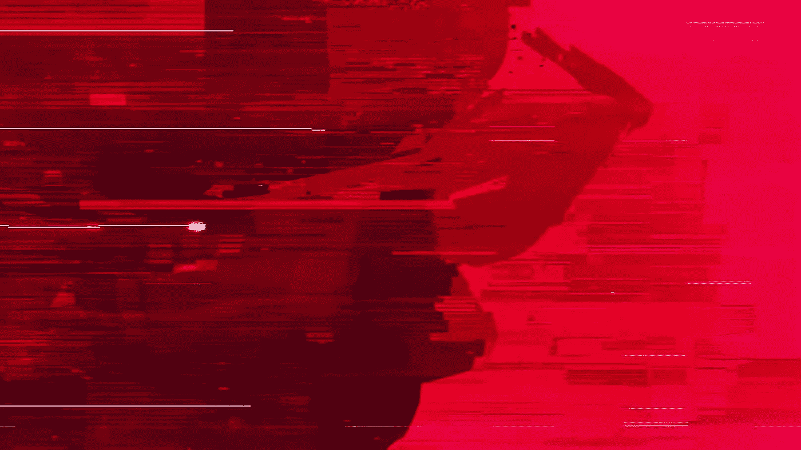
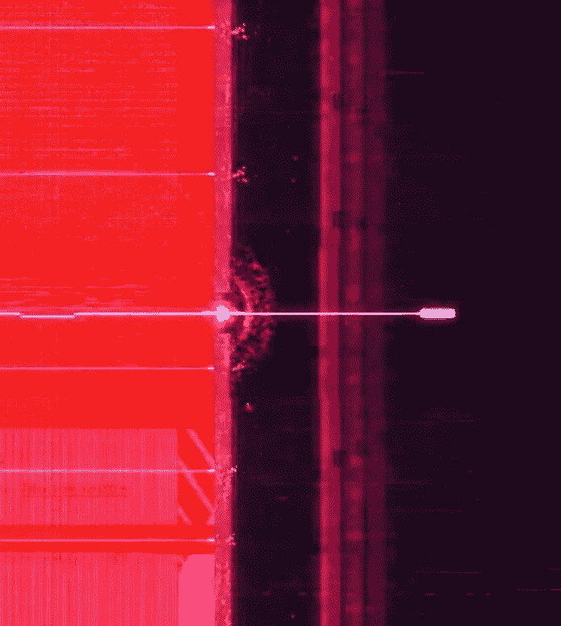
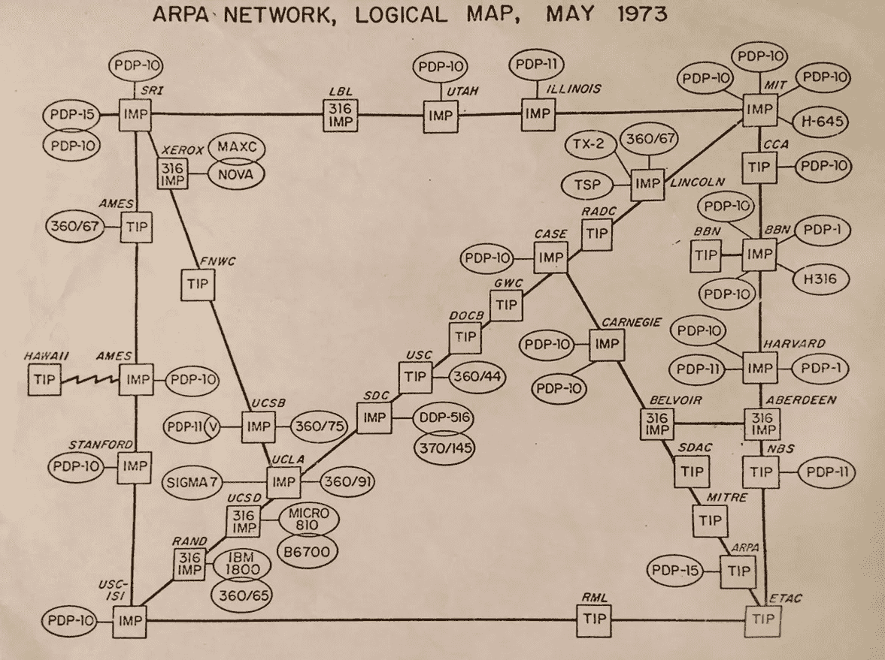
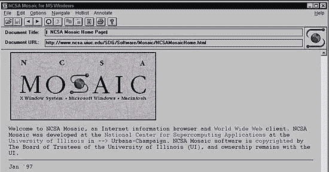

# 你看过好莱坞最棒的科技电视节目之一吗？

> 原文：<https://medium.com/geekculture/have-you-watched-one-of-the-best-tv-shows-from-hollywood-about-technology-16badcafcb27?source=collection_archive---------23----------------------->

或者:将《停止与着火》的虚构解读为真实事件。

这不仅仅是关于云或安全，而是关于一般的信息技术及其在过去几十年中的发展。

在一个虚构的世界里，这就是全部。

当然，这不是对这部剧、演员甚至制作本身的评论，而是我对这部剧的想法——侧重于它的技术方面。

作为一名热爱历史的 it 专业人士，我分享这篇文章是因为它对我很有启发。

## 。/theShow

这个节目叫做“停止并着火”。

它讲述了四个技术人员和其他几个以某种方式参与其中的人的故事。

这四位技术人员有着不同的背景、技能和目标——这些都是显而易见的，而且在该剧播出的四季中(大部分时间)都得到了很好的探索。

*   软件天才
*   硬件天才
*   空想家
*   商业天才

在展览中给我留下深刻印象的是他们如何描绘和展示所有这些不同的技能如何在行业中占有一席之地。以一种更微妙的方式:他们的竞争(在他们自己和行业之间)是为了拥有最好的想法和执行——这通过几件事情变得很清楚:

1.  该节目的片名为“Halt and Catch Fire”，在计算中简称为[HCF](https://en.wikipedia.org/wiki/Halt_and_Catch_Fire_(computing)):

> HCF 成为一个幽默的总括术语，指可能冻结处理器的指令，包括出于测试目的的有意指令，以及无意的非法指令。有些被认为是硬件缺陷，如果系统是共享的，恶意用户可以执行它来发起拒绝服务攻击。

2.展览的开幕在许多方面突出了这一点，[如这里所讨论的](https://www.artofthetitle.com/title/halt-and-catch-fire/):

> 一个想法可能是一件暴力的事情。从虚无中诞生，凭着运气、灵感的闪现，有时是按下按钮，强行进入这个世界。
> 
> 在 AMC 的新时代剧*的开场*，一个火花在纯粹的红色中点燃了一条道路，将一个想法变成了现实。零变成了一。输入变成输出。在朱红色的虚空中，这些人物的脸几乎无法辨认，只不过是些浮华的近似值。

在朱红色的风景中跟随一个白色的信号(代表和想法)(旁边还有其他白色的信号/想法)。

Breakthrough!

[弹性——片头片尾:Halt &着火——YouTube](https://www.youtube.com/watch?v=ucSUs3adMQ8)

这部剧在每集中都传达了这一点——同时提到了从 70 年代末/80 年代初的个人电脑革命开始的 IT 行业的关键时刻。

在旅程的最后，这部剧将一切联系起来，令人难以置信。这是一堂关于科技与生活的课。

史蒂夫·乔布斯在他著名的哈佛演讲中也提到了这一点(这也是我需要写的东西！)—在这种情况下，史蒂夫说(以一种简单的方式)生活中的一切都是有原因的。该节目用以下句子将生活与科技联系起来:

> “让你得到东西的东西”。

## 。/为什么

为什么你要把宝贵的时间花在看电视上？

作为一个喜欢的人，我会指出几个原因:

*   好方向
*   论要点对话
*   惊人的配乐
*   技术:信息技术/云计算/信息安全
*   善用象征手法

简而言之:

> 我发现这是一个相当惊人的壮举，看到有趣的和引人入胜的戏剧围绕着真正的技术讨论和高质量的生产。

从美学角度来看，我认为这部剧通过使用合成音乐、沉默和尴尬角度的镜头传达了一种空灵的氛围——它给观众留下了足够的时间来处理和消化他们传达的感情。

在一些场景中，空虚和孤独的感觉伴随着绝望，而其他人的兴奋和希望——不知何故，尽管有技术背景，也确实体现了人性。

从艺术的角度来看，这很了不起。

请记住:

> 该展览涉及现代计算时代——代表 IT 行业的真实数字——最重要的是，展示了技术突破的重要性。

从技术的角度来看，这是值得注意的。

## 。/era(包含剧透—您已被警告)

那么，这部剧的几季暗示了什么样的技术时代呢？

这些是我挑选的:

# 第一季:个人计算/图形用户界面

*   [个人计算](https://en.wikipedia.org/wiki/Personal_computer):与 PC vs Apple 2 有关，然后是 Macintosh(它说话了！)在最后。
*   [GUI](https://en.wikipedia.org/wiki/Xerox_Alto) :图形用户界面的概念是革命性的，问问施乐和鼠标的发明——还有史蒂夫·乔布斯是如何喜欢这个想法的:)

# 第二季:游戏/恶意软件/云/初创公司/社交/防病毒

*   [创业](https://www.investopedia.com/terms/s/startup.asp):兵变始于一群年轻程序员的房子。
*   [安全](https://www.ifsecglobal.com/cyber-security/a-history-of-information-security/):一个让网络陷入停顿的网络自传播软件，这是对爬虫的肯定。
*   [杀毒](https://en.wikipedia.org/wiki/Antivirus_software#1980%E2%80%931990_period_(early_days)):季末声明一家杀毒公司。
*   [云](https://en.wikipedia.org/wiki/Cloud_computing):Joe 提到的一个简单的概念，在下班时间租用主机的空闲时间(分时概念)。很早的云时代，IBM 和 DEC 就涉足其中。

# 第三季:网络/互联网安全/风险投资/网络浏览器

*   网络:提到了计算机分布式网络的设计，很像 ARPANET:

*   互联网安全:一个角色的命运如何引发对互联网和人们福祉/安全的讨论。
*   [风险投资](https://en.wikipedia.org/wiki/Venture_capital):虽然不是他们中的任何一个人创造的，但这个概念得到了认可。
*   网络浏览器:就像早期的网络一样，需要一个图形工具来导航，这个问题将在季末讨论。这是对[马赛克浏览器](https://en.wikipedia.org/wiki/History_of_the_web_browser)的肯定。

[April 22, 1993: Mosaic Browser Lights Up Web With Color, Creativity | WIRED](https://www.wired.com/2010/04/0422mosaic-web-browser/)

# 第四季:ISP /网络索引/网络门户

*   互联网服务提供商在 90 年代中后期是一件大事。你必须记住他们的光盘来安装他们的拨号软件？如果我没记错的话，提到了美国在线。
*   网络索引:一个网络爬虫，向主宰搜索引擎市场的竞赛致敬。提到雅虎，也对谷歌点头。
*   门户网站:这在 25 年前也是一件大事，那就是成为用户的首选页面。它集中了电子邮件/新闻/聊天/游戏/搜索等服务，以及你想在网上得到的一切。向雅虎和 MSN 致敬。

在座的谁不记得，不珍惜(对，对！)的门户网站？90 后？看看 1996 年 10 月的 MSN.com:

source: [Msncom-1996.png (304×327) (wikimedia.org)](https://upload.wikimedia.org/wikipedia/en/a/ab/Msncom-1996.png)

如果你看过这个节目，你觉得怎么样？此外，我是否忘记了节目中的任何重要技术(我当然忘记了)，这是什么？

我会留给你一些想法:

[停下来，然后着火，第一集，“电脑不是东西……”——YouTube](https://www.youtube.com/watch?v=YQLbi4VXYcA)

[《让你找到那个东西的东西》——停下来，然后着火(HACF)——YouTube](https://www.youtube.com/watch?v=-Bics9UkjK8)

在 twitter 上关注我(更多随机帖子，但主要是信息安全/云内容:):[Camillo(@ iamcamillo)/Twitter](https://twitter.com/iamcamillo)

了解有关我的云和安全项目的更多信息:

网页:[www.cloudnsec.com](https://www.cloudnsec.com)

听:【bit.ly/cloudnsecspotify
看:[bit.ly/cloudnsecyoutube](https://bit.ly/cloudnsecyoutube)

感谢您的阅读，并留下您的想法/评论！