# 与光探头组一起玩得开心-游戏开发系列 57

> 原文：<https://medium.com/geekculture/having-fun-with-light-probe-group-game-dev-series-57-4011176692ce?source=collection_archive---------45----------------------->

使用光探头组的简短指南。

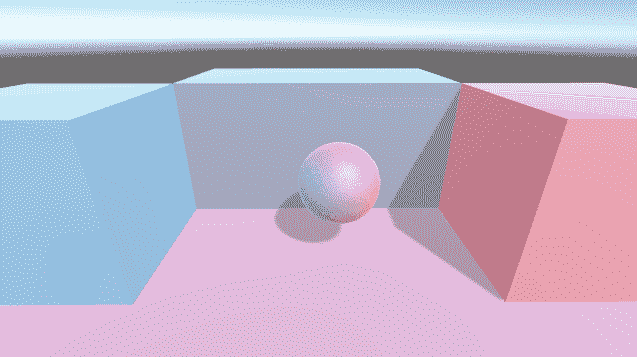

在 Unity 中使用灯光，如果我们想在游戏物体上创建一些反射，它应该是静态的，否则不会显示任何效果。但是，光探针组可以打破这个限制。
光探头组可以让你创建一个光反射区域，允许 Unity 计算该区域中的所有对象并进行光反射。

在这里，我创建了一个场景来演示光探头组如何在 Unity 中工作。

首先，在一个干净的场景中，创建一个平面作为地板，然后创建并调整一个立方体。

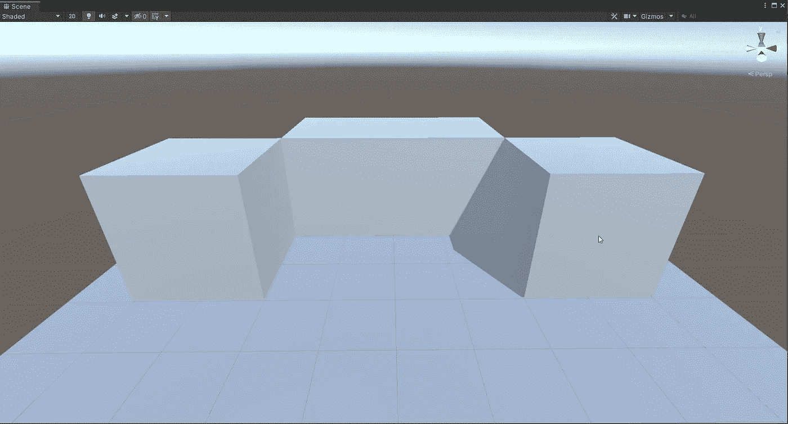

然后创建两个点光源，给它们两种不同的颜色。确保光线范围控制在一个角落。

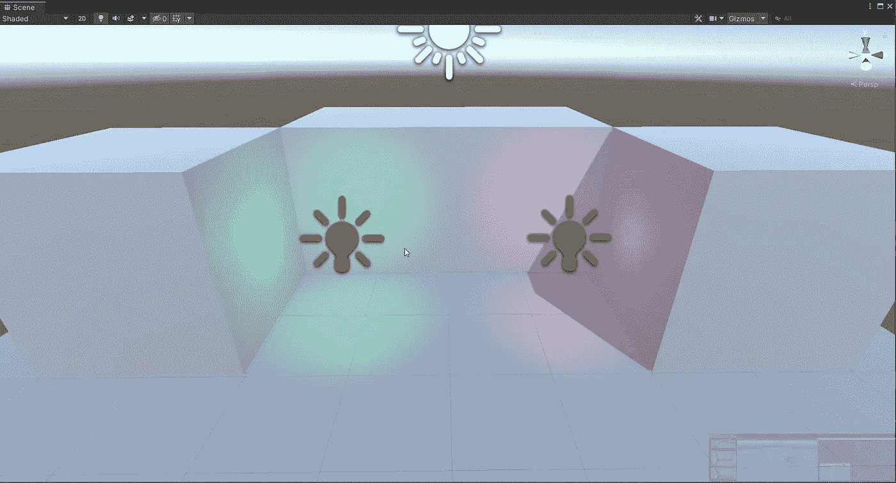

然后创建一个球体，并把它放在两盏灯的中间。

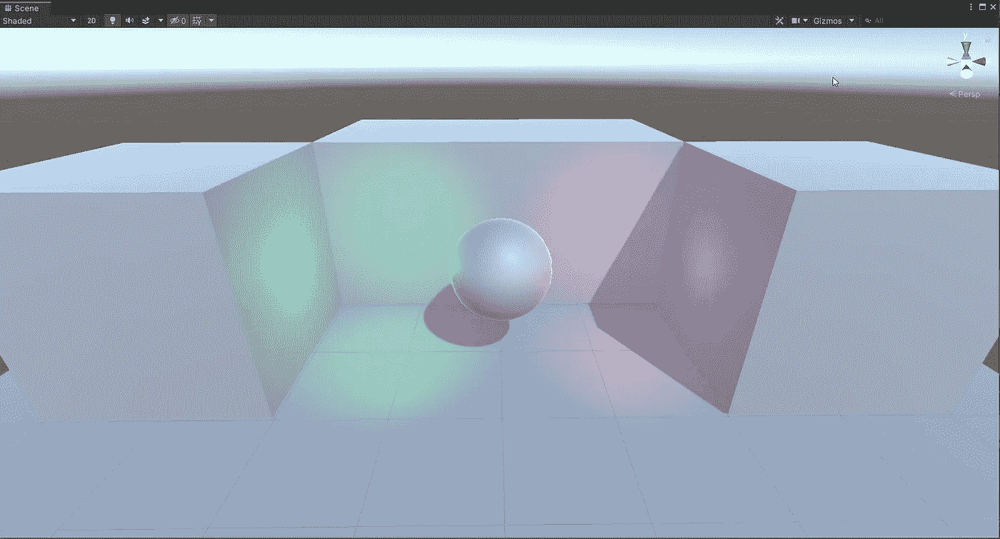

通过这个设置，你应该可以看到灯光在球体上反射出一个点。这是对球体表面的直接照明。如果我们移动这个球体，你应该注意到反射的范围没有改变。

然后我们可以将 2 点光源的模式从**实时**改为**烘焙**。为了清楚地看到结果，将平行光也改为**烘焙**。

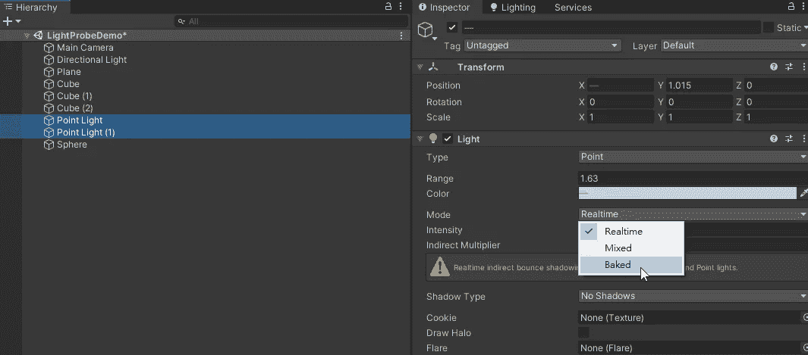

这是我们改变灯光模式后的样子。

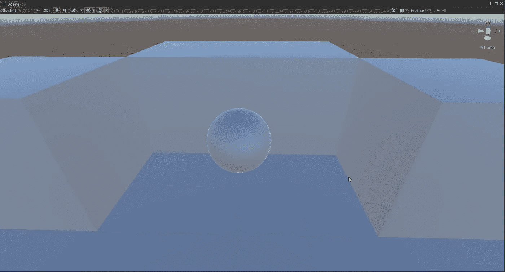

然后我们可以添加光探针组。
右键点击层级>灯>灯探针组。

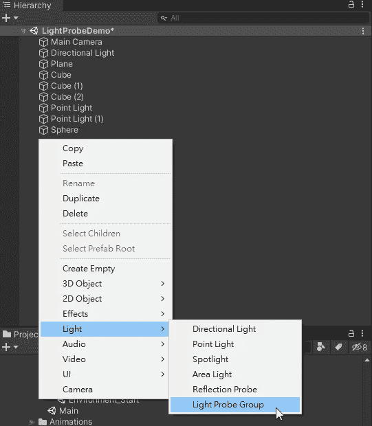

它将创建光探头组的默认设置。

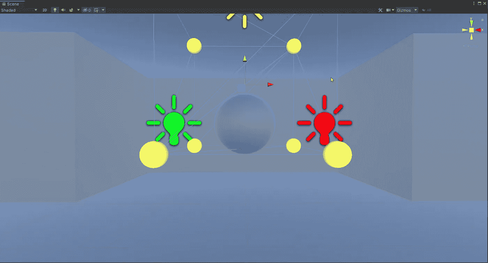

我们可以点击**检查器**中的**编辑光探头**来调整所有的光探头。

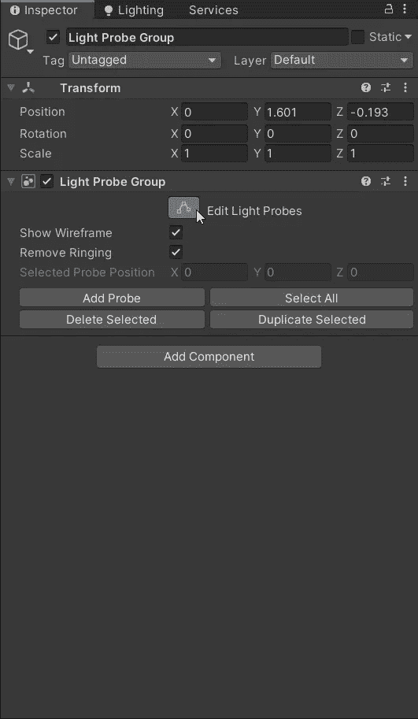

然后调整探头。如有必要，复制它。请注意，光探头就像传感器，你需要将它们更多地散布在有光的地方，它将接收更多面的光反射计算。

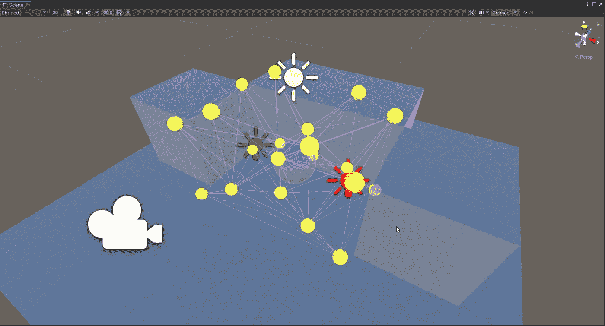

而且在 2 光的中间，它将需要一些光探针。这些将从两侧接收光线数据，以平衡物体上的反射。

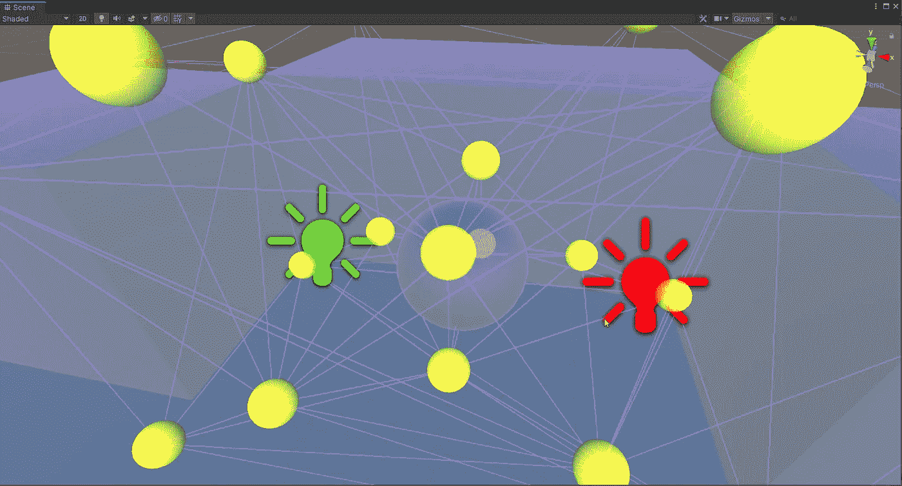

完成定位光探头后，你应该可以看到球体和立方体上的颜色反射。如果您看不到结果，请确保在**照明**选项卡中启用**自动生成照明**。

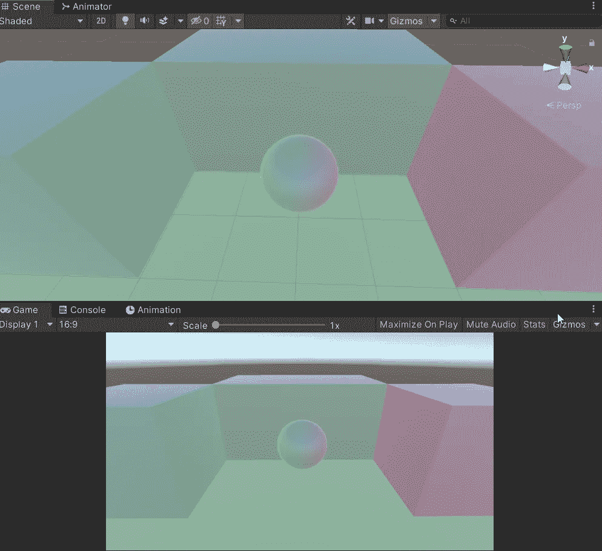

移动球体，您应该会看到光探头如何在非静态物体上呈现光反射。

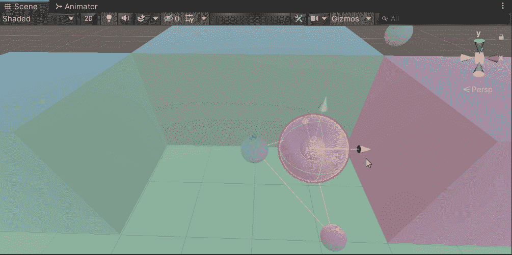

光探头可以影响整个区域。稍微改变一些光探头，你应该会看到不同之处。

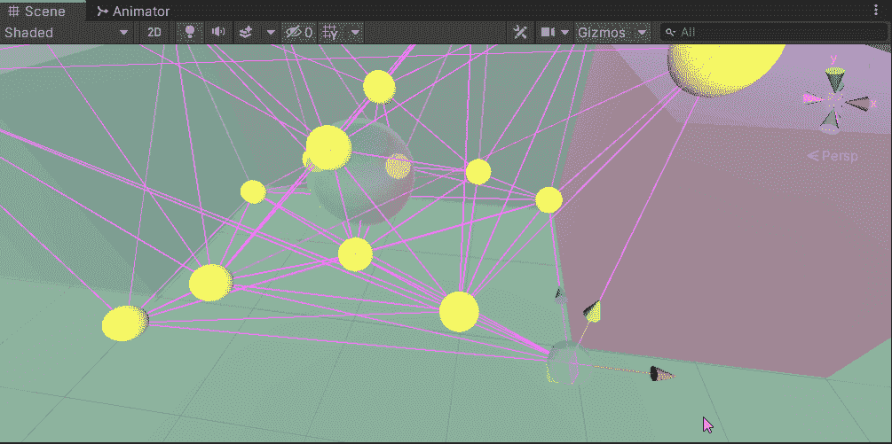

## 结论

玩光探组有几个关键点。

*   灯光模式必须是**烘焙**。
    如下图所示，当我们使用**烤**光时，光探头会呈现出它检测到的光的颜色。然而，随着**实时**光，它总是显示暗灰色与所有的光探头。

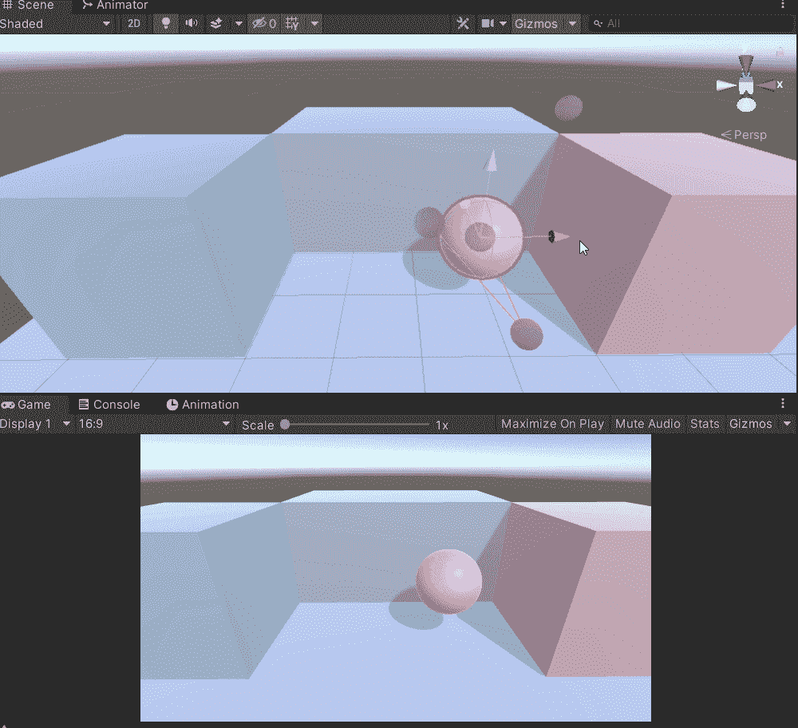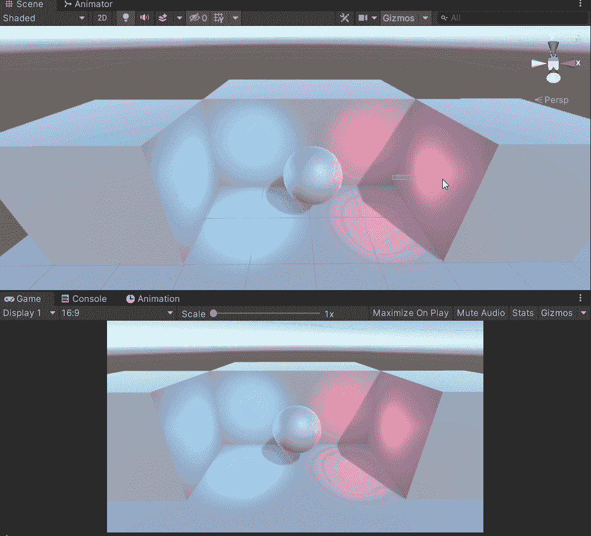

L: Baked light; R: Realtime light

*   更亮或光源位置应该需要更多的光探头来从许多面接收更多的数据。

Bad example

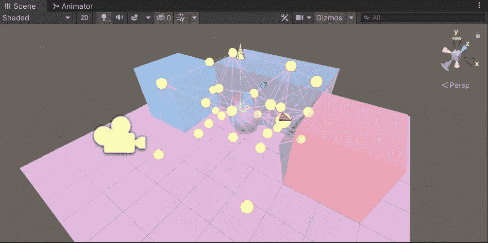

Much better with more probes on light source.