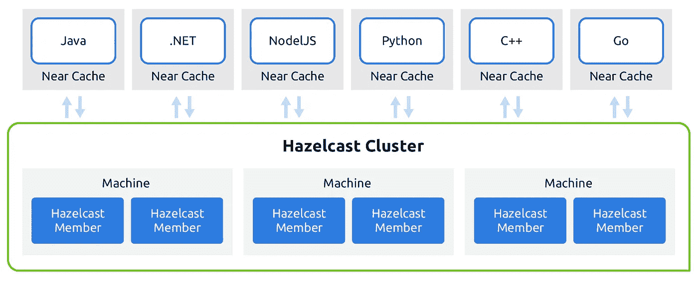
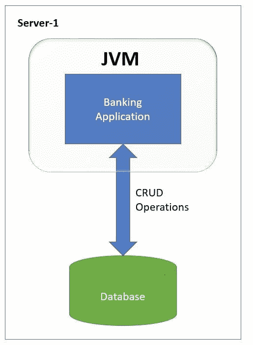
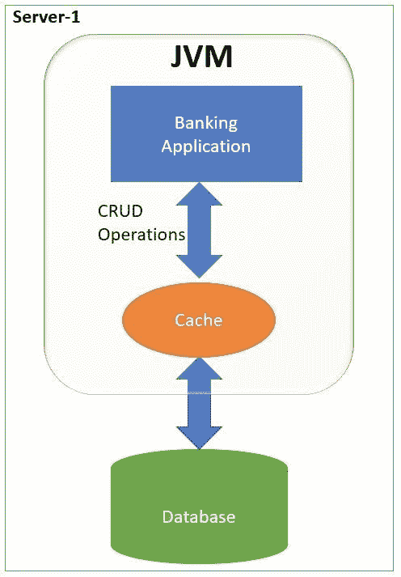
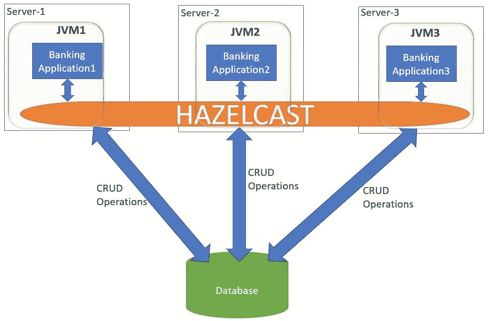
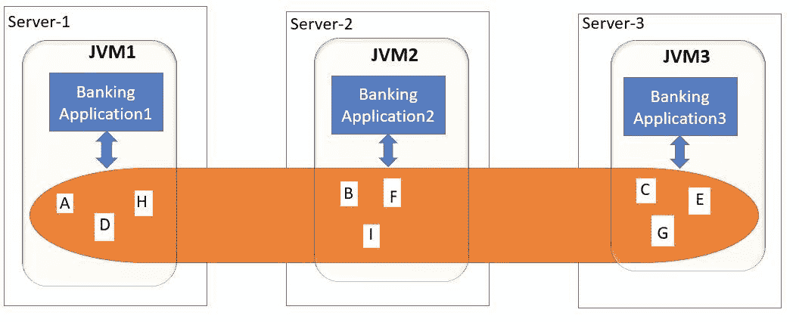
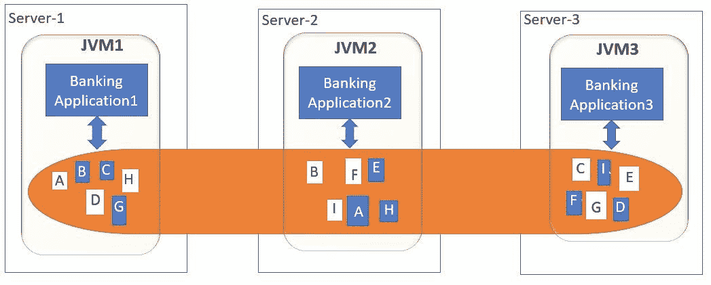
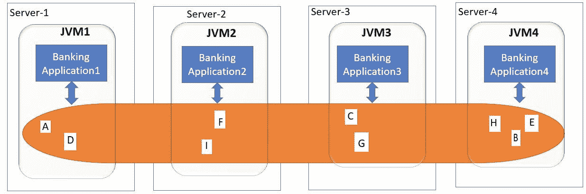

# Hazelcast 内存缓存

> 原文：<https://medium.com/geekculture/hazelcast-in-memory-caching-d12d2e562bf1?source=collection_archive---------1----------------------->

在本教程中，我们将学习什么是 **Hazelcast** 和**何时使用它**。 **Hazelcast IMDG** 是一个基于 **Java** 的开源内存数据网格。这是一个由物理机或虚拟机支持的集群数据网格。在本教程中，我们将着眼于 **Hazelcast** basic，在下一个教程中，我们将实现 Spring Boot + Hazelcast 应用程序。

什么是 **Hazelcast？**

让我们以一个简单的银行应用程序为例，它为用户银行账户执行 **CRUD** 操作。最初，我们使用**单片**方法开发这个应用程序。银行应用程序将被部署到运行 JVM 的单个服务器上。银行详细信息将保存在数据库中。每当用户想要获取数据时，它就从数据库中检索数据，并将其发送给运行在 JVM 中的银行应用程序。

上述应用程序的主要缺点是每次调用数据库时都会调用**。无论是创建、读取、更新还是删除，这个应用程序都会对数据库**进行**调用。这将是一个网络调用，这将使应用程序**慢得多**。**

我们可以使用**缓存**来提高应用程序的速度。**缓存是一种简单的内存数据结构，类似于映射图**。其中键是帐号，值是帐户对象。因此，用户的帐户详细信息将存储在地图和数据库中。

这将是应用路线的**架构**。这里我们有一个缓存和数据库。当数据库中的数据太大时，**缓存将根据一些缓存算法只保存相关数据**。每当用户需要特定账号的账户细节时，我们将从缓存中获取它**并返回它**，而不是调用数据库。这将节省我们对数据库的网络调用，因此速度更快。这将提高我们应用程序的性能。

上述方法有缺点。

*   假设随着越来越多的用户执行像添加新帐户这样的操作，应用程序负载增加了很多。我们创建的缓存通常存储在 JVM 内存中。**有尺寸限制**。
*   为了解决上述问题(以及单片应用程序的许多其他问题),我们现在转向**分布式微服务架构**,在这里我们已经启动了银行应用程序的多个实例，以实现更好的**负载平衡**。

这里我们将有**不同的应用程序(服务器)**。这些服务器中的每一个都将数据加载到同一个数据库中。因为每个应用程序运行在不同的服务器上，所以每个应用程序都有不同的 JVM。**以及为每个 JVM 单独创建的每个应用的缓存**。

假设有一个请求传入，银行**应用程序 1** 存储特定银行编号的银行详细信息，并将数据存储在**缓存 1** 中，缓存 1 是**应用程序 1** 和数据库的自有缓存。但是银行**应用程序 2** 和**应用程序 3** 如何知道这个缓存更新呢？他们不知道这笔交易。假设某个其他用户调用银行**应用程序 3** 来检索新插入的银行细节。它不会在**缓存 3** 中。所以它会从数据库中获取数据。因此，将需要一个网络调用来获取新的银行信息。

此外，假设银行**应用程序 1** 已经更新或删除了现有数据。现在这些更新的细节没有出现在**申请 2** 和**申请 3** 中。因此**缓存 2** 和**缓存 3** 将包含无效/未更新的数据。这可能是该应用程序中的一个主要问题。

为了解决这些问题，我们使用了分布式内存缓存，即 **Hazelcast** 。

**Hazelcast 是一个内存分布式缓存**。假设银行**应用程序 1** 更新了其缓存，那么这种变化也会反映在银行**应用程序 2** 和银行**应用程序 3** 中。因此，使用 Hazelcast 在所有缓存中维护数据完整性。

内存数据网格(IMDG)的目标是通过将数据保存在内存中并以高度分布式的方式提供极高的可用性。Hazelcast 的优点是，

*   **集群** — Hazelcast 拥有一组协同工作的集群节点
*   **分布式**—hazel cast 中的数据分布在所有节点中

*   **容错** — Hazelcast 维护数据的复制副本。

假设 **JVM1** 宕机。尽管如此，出现在 **JVM1** 中的所有数据也作为维护的复制副本出现在其他节点中。因此，如果您正在使用 Hazelcast，就不会有数据丢失。

*   **应用缩放** — Hazelcast 可以水平缩放。它本质上是有弹性的。新节点可以添加到集群中，节点中的数据会自动再次分布到所有节点中。

假设我们又添加了一个银行**应用程序 4** 之前存在于 3 个节点中的所有数据将自动分布到 4 个节点中。

所以到现在为止，你应该对什么是 Hazelcast 和什么时候使用它有了很好的了解。在下一个教程中，我们将实现一个 Spring Boot + Hazelcast 应用程序。

谢谢大家！