# HDFS 命令备忘单

> 原文：<https://medium.com/geekculture/hdfs-commands-cheat-sheet-1cd7bf22e795?source=collection_archive---------1----------------------->

HDFS 命令快速指南

HDFS 是 Hadoop 生态系统的主要枢纽，负责跨各种节点存储结构化和非结构化的大型数据集，从而以日志文件的形式维护元数据。因此，要使用这样一个系统，我们需要精通或者至少应该知道常用的命令和过程来简化我们的任务。在这个问题上，我们已经巩固了一些最常用的 HDFS 命令，你应该知道与 HDFS 合作。

首先，我们需要检查下面的列表。

1. [**安装 Hadoop**](/p/61b0e67342f8)

2.**运行 Hadoop** —我们可以使用‘start-all . cmd’命令或者直接从 Hadoop 目录启动。

3.**验证 Hadoop 服务** —我们可以使用下面的命令检查我们的 Hadoop 是否启动并运行。

**jps**

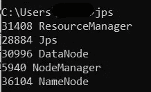

伟大的..！！！现在我们准备好执行和学习命令。

> * *注意:-这些命令是特定于大小写的。写命令时，一定要特别注意大写和小写字母。

1.  **version —** 该命令用于了解 Hadoop 的版本，以及附加的本地文件系统位置和编译信息。

## ***hadoop 版本***

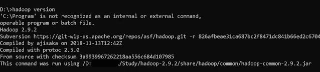

hadoop version

**2。mkdir —** 该命令用于创建一个新目录，如果它不存在的话。如果目录存在，它将给出一个“文件已经存在”的错误。

## hadoop fs -mkdir

mkdir

**3。ls —** 该命令用于检查 HDFS 中的文件或目录。它显示指定目录中每个文件或目录的名称、权限、所有者、大小和修改日期。

## hadoop fs -ls

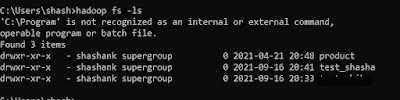

hadoop ls

**4。put —** 该命令用于将数据从本地文件系统复制到 HDFS。

## Hadoop fs-put<local file="" path=""></local>

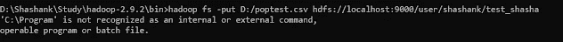

hadoop put

我们可以从 HDFS 网站上验证这一点。

hadoop put webUI

**5。get —** 该命令用于将数据从 HDFS 复制到本地文件系统。该命令与“上传”命令相反。

## hadoop fs -get<hdfs file="" path=""><local file="" path=""></local></hdfs>

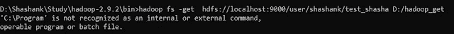

hadoop get

我们可以从本地文件系统中验证这一点。

hadoop get webUI

6。cat — 命令用于查看 HDFS 文件中的数据

## hadoop fs -cat

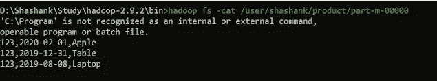

hadoop cat

**7。mv —** 该命令用于将文件从 HDFS 的一个位置移动到 HDFS 的另一个位置。

## hadoop fs -mv <destination hdfs="" path=""></destination>

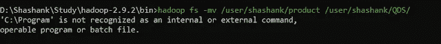

hadoop mv

我们可以从 Web 用户界面验证这一点。

hadoop mv webUI

**8。cp —** 该命令用于将文件从 HDFS 的一个位置复制到 HDFS 境内的另一个位置。

## hadoop fs -cp <destination hdfs="" path=""></destination>

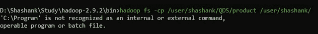

hadoop cp

我们可以从 Web 用户界面验证这一点。

hadoop cp webUI

**9。copyFromLocal —** 该命令用于将数据从本地文件系统复制到 HDFS。

## Hadoop fs-copy from local<local file="" path=""></local>

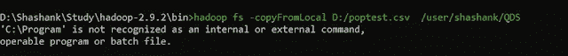

Hadoop copyFromLocal

我们可以从 WebUI 验证复制的文件。

**10。copyToLocal —** 该命令用于将数据从 HDFS 复制到本地文件系统。

## hadoop fs -copyToLocal<hdfs file="" path=""><local file="" path=""></local></hdfs>

hadoop copyToLocal

我们可以在本地文件系统中检查该文件。

**11。movefromlocial—**该命令用于将文件或目录从本地文件系统移动到 HDFS。

## Hadoop fs-movefromlocial<local file="" path=""></local>

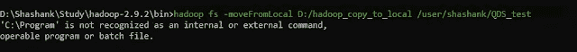

hadoop moveFromLocal

**12。moveToLocal —** 该命令用于将文件或目录从 HDFS 移动到本地文件系统。该命令尚未实现，但很快就会实现。

## Hadoop fs-moveToLocal<hdfs file="" path=""></hdfs>

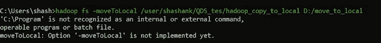

hadoop moveToLocal

**13。rm —** 删除，该命令用于从 HDFS 中删除/移除文件。

## hadoop fs -rm

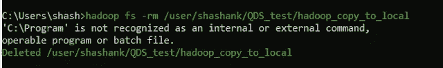

hadoop rm

**14。tail —** 该命令用于从 HDFS 读取文件的尾部/结尾部分。它有一个额外的参数“[-f]”，用于显示文件的附加数据。

## hadoop fs -tail [-f]

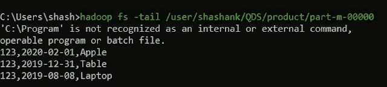

hadoop tail

15。expunge — 该命令用于清空垃圾箱。

## hadoop fs -expunge

hadoop expunge

16。chown — 当我们想在 HDFS 改变一个文件或目录的**用户**时，我们应该使用这个命令。

## hadoop fs -chown

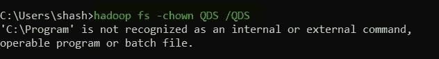

hadoop chown

我们可以使用 hadoop -ls 命令或从 WebUI 验证用户是否进行了更改。

hadoop chown WebUI

17。chgrp — 当我们想在 HDFS 改变一个文件或目录的**组**时，我们应该使用这个命令。

## hadoop fs -chgrp

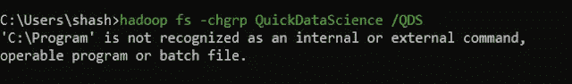

hadoop chgrp

我们可以使用 hadoop -ls 命令或从 WebUI 验证用户是否进行了更改。

hadoop chgrp WebUI

18。setrep — 该命令用于在 HDFS 中更改文件的复制因子。

## hadoop fs -setrep<replication factor=""></replication>

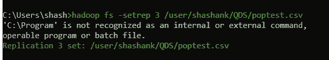

hadoop setrep

我们可以从网络界面查看。

hadoop setrep WebUI

19。du — 该命令用于检查文件或目录的磁盘使用量。

## hadoop fs -du

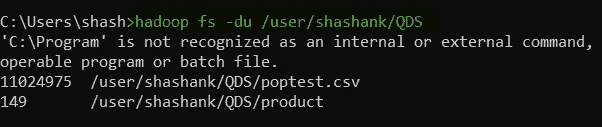

hadoop du

**20。df —** 此命令用于显示 HDFS 文件系统的容量、可用空间和大小。它有一个额外的参数“[-h]”，用于将数据转换为人类可读的格式。

## hadoop fs -df [-h]

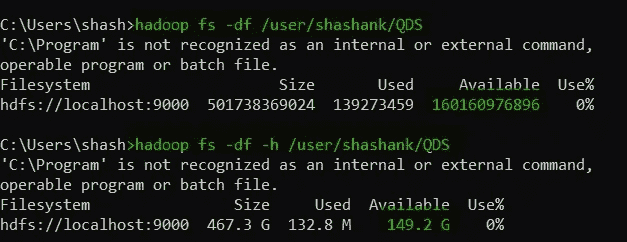

hadoop df

**21。fsck —** 此命令用于检查 HDFS 文件系统中文件的健康状况。

## hadoop fsck

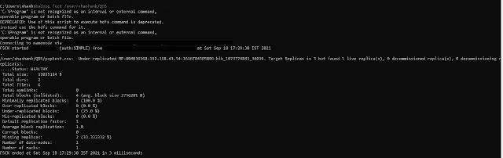

hadoop fsck

它还有一些属性/选项来修改命令的用法。

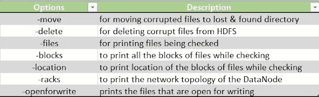

hadoop fsck options

**22。touchz —** 该命令在指定的目录中创建一个大小为 0 的新文件。

## hadoop fs -touchz

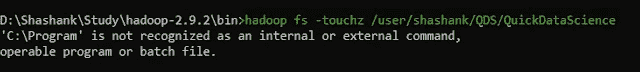

hadoop touchz

新文件可以在 WebUI 中看到。

hadoop touchz webUI

**23。test —** 该命令回答关于< HDFS 路径>的各种问题，并通过退出状态给出结果。

## hadoop fs -test

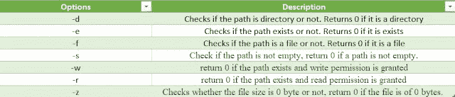

hadoop test options

**24。text —** 这是一个简单的命令，用于在控制台上打印 HDFS 文件的数据。

## hadoop fs -text

25。stat — 该命令提供 HDFS 中文件或目录的 stat。

## hadoop fs -stat

hadoop stat

它可以提供以下格式的数据。默认情况下，它使用“%y”。

hadoop stat formats

**26。用法—** 显示给定命令或所有命令(如果未指定)的用法。

## Hadoop fs-用法<command></command>

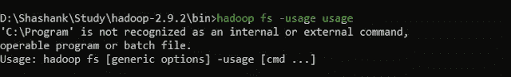

hadoop usage

**27。帮助—** 显示给定命令或所有命令(如果未指定)的帮助。

## hadoop fs -help<command></command>

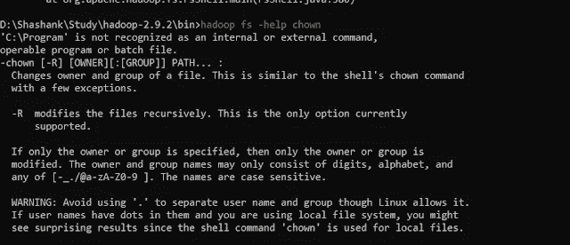

hadoop help

**28。chmod —** 用于更改 HDFS 文件系统中文件的权限。

## hadoop fs -chmod [-r]

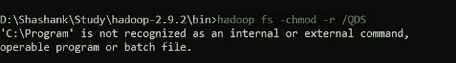

hadoop chmod

**旧权限**

hadoop chmod old permission

**新权限**

hadoop chmod new permission

29。appendToFile — 该命令用于将本地文件系统中的两个文件合并为 HDFS 文件中的一个文件。

## Hadoop fs-appendToFile<local file="" path1=""><local file="" path2=""></local></local>

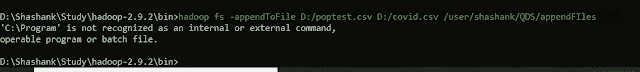

hadoop appendtofile

hadoop appendtofile webui

三十岁。校验和— 该命令用于检查 HDFS 文件系统中文件的校验和。

## hadoop 文件系统校验和

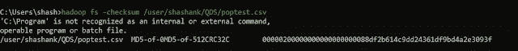

hadoop checksum

**三十一。count —** 计算特定路径下文件、目录的数量和大小。

## Hadoop fs-count[选项]

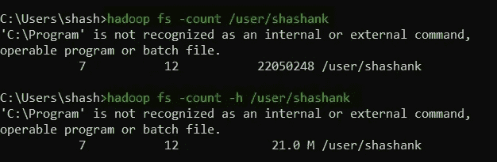

hadoop count

这个函数也有一些函数可以根据需要修改查询。

hadoop count options

**32。查找—** 该命令用于在 HDFS 文件系统中查找文件。我们需要提供我们正在寻找的表达式，并且如果我们想要在特定的目录中寻找文件，也可以提供一个路径。

## hadoop fs -find

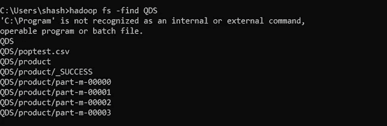

hadoop find

**33。getmerge —** 该命令用于将 HDFS 目录的内容合并到本地文件系统的一个文件中。

## Hadoop fs-get merge<hdfs directory=""></hdfs>

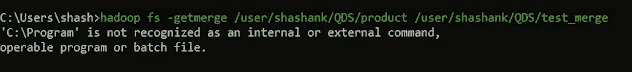

hadoop getmerge

可以在本地文件系统中看到合并的文件。

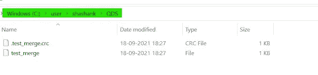

hadoop getmerge file

HDFS 命令概述。

HDFS command Cheat codes

# 摘要

我们学习了最常见和最常用的 HDFS 命令。我们已经看到了如何使用它们，也学到了实用的方面。

所以不要只是阅读，和我们一起实践，让我们知道你面临的问题和挑战。

在那之前…这是快速数据科学团队签署。另一篇文章再见。