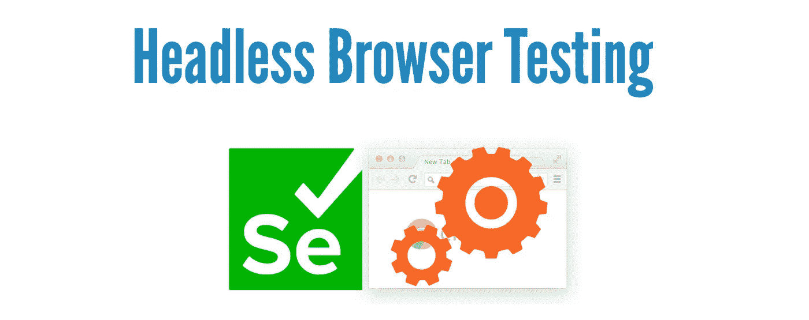

# 无头浏览器测试澄清

> 原文：<https://medium.com/geekculture/headless-browser-testing-clarified-d544ef0acf43?source=collection_archive---------12----------------------->

## 无头浏览器测试大多是不必要的。

*本文是“* [***IT 术语澄清***](https://zhiminzhan.medium.com/my-article-series-5f1a551d8796#e91c) *”系列之一。*

无头浏览器测试是一种在没有 UI (head，Unix 术语)的情况下运行浏览器测试的方式。让我们来看看在 headless 模式下的 Selenium 测试执行，以及作为比较的普通模式。