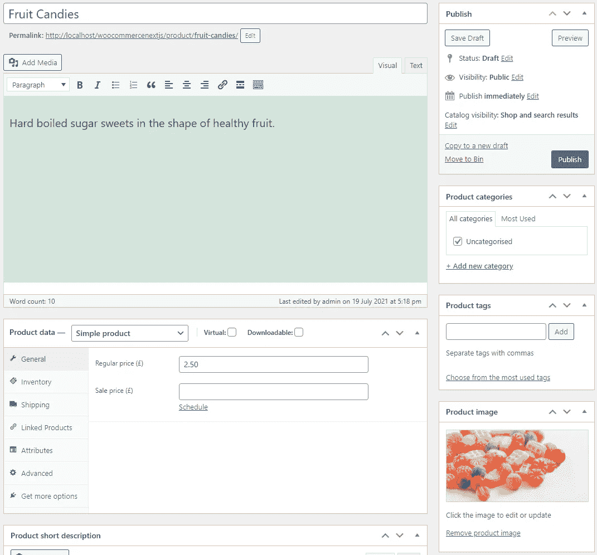
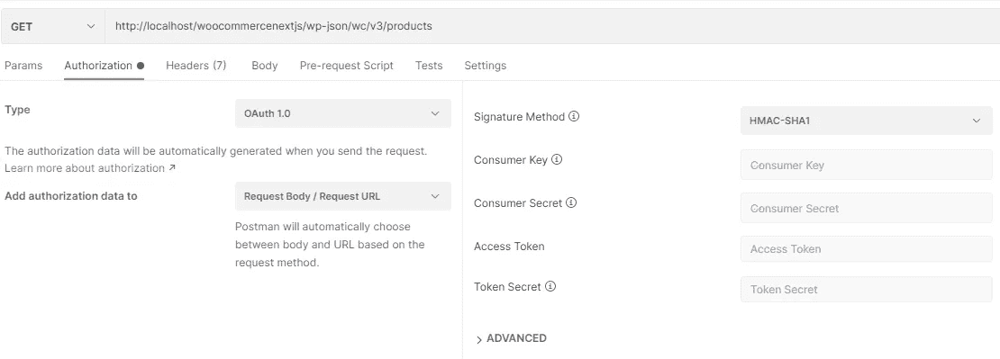
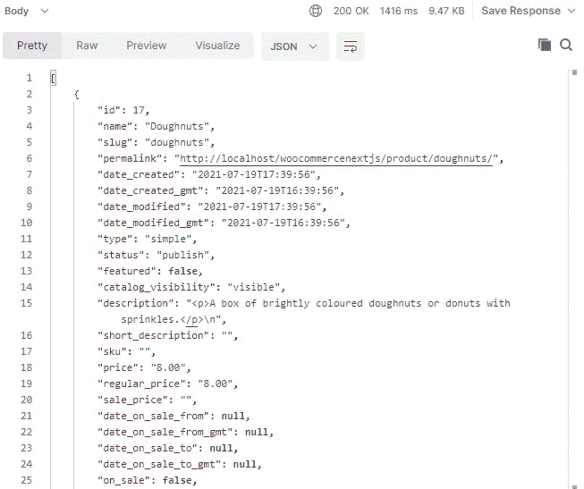

# Headless WooCommerce & Next.js:用 Postman 设置 WooCommerce & Test

> 原文：<https://medium.com/geekculture/headless-woocommerce-next-js-set-up-woocommerce-test-with-postman-5e7859c65626?source=collection_archive---------8----------------------->


Photo by [Roman Kraft](https://unsplash.com/@romankraft?utm_source=medium&utm_medium=referral) on [Unsplash](https://unsplash.com?utm_source=medium&utm_medium=referral)

现在你的 WordPress 站点已经安装了 WooCommerce，是时候配置 WooCommerce 并开始添加一些销售产品了！

# 配置 WooCommerce 设置

在你的 WordPress 站点中，点击 WooCommerce 菜单选项并进入`Settings`。在“设置”页面中，不同的选项卡下会有更多的选项可供选择(例如，常规、产品、运输、支付)。

慢慢来，让自己熟悉这些设置，但我在这篇文章中只是轻轻一碰，因为我想和你讨论的主要问题是如何让产品进入你的网站，并能够结账和付款。

至少让我们确保货币设置正确—我使用的是`Pound sterling(£)`。记得点击屏幕底部的`Save changes`。

我们将在稍后阶段处理支付，届时我们可以使用 Stripe 来帮助我们处理卡支付。

在`Advanced`选项卡中点击`REST API`链接并添加一个密钥。使用您喜欢的任何描述，并确保权限设置为`Read/Write`。这将生成一个**消费者密钥**和**消费者秘密**，您将需要它们来访问 WooCommerce API 端点。

# 添加产品

点击导航栏上的产品菜单选项，并转到`Add New`。同样，这里有很多选项可供选择，我们将保持简单。在这个例子中，我们需要一个产品名称、描述、图片和价格。这个例子将只使用`Simple products`,但是你可以在感觉舒服的时候进行实验。



Screenshot showing the Add Product screen in WooCommerce

添加图片时，你可以上传一个文件(并添加`alt text`)，这样图片就会保存在你的 Wordpress 站点中，如果你想的话，你可以通过 URL 访问它。准备好之后点击`Publish`或`Save draft`如果您想稍后再做。

首先添加一些产品，然后我们将使用 Postman 来测试我们是否可以获得数据。

注意:确保您在`Settings > Permalinks`中使用了漂亮的永久链接，以便支持自定义端点。**默认永久链接无效。**


Photo by [Mick Haupt](https://unsplash.com/@rocinante_11?utm_source=medium&utm_medium=referral) on [Unsplash](https://unsplash.com?utm_source=medium&utm_medium=referral)

# 邮递员

[Postman 是一个方便的工具](https://www.postman.com/)，它可以让你向 API 端点发出请求，而不需要进入代码。使用这个工具，我们可以预览正在获取的数据。

是时候让我们看看 WooCommerce 开发者文档了，尤其是他们的 REST API 文档。首先，它告诉我们 1)需求是什么，2)它有一个官方的 JavaScript 库[，以及 3)我们需要做什么来验证 API 调用。](https://www.npmjs.com/package/@woocommerce/woocommerce-rest-api)

重要的是，根据您使用的是 HTTP (OAuth 1.0a)还是 HTTP **S** (基本身份验证)，有不同的身份验证方法。因为我使用的是本地开发网站，所以我需要使用 OAuth 1.0a 进行认证。WooCommerce 开发人员文档提供了大量相关信息，但很快就会让人不知所措。让我们先看看如何使用 Postman 让它工作。



Screenshot of Postman

在 Postman 中创建一个新标签，点击`Authorization`选项。在这里，我们可以选择不同的认证类型。我们要`OAuth 1.0`。在右边的面板中，我们需要输入我们的凭据。WooCommerce 已经指定它需要的签名方法是 HMAC-SHA1，所以让我们选择这个。接下来的两个字段与`Consumer Key`和`Consumer Secret`相关。您之前已经在 WooCommerce 设置选项卡(在高级下)中生成了这些值，因此请将这些值复制并粘贴到这里。不需要包括`Access Token`或`Token Secret`。

有了身份验证凭证，我们需要输入我们想要点击/使用的 API 端点。

我们想列出我们最近添加到 WooCommerce 的所有产品。在 WooCommerce 开发者文档中，有一部分是关于产品->列出所有产品。文档告诉我们 HTTP 请求是:`GET /wp-json/wc/v3/products`。我们知道这是一个 GET 请求，端点被附加到您的基本 URL 上——在我们的例子中，基本 URL 是`http://localhost/woocommercenextjs`。

在 Postman 中，确保请求是 GET，并键入 URL，其中基本 URL 后跟 API 端点。

```
GET 
http://localhost/woocommercenextjs/wp-json/wc/v3/products
```

认证凭证已经设置好了，所以您可以点击`Send`并看到一个成功的响应。



Screenshot of a successful JSON response from WooCommerce API end point

您可以看到我们得到的响应与 WooCommerce 开发人员文档中的示例结构相同。因此，如果您不希望使用 Postman 进行测试，那么您可以将文档中的示例作为 JSON 响应的参考。

现在我们知道我们能够从 WooCommerce 获取数据，我们可以将注意力转向前端和 Next.js。

第 1 部分:用 WooCommerce 创建一个本地 WordPress

[第 2 部分:设置 WooCommerce &测试与邮递员](https://leojbchan.medium.com/headless-woocommerce-next-js-set-up-woocommerce-test-with-postman-5e7859c65626)

[第三部分:设置 Next.js](https://leojbchan.medium.com/headless-woocommerce-next-js-set-up-next-js-b8d2193b2688)

[第 4 部分:用 TypeScript 和 Next.js 设置样式组件](https://leojbchan.medium.com/headless-woocommerce-next-js-set-up-styled-components-with-typescript-and-next-js-18cc047ccd79)

[第 5 部分:展示产品并创建订单](https://leojbchan.medium.com/headless-woocommerce-next-js-display-products-and-create-orders-593a6c5aee86)

[第 6 部分:为状态管理建立 Redux 工具包](https://leojbchan.medium.com/headless-woocommerce-next-js-set-up-redux-toolkit-for-state-management-c605adda58fe)

[第 7 部分:创建购物车](https://leojbchan.medium.com/headless-woocommerce-next-js-create-a-cart-8a3e49b90076)

[第 8 部分:设置条带并创建检验](https://leojbchan.medium.com/headless-woocommerce-next-js-set-up-stripe-and-create-checkout-d01333607a66)