# 无头 WordPress Gutenberg & Next.js —第 1/3 部分:用 React 创建一个块

> 原文：<https://medium.com/geekculture/headless-wordpress-gutenberg-next-js-part-1-3-creating-a-block-with-react-e8d69e8460d4?source=collection_archive---------0----------------------->

## WordPress 的生态系统肯定会朝着用 JavaScript 和非 PHP 方式开发插件、主题和核心本身的方向发展。感谢**古腾堡**和 **WordPress JavaScript API** ，我们可以创造一些很酷的东西。其中之一就是**生产就绪的 WordPress 静态站点构建器**，我们将在本系列中对其进行编码。

# 开始之前

如果你不了解**古腾堡**、 **React** 或 **WordPress** 的某些坚实层面，这篇文章可能对你来说太难了。为了熟悉**古腾堡开发**，请继续阅读来自[官方文档](https://developer.wordpress.org/block-editor/developers/)的一些文章。它会帮助你理解它的用途和使用的技术。

# 介绍

我总是寻找最好的解决方案和编码方式。有些人可能会说我懒惰，但是我不喜欢在任何事情上重复自己，包括代码。这就是为什么我花了一些时间进行研究，开发了一种用 WordPress 作为无头后端，Gutenberg 作为页面编辑器来构建 SSG 生成页面的方法。**全部同一个构件结构来源。**

## 但是它与互联网上的其他文章或教程有什么不同呢？

我的实现从头到尾都是自定义的，这意味着我们不使用预定义的 WP 块(虽然我们可以！).我们构建了自己的模块，可以同时在三种环境中使用:

*   **管理端 WordPress** (后期编辑屏幕)——作为一个全功能的古腾堡模块，具有自定义数据字段、JS 事件、实时编辑等
*   **客户端 WordPress(前端)**——作为一个带有可选样式和脚本的静态 HTML
*   **Next.js(或 Gatsby 或 Nuxt 或其他 SSG/SSR 框架)** —作为全功能 React 组件，然后是静态 HTML+CSS+JS

下面是我们将要做的一个简短采访:

A video about Gutenberg to Next.js connection

请注意，视频中的样式或功能可能与项目存储库中的不同，因为它们可能会被更新。

**在视频中可以看到，整件事都是关于**:

1.  创建一个 **React 组件**，它将成为我们的块
2.  使用 React 组件，我们在上面的 **WordPress** ，中创建了一个**古腾堡** **块**，仅使用 JavaScript 和 React(我们也可以使用许多`@wordpress/*`包，如`@wordpress/blocks`，`@wordpress/i18n`)
3.  添加一些基本的样式，使**块** **与额外的 JavaScript 交互**
4.  在 WordPress 和外部应用程序( **REST API 或 GraphQL** )之间创建一个**通信层**
5.  用 Next.js 或 Gatsby 构建一个 **SSG 生成的网站**，使用之前构建的模块和一个**通信层**with(headless)**WordPress**

# WordPress 开发环境

为了开始我们的项目，我们需要一个可以工作的 WordPress 实例。就个人而言，对于这样的小项目，我使用 Docker docs 中的 **Docker** 和一个基本的`docker-compose.yml`配置文件。非常好用。

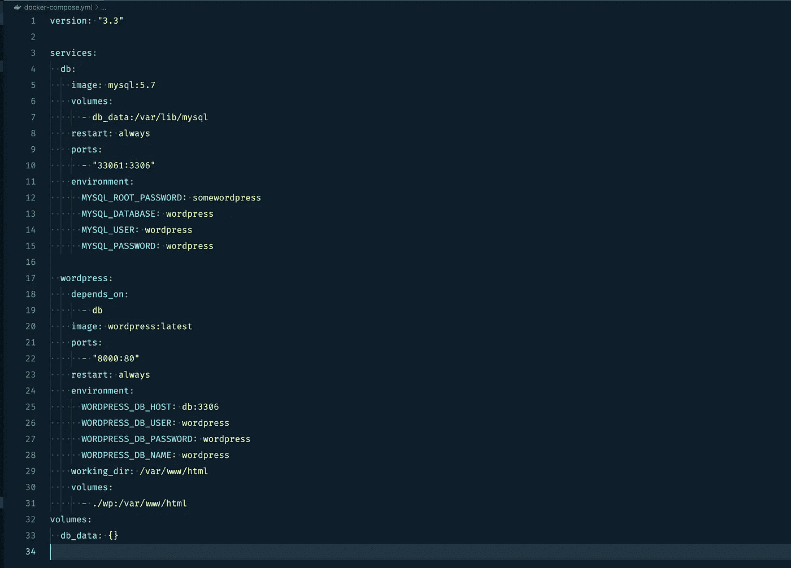

docker-compose.yml (placed inside project root folder)

请注意，**我已经在默认文件**中添加了几行:

*   **第 9–10 行**:这将映射我们的端口，并允许我们从 Docker 容器外部连接到 MySQL(使用 TablePlus 或 Sequel Pro)——它将在第 10 行定义的端口 **33061** 上被访问
*   **第 29–31 行**:这将把我们的 WordPress 文件映射到容器之外，并允许我们在本地编辑文件，而不需要进入 Docker 容器。它在一个子文件夹中，所以以后可以添加到`.gitignore`

您现在可以打开终端并键入`docker-compose up -d --remove-orphans`。这将运行我们的 **Docker** 容器并“启动”我们的新 **WordPress 实例**。标志`-d`和`--remove-orphans`在文档中有描述。

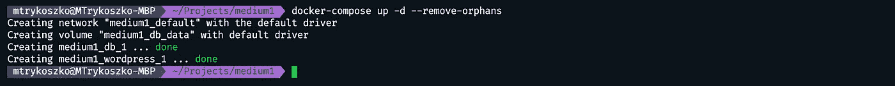

It should output green “done” flags twice — one for database and one for WordPress container

现在**打开你的浏览器，输入** `[http://localhost:8000](http://localhost:8000.)`。为什么:8000？因为我们已经在 docker-compose 的第 22 行定义了这个端口。

你现在应该看到默认的 WordPress 配置屏幕。继续并配置站点。

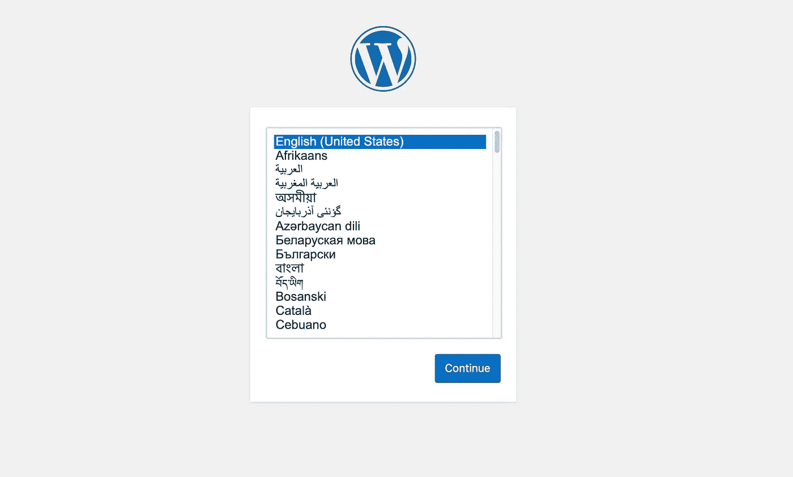

WordPress new instance config screen

# PHP 部分

正如我之前说过的，我们需要编写 PHP。但是不要担心，这只是一个文件中的几行内容。也可以在整个项目中完成一次。我们需要用 PHP 编码什么？

*   插件核心(我们块的家)
*   使用一些 WP 过滤器或钩子(但这也可以用 JavaScript `[@wordpress/hooks](https://developer.wordpress.org/block-editor/packages/packages-hooks/)`来完成)
*   将块的资产入队

首先，让我们创建插件。为此，在`./wp/wp-content/plugins`中创建一个文件夹。我将把它命名为`fancy-block`。在这个文件夹中，我将创建主插件文件:`index.php`。

Basic structure of a plugin

接下来，我们需要编写一些 PHP 代码。我们需要:

1.  添加一个`<?php`声明(以便服务器理解)——第 1 行
2.  在插件的标题(WordPress)中添加一个带有插件信息的评论——第 2-8 行——和在 WP 插件或主题中一样
3.  阻止访问 WordPress 作用域之外的插件——第 10 行
4.  获取我们生成的资产—第 14 行(更多信息见下文)
5.  用`wp_register_script` —第 15-20 行登记 pt 4 中的资产
6.  用`register_block_type`注册我们的古腾堡区块—第 21–24 行
7.  钩住`init` —第 26 行

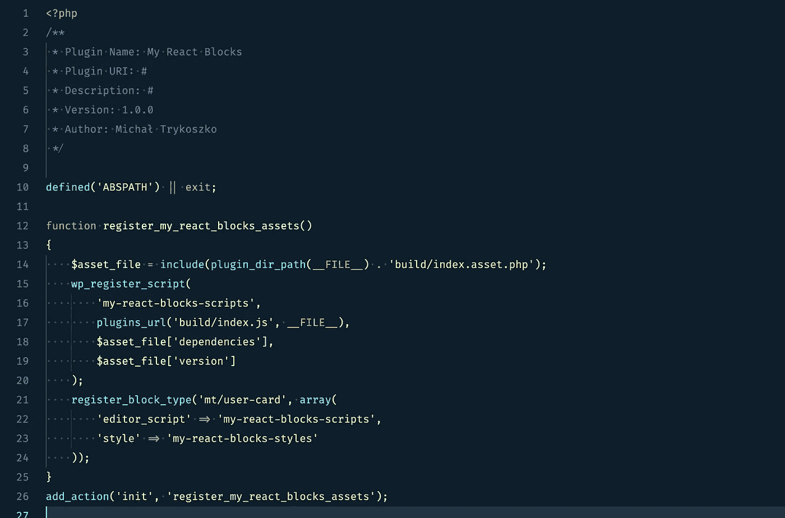

All the PHP code we need for now

干得好！👏

顺便说一句。暂时不要启用你的插件！它可能会让你的 WP 安装崩溃。

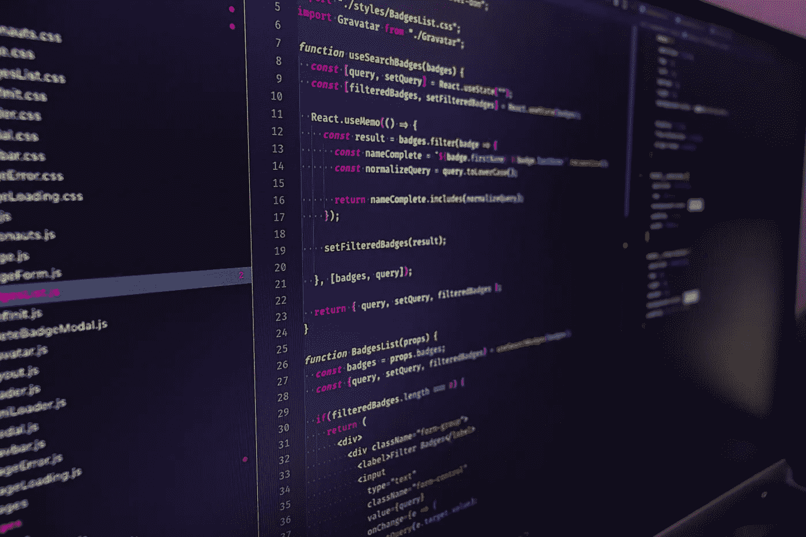

React Components

# 反应组分

首先，我们需要创建 React 组件和我们在未来的 Gutenberg 块中需要的任何功能，如事件、API 获取、状态或模拟，以及所有其他东西。

## 反应组件生成

启动 React 项目有很多方法，比如项目样板、框架等等。我们也可以直接在 Next.js 应用程序中创建组件。但是在古腾堡身上使用可能会有问题。我将在这个项目中使用众所周知的****。我们将使用它来构建我们的组件，然后我们将使用它作为古腾堡区块的基础。****

> ****为什么是 CRA？😠****

****我必须说这是最省时的方法吗？****

## ****出发点****

****首先，进入插件的根目录，为我们的组件创建一个子文件夹。让我们和 CRA 一起创造它:****

****`npx create-react-app components`****

****接下来，我们需要创建我们的 React 组件。我不会在我的文章中涉及这一部分，因为它会花费太长时间。你可以在网上找到很多关于 [React](https://reactjs.org) 的资源。这里有一些提示。****

## ****RFC 或 RCC****

****您可以为 Gutenberg 创建`functional`或`class`组件。**两者都可以工作**并且…****

*   ****…是的！你将能够使用 [**反应钩子**](https://reactjs.org/docs/hooks-intro.html) 比如`useEffect()`里面的功能组件和…****
*   ****…是的！您将能够使用 [**生命周期方法**](https://reactjs.org/docs/react-component.html) 等`componentDidMount()`类内组件****

****…并在 Gutenberg 内部、WP 前端和 Next.js 中使用它们。****

## ****状态****

****要管理组件的状态，可以使用任何种类的 React 状态管理，如 Redux、React Context 或任何其他方式，就像创建独立的 React 应用程序一样。你也可以像我一样嘲笑你的 API。****

****更多关于反应状态和生命周期的信息请点击。****

## ****示例组件****

****我做了一个组件，在一个小盒子里显示用户的数据。此外，还有一个模式/手风琴，它可以在点击按钮时打开和关闭。****

****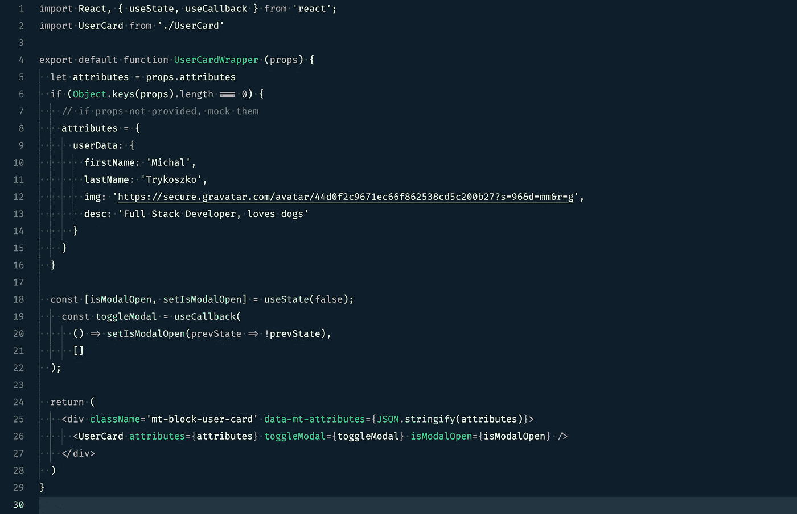****

****An example of React Functional Component (UserCardWrapper) I made for this article****

****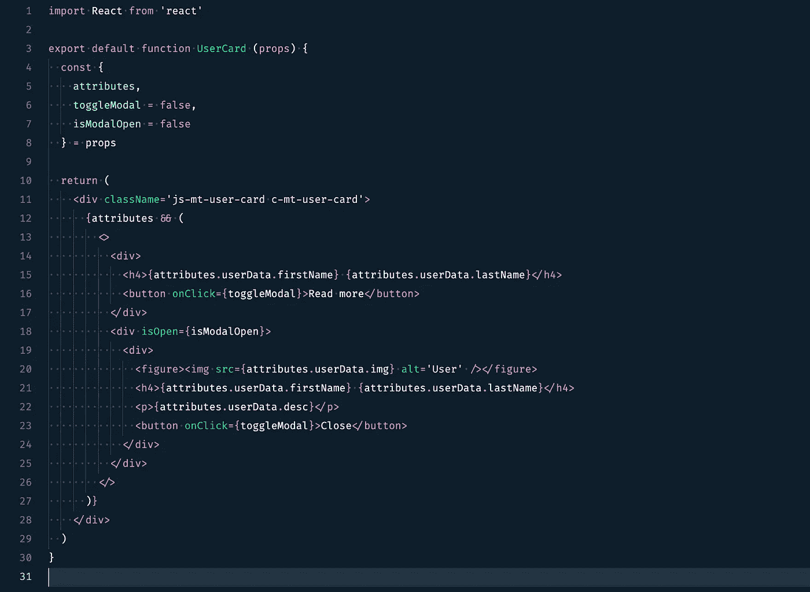****

****An example of component (UserCard) which will be imported to parent****

****注意和 [React 挂钩的用法(例如](https://reactjs.org/docs/hooks-reference.html#useeffect) `[useState()](https://reactjs.org/docs/hooks-reference.html#useeffect)` [)](https://reactjs.org/docs/hooks-reference.html#useeffect) 只在父组件中使用。稍后我会解释为什么它只在顶层组件中。****

****这就是组件的样子:****

****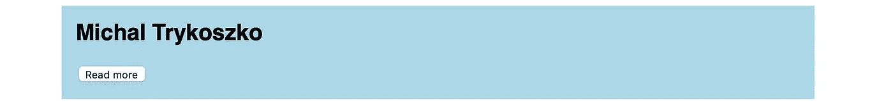****

****The component itself (isModalOpen = false) (please don’t dislike me for taste! 😂)****

****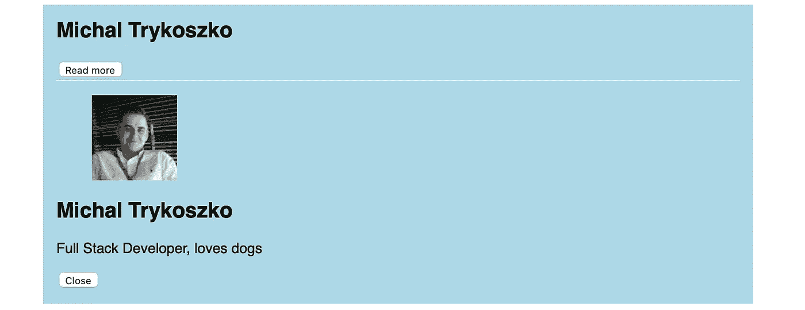****

****The component itself (isModalOpen = true)****

****这将是足够的纯反应了。我们用 WordPress 混合一下吧！****

********

# ****`registerBlockType: "WordPressify" React component`****

****这是我们将结合 JavaScript 和 WordPress 的部分。****

****你可能知道，JavaScript 的生态系统允许我们使用 NPM 来管理包，就像 PHP 中的 Composer 一样。`@wordpress/*`上面提到的当然都有。我们要用它。****

******从**开始，在你的插件根目录下创建一个`package.json`文件(在`index.php`旁边)。要做到这一点，打开终端，进入插件根目录，键入`npm init`并通过所有步骤来配置软件包。****

****然后，通过键入`npm install @wordpress/scripts --save-dev`来安装`@wordpress/scripts`。您肯定知道，React 需要编译才能在浏览器中运行。这就是为什么我们需要导入官方的`scripts` [包](https://developer.wordpress.org/block-editor/packages/packages-scripts/)。然后，为了利用它，给`package.json`加两个`scripts`:****

1.  ****`build` — `wp-scripts build ./src/index.js`****
2.  ****`start`——`wp-scripts start ./src/index.js`****

****现在，您的 package.json 应该如下所示:****

****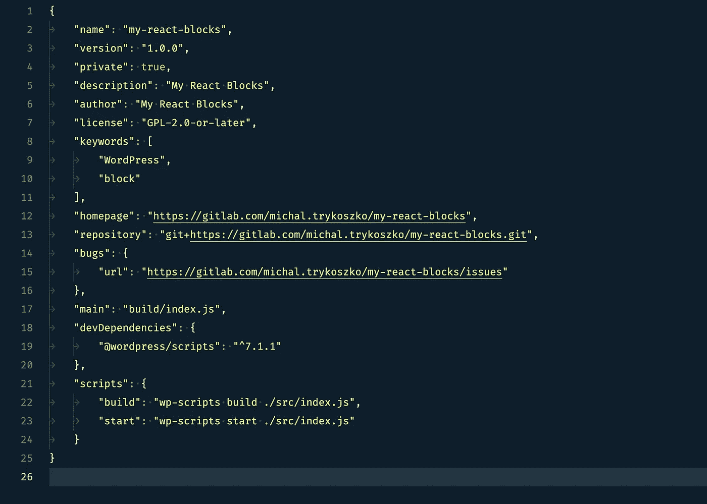****

****package.json with @wordpress/blocks and scripts****

****为了运行脚本，让我们创建之前在`package.json`中链接过的`./src/index.js`文件:****

****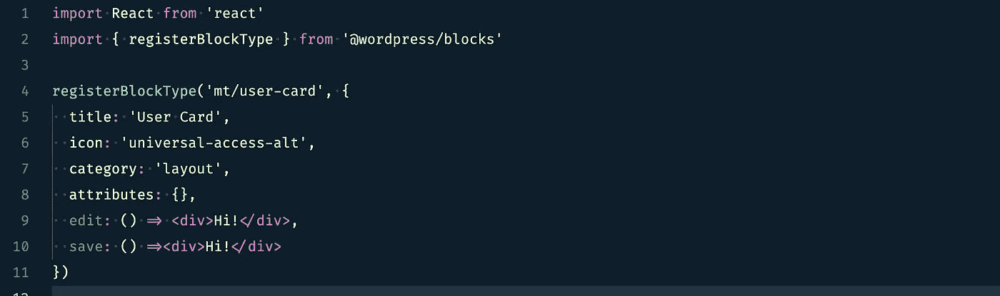****

****./src/index.js****

****如你所见，我已经安装、导入并使用了来自`@wordpress/blocks`的`registerBlockType`函数，并提供了一些数据，如标题、图标、类别和空属性对象。我还导入了 React，因为它强制使用 JSX。****

****下面是上面使用的例子:****

****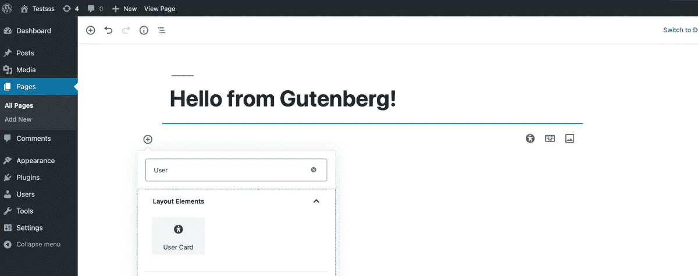****

****You can already add your block to any of your posts****

****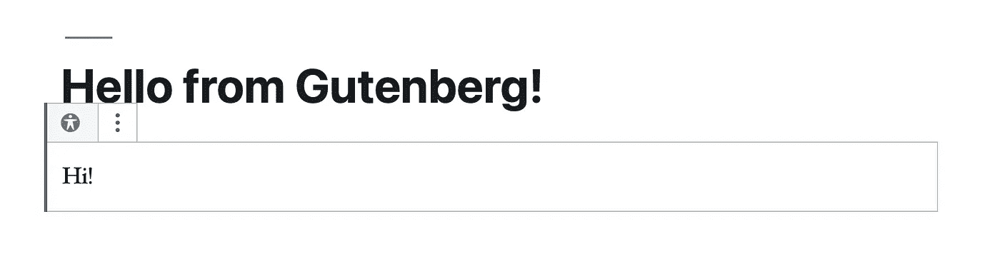****

****Here’s the live example of block we created****

## ****两个不错的函数——edit()和 save()****

****根据官方 WordPress 文档，我们可以在`registerBlockType()`中使用两个方便的功能。****

****其中一个是`edit()`，在`wp-admin` post edit screen 内渲染块时会用到。****

****另一个是`save()`。将块作为静态 HTML 保存到数据库时将使用它(因为所有块都作为静态 HTML 保存到数据库！).****

****请记住，向两者传递相同的组件是可能的，但在我看来这没有多大意义。通常`edit()`比`save()`复杂得多，因为我们可以在这里使用`InspectorControls`和 WordPress 的其他好东西。我们还管理`edit()`中的侧边栏“元框”。****

******注意**:不幸的是，像 CSS-in-JS 或 React hooks 这样更复杂的功能在`save()`中无法使用。这就是为什么我首先将组件分为子组件和父组件。****

****让我们利用之前创建的 React 组件。****

****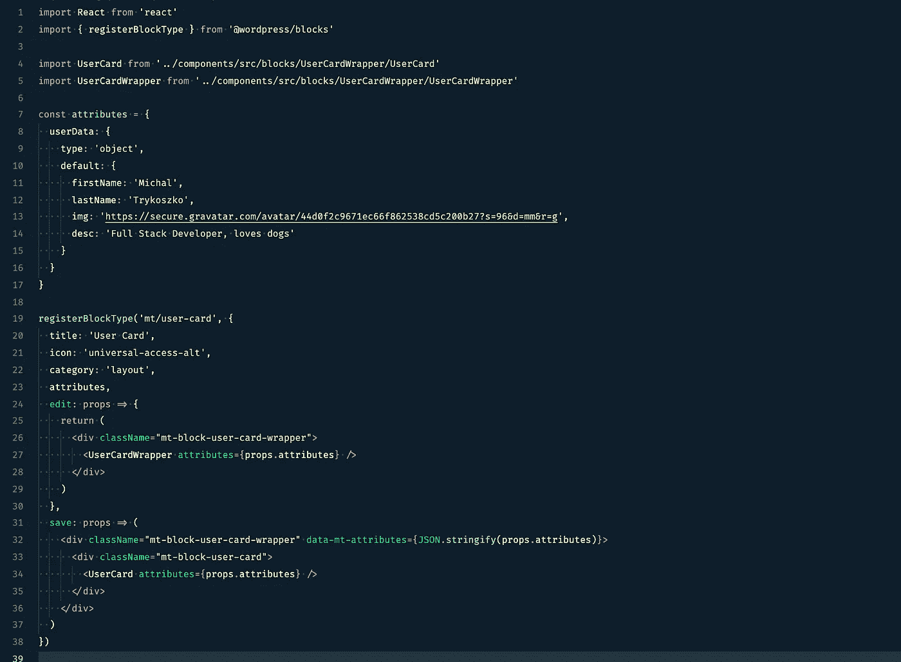****

****Our React Component inside Gutenberg****

****我在这里补充的是:****

*   ****我已经将我们的 React 组件传递到古腾堡内部进行渲染了****
*   ****我已经为 block 分配了一些默认属性(就像我之前模仿组件内部的 API 一样)****
*   ****我在`edit()`和`save()`里面都添加了一些包装`<divs>`——以便在`edit()`中使用 React 钩子****

****这是古腾堡内部街区的样子:****

****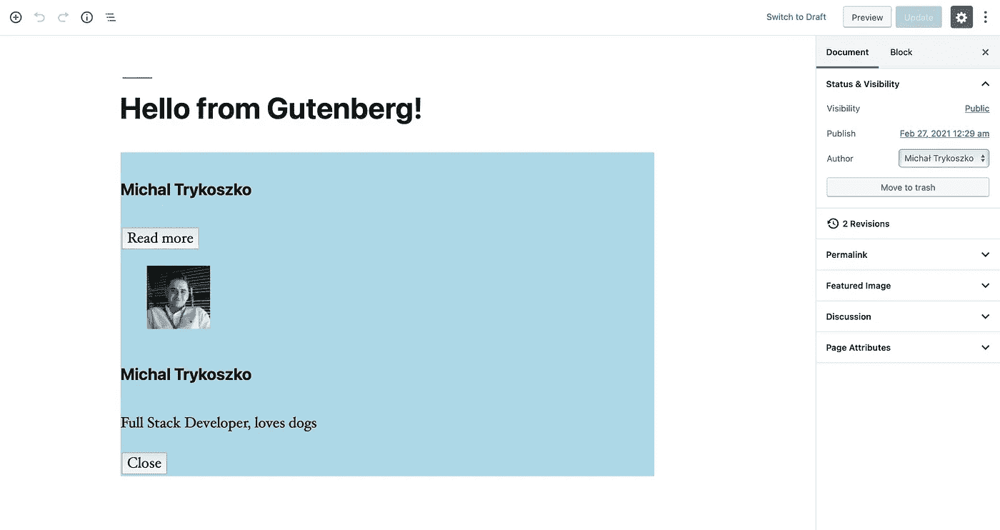****

****WordPress Gutenberg block made from React Functional Component****

****这就是它在前端的样子:****

****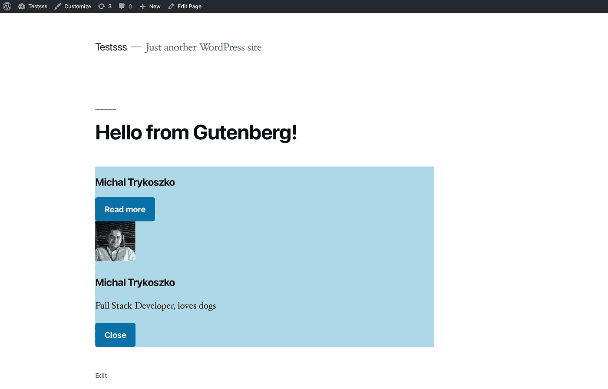****

****React-built Gutenberg block****

## ****试试看，玩玩吧！****

****当然风格不同，JavaScript 也不行。这些问题将在下一集讨论。****

# ****摘要****

****如果你觉得缺少或者卡在某个地方，我还做了一个演示块，这里:[https://github . com/trykoszko/Gutenberg-block-hydration-example](https://github.com/trykoszko/gutenberg-block-hydration-example)。如果你愿意，你可以使用它或贡献它。****

****大约一年前，我还发布了一个关于古腾堡块状水化的视频:****

****Make your React Gutenberg block interactive****

****BTW！关于 WordPress JavaScript API，我有一个提示给你。进入文章编辑界面，打开控制台，输入`wp`。你会看到很多很酷的东西！****

****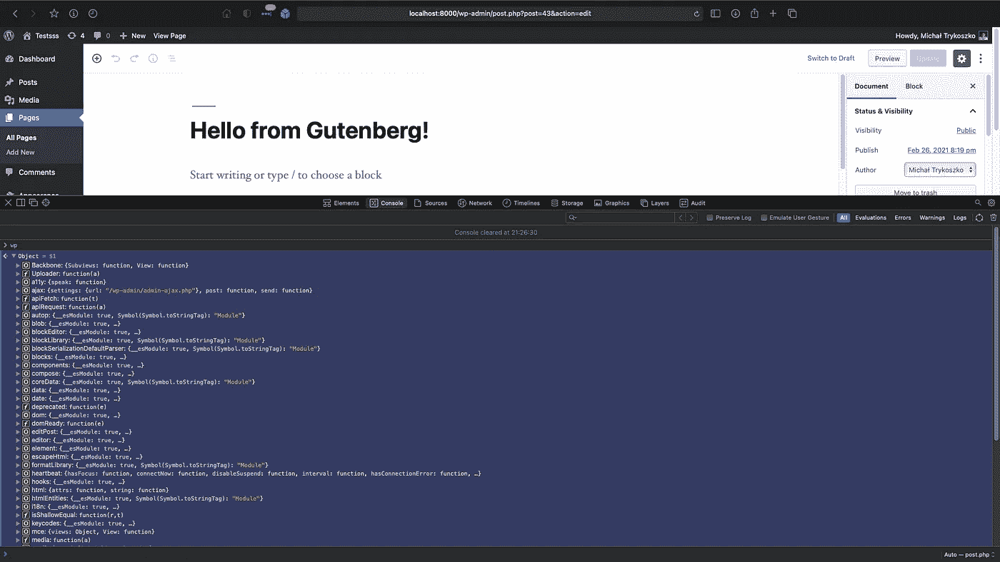****

****wp object inside WordPress post edit screen****

****今天到此为止。在这篇文章的下一部分，我们将涵盖更高级和更深入的主题，如**古腾堡块水合**和**无头 WordPress Gutenberg + Next.js** 。他们很快就会出来。****

****随时让我知道你的任何想法！这是 WordPress 的未来吗？你有什么看法？****