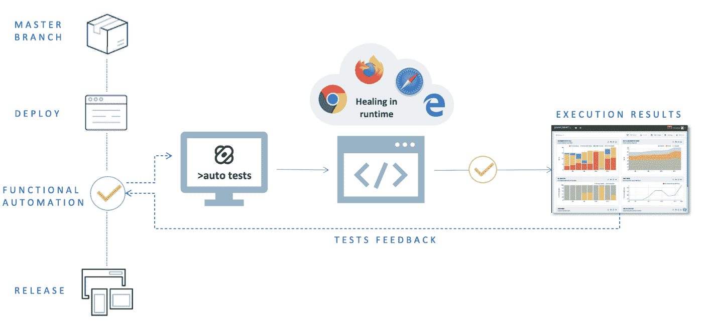
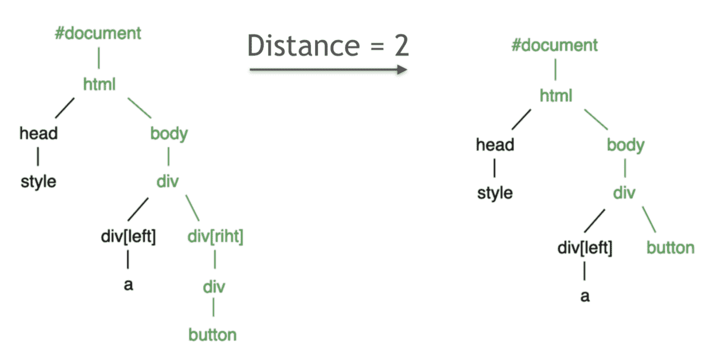
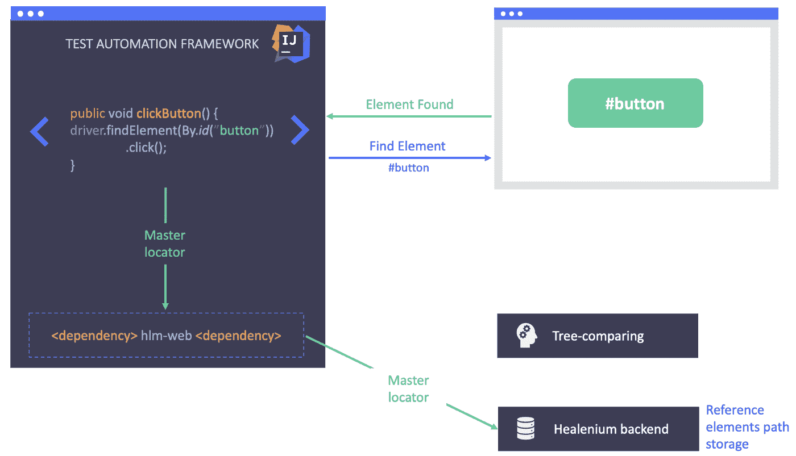
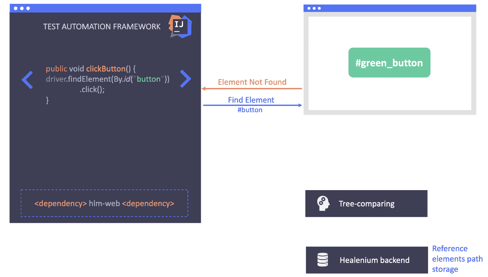
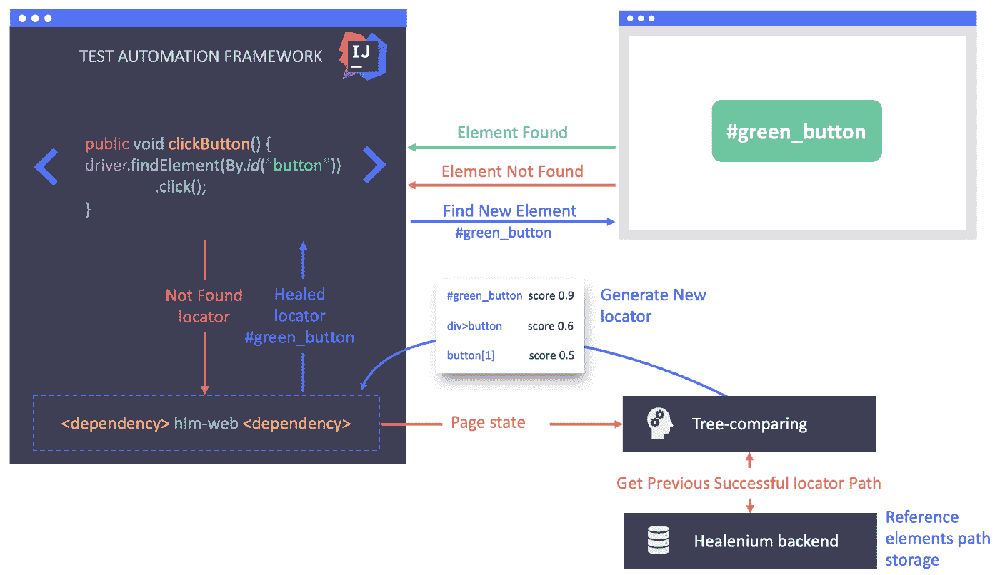
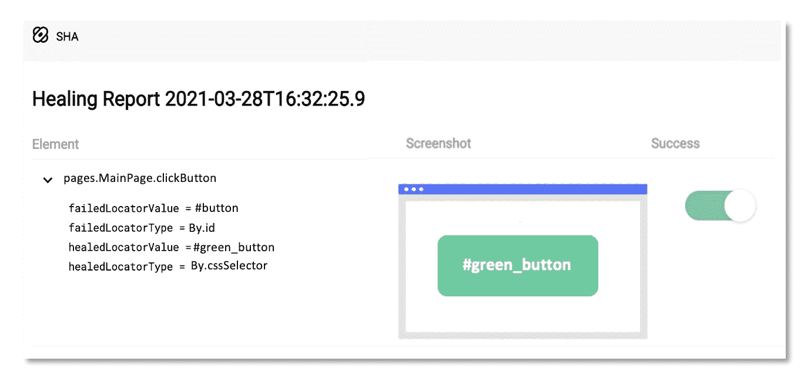
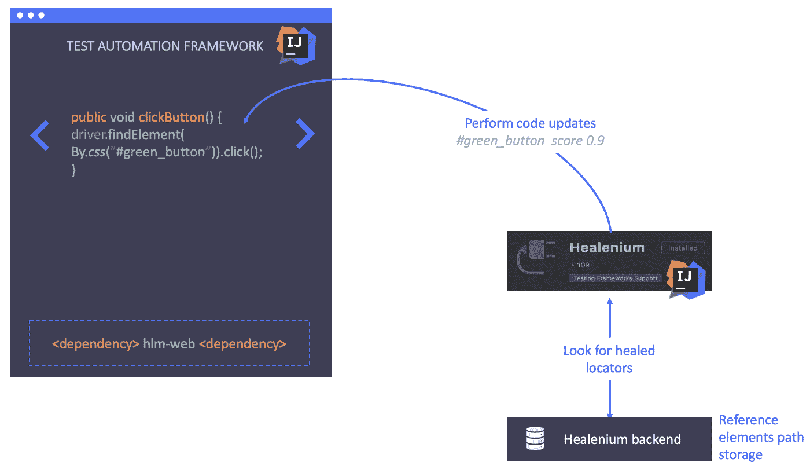

# healenium:Selenium 测试自动化的自我修复库

> 原文：<https://medium.com/geekculture/healenium-self-healing-library-for-selenium-test-automation-26c2358629c5?source=collection_archive---------2----------------------->

由于布局的改变和选择器的损坏，所有的自动化 UI 测试迟早都会捕获到 NoSuchElementException。结果，测试崩溃，CI 构建变成红色。在这篇文章中，我将介绍一个名为 [Healenium](https://healenium.io/) 的自我修复库，它的功能和用途。

Healenium 是一个人工智能驱动的[开源](https://github.com/healenium)库，它提高了基于 Selenium 的测试的稳定性，自动处理更新的 web 元素的变化，并使用自我修复机制帮助克服 UI 自动测试不稳定的问题。

**Healenium 为企业带来巨大价值:**

*   它最大限度地减少了测试自动化代码维护时间，因此团队可以专注于增加覆盖率。
*   由于修复是在运行时执行的——自动化的端到端测试将是稳定的，UI 更改将不再影响它们。
*   测试提供准确的质量反馈，CI 渠道只有在出现与产品相关的问题时才会失败。

# 里面有什么？

在引擎盖下，Healenium 使用一种机器学习算法来分析当前网页的变化:用权重修改最长公共子序列算法。它解决了为标签、Id、类、值和其他属性寻找一组序列中所有序列共有的最长子序列的问题。所以如果一个元素改变了它在 DOM 中的位置或者有了新的 id，Healenium 会找到它并生成新的 locator。

# 【Healenium 是如何工作的？

让我们看看这个例子。

假设我们试图通过 id**#按钮在 UI 上找到我们的元素。**

正如我们所看到的，元素被成功地找到了。Healenium 在存储器中保存一个成功的定位器，作为下一次测试执行的基线

现在假设 UI 发生了变化，目标元素的新 id 是一个 **#green_button。**但是测试团队没有意识到这些变化，也没有更新测试自动化代码库。

因此，我们试图通过旧 id **#button** 找到目标元素，结果没有找到元素。

标准的 Selenium 实现测试在这种情况下会失败，但 Healenium 不会。Healenium 捕获 NoSuchElement 异常，触发机器学习算法，传递当前页面状态，获取之前成功的定位器路径，比较它们，并生成修复的定位器列表。

它采用得分最高的定位器，并使用该定位器执行操作。

正如我们所看到的，该元素被成功地找到并通过了测试

测试运行后，Healenium 会生成一份报告，其中包含关于修复定位器、屏幕截图和修复成功反馈按钮的所有详细信息

如果修复成功，我们可以使用 Healenium Idea 插件更新我们的自动化测试。插件寻找修复并使用修复的定位器更新测试代码

# **Healenium 基础架构包含几个组件:**

[**healenium-web**](https://github.com/healenium/healenium-web)**—集成了测试自动化框架的 Java 库**

*   **实现 Selenium WebDriver**
*   **覆盖 findElement()方法**
*   **捕捉 NoSuchElementException**
*   **激活树比较库中的 LCS 算法**

**[**healenium-back end**](https://github.com/healenium/healenium-backend)**—管理修复的 docker 容器，包括存储元素信息的 PostgreSql 数据库****

*   ****将参考元素路径保存到存储器****
*   ****从存储中获取引用元素路径****
*   ****收集数据以生成报告****

****[**healenium-report-Gradle**](https://github.com/healenium/healenium-report-gradle)**，**[**healenium-report-maven**](https://github.com/healenium/healenium-report-mvn)**—Gradle 和 Maven 报告，在每个测试套件运行后监听触发的测试会话并生成报告链接******

********树比较—** LCS 算法实现******

*   ****获取当前 DOM 状态****
*   ****在当前状态下搜索最佳子序列****
*   ****生成新的定位器(CSS、XPath、id 等。)****

****[**healenium-Idea**](https://github.com/healenium/healenium-idea)—Intellij Idea 插件，在数据库中搜索治疗结果并更新代码库中的定位器****

# ******高级** Healenium **特性:******

*   ****多项目工作——您可以将不同项目的几个测试自动化框架连接到一个 Healenium-backend 实例。****
*   ****并行测试执行——不要用一个线程来限制自己****
*   ****在远程基础设施上执行测试——您可以在 Selenium Grid 或 Selenoid 上运行测试****
*   ****Iframes，JS 动作支持—用于高级测试****
*   ****与 selenium 等基于硒的框架集成，用于您的测试实现****
*   ****适用于带[装置](https://github.com/healenium/healenium-appium)的移动测试。****
*   ****借助于 [healenium-RP](https://github.com/healenium/healenium-plugin-reportportal) 扩展，测试执行结果可以存储在报告门户中****

# ****结论****

****我想强调的是，Healenium 可以成为解决项目 UI 自动测试不稳定问题的完美解决方案:****

*   ****频繁的用户界面变化****
*   ****由内容管理系统生成的用户界面****
*   ****基于 Selenium WebDriver 的测试自动化****
*   ****需要本地化测试或在 Internet Explorer 下测试的项目****

******在官方 [GitHub repo](https://github.com/healenium/healenium-example) 中可以找到 Healenium 在不同测试自动化框架中使用的例子******