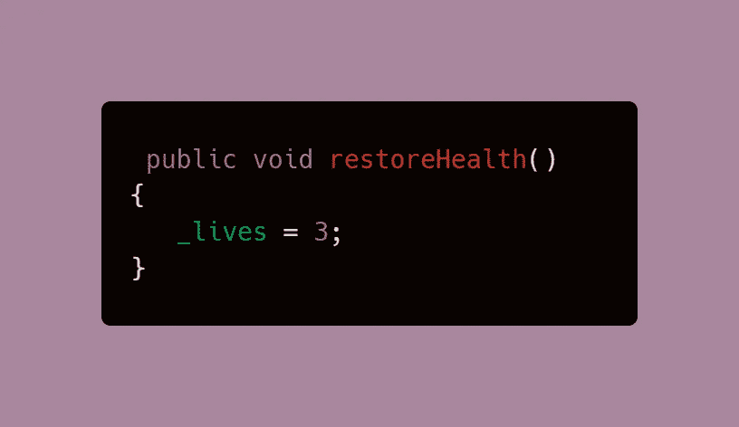
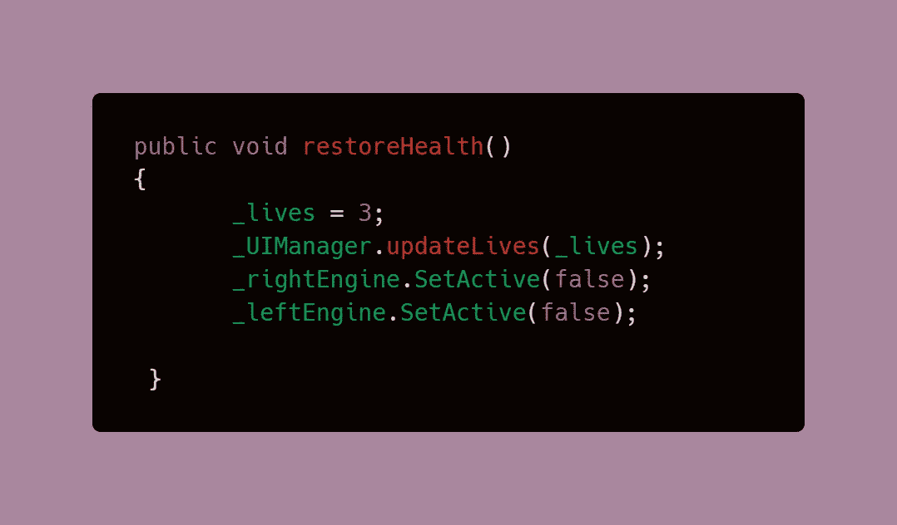
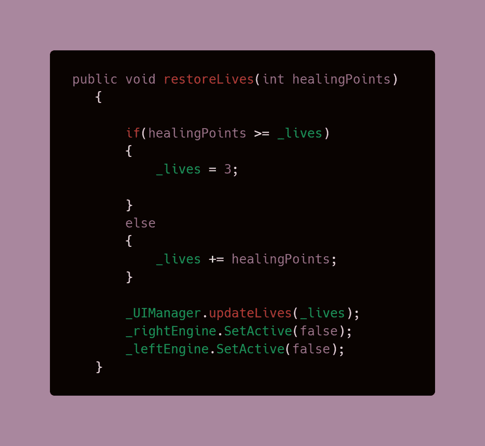
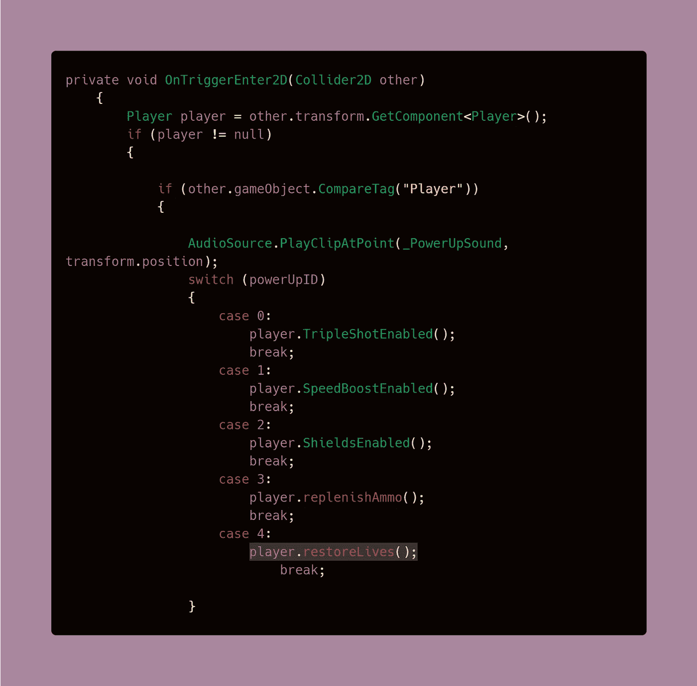
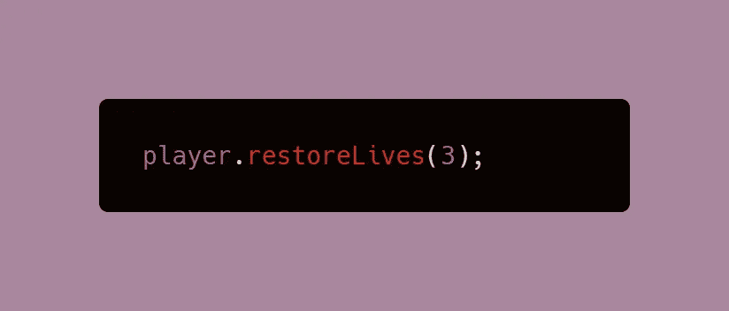
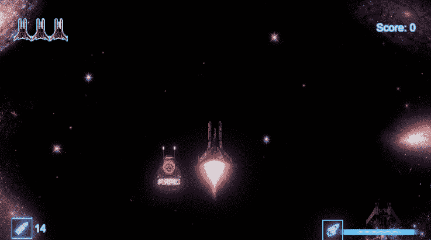

# 健身收藏品

> 原文：<https://medium.com/geekculture/health-up-collectible-ea1d61b3f4b?source=collection_archive---------59----------------------->

在创建了一个[生命计数器 UI 元素](/codex/creating-a-lives-counter-ui-element-in-unity-9d48b485555e)，并使用精灵添加了[伤害 VFX 之后，是时候给玩家一个治疗的方法了。出于我的 2D 太空射击游戏的目的，这将以加电的形式完成，但是这种逻辑可以用于任何使用碰撞系统的收藏品。](/codex/damage-vfx-using-animated-sprites-in-unity-c13e2dbb68bb)

**目标**:创造一种能量，收集后可以使生命恢复到最大值，或者选择值。我们也将禁用破坏视觉效果，使船看起来全新。

# 治疗玩家

治疗玩家或者增加生命值很容易完成。在[生命计数器 UI Elemen](/codex/creating-a-lives-counter-ui-element-in-unity-9d48b485555e) t 代码中，我们为玩家生命设置了一个变量，这个变量可以在任何需要的时候用来操作数字。

1.  创建一个处理修复行为的方法。所有的行为需要做的是采取球员生命变量，并将其分配到最大或默认的能力。这样，不管集体伤害如何，当他们与这个收藏品相撞时，游戏将总是回到完全健康状态。通过指定默认值而不是使用加法，你不会有超过最大生命值的治疗值。

**替代方法:**如果你想有一个方法，允许你添加不同数量的生命。你可以创建一个带有 int 参数的方法，就像在[弹药收集代码](/geekculture/refill-player-ammo-without-overshooting-the-clip-capacity-1e9a890857d2)中使用的一样。这允许您在调用该方法时分配任何数字，但是要注意溢出值。这里，我们避免使用简单的 if-else 语句。

2.既然我们也有[伤害 VFX](/codex/damage-vfx-using-animated-sprites-in-unity-c13e2dbb68bb) ，我们需要在治疗的时候禁用那些。我选择关闭所有的伤害 VFX，因为我的生命能量可以治疗所有伤害。用户界面也需要更新，以反映生命的数量。

> **注意**:提醒一下，这个脚本使用了来自 Lives UI Elements 脚本的代码，这就是 updateLives 方法的起源。

使用另一种方法，您必须注意代码是如何放置的。如果你有受损 VFX，你可以选择什么时候去激活它们，以及有多少会被激活。

3.在冲突检测代码中调用方法。在我的例子中，我使用的是一个[模块化加电系统](https://levelup.gitconnected.com/creating-modular-power-up-systems-bcf349e0020)，它利用[开关声明](https://levelup.gitconnected.com/switch-statements-to-the-rescue-277cb924c312)来实现所有不同的[加电](https://levelup.gitconnected.com/adding-power-ups-e4af4ccbd7cb)效果。

如果你最终使用了**替代方法**，这里是你分配你想为玩家恢复多少生命或生命值的地方。您可以使用以下语法简单地调用该方法:

4.最后，使用一个[协程](/codex/coroutines-with-unity-b5a2b3fc3426)随机实例化加电来处理生成。

## 结果是:

