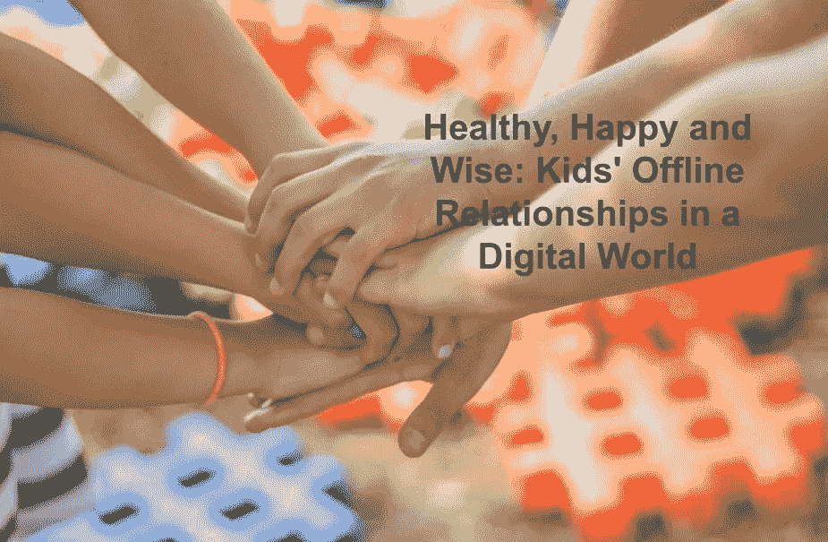

# 健康、快乐和智慧:数字世界中孩子们的线下关系

> 原文：<https://medium.com/geekculture/healthy-happy-and-wise-kids-offline-relationships-in-a-digital-world-4db2f05d7bba?source=collection_archive---------13----------------------->

我们都希望我们的孩子快乐成长。什么会给他们带来幸福？是钱吗？名气？基因好？不。很多人都有这些，他们非常痛苦。

事实证明，让生活变得美好的是一个人的人际关系的质量。

这一发现来自哈佛成人发展研究，这是对人类幸福最长的研究，已经持续了 80 多年。研究人员从 1938 年开始追踪一组人的一生。

他们发现，亲密关系——而不是财富或成就——保护我们的身心健康，并导致更长寿和更幸福的生活。*“在 50 岁时对感情最满意的人在 80 岁时也最健康，”*该研究的现任负责人罗伯特·沃尔丁格说。[他的 TED 演讲，题目是“什么造就了美好的生活？关于幸福的最长研究的教训，《T5》已经被观看了数百万次。](https://www.ted.com/talks/robert_waldinger_what_makes_a_good_life_lessons_from_the_longest_study_on_happiness)

Waldinger 博士解释了为什么关系如此重要:*“个人联系创造精神和情感刺激，这是自动的情绪助推器，而孤立是情绪破坏者”。*

**在我们孩子的数字世界中，个人联系会发生什么变化？**

# 隔离

我们的设备，尤其是智能手机，非但没有改善人与人之间的联系，反而削弱和削弱了这种联系。因为每个人都在盯着自己上瘾的屏幕，家人越来越觉得彼此疏远。数字友谊是浅薄和支离破碎的。

整个商业模式都是为了孤立。孩子们可能在社交媒体上有数百个朋友，但却感到完全孤独，并经历抑郁和焦虑，这是孤独的典型标志。他们的幸福受到缺乏亲密关系的影响，专家将年轻人的心理健康危机归咎于智能手机。

但是等一下——他们联系如此紧密，他们无时无刻不在交流！难道所有的短信、发帖和分享不都像面对面的交谈一样有效地建立关系吗？不，不是这样的——麻省理工学院教授雪莉·特克说，她花了 30 年时间研究人们与科技关系的心理学。在她的书*回收对话:数字时代对话的力量*中，她解释了对话以三种方式支持我们的关系:

*   **自我反省:与自己的关系**
*   **移情:与他人的关系**
*   **存在:与世界的关系**

所有这三个层次的关系对人类的繁荣都至关重要。问题是——设备把它们都打乱了。

# 自我反省:与自己的关系

为了和别人有关系，孩子首先需要和自己有关系。他们需要定义自己是谁——这在网上聊天中是做不到的。

孩子们根本没有时间去了解自己。他们的数字自我[是为社会认可反馈](https://www.techdetoxbox.com/weapons-of-digital-manipulation/social-validation/)而设计的，总是让他们忙碌，而弄清楚他们到底是谁的内在工作却被忽视了。

这是[默认模式网络](https://en.wikipedia.org/wiki/Default_mode_network)的工作——一个基本的大脑系统，只有当我们无所事事时才会被激活。这是一种没有输入的状态。但是，当我们的孩子醒着的每一分钟都被数字输入超负荷时，就没有独处和思考的空间了。

因此，他们在成长过程中从未建立起自己的身份。他们不会花时间去处理自己的情绪。[他们的性格是他们“喜欢”的总和](https://www.techdetoxbox.com/screen-time-problems/self-esteem-the-sum-of-all-likes/)。他们总是被屏幕分散注意力，从不向内看，定义他们的价值观，或者回答“我是谁”和“我为什么在这里”这类深刻的问题。

孩子们考虑在社交媒体上“社交”的时间是一种联系，而不是一种关系。在社交媒体上，[自我反省变成了自我展示](https://www.techdetoxbox.com/weapons-of-digital-manipulation/social-validation/)，一种对无情观众的表演，导致强迫性使用、焦虑和自卑。一个真实的自我不存在，只有一个策划的形象，没有这个形象，他们觉得自己不存在。

这个虚假的网络自我无法承受给予和接受同理心的伤害。

# 同理心:与他人的关系

同理心是一种需要练习的技能。它是在面对面的关系中获得的，专家警告说，今天的年轻人严重缺乏同理心，因为他们的整个社交生活都发生在手机上。他们真的不知道如何与人交谈，这给别人和自己都造成了很大的伤害。

一个青少年可能在短信中冒犯了一个朋友，而他甚至没有注意到。他们看不到自己造成的痛苦:面部表情和眼神交流是一种非语言的反馈，只发生在真实的对话中。

网上的友谊比不上真实的关系，当浪漫转移到智能手机上时，爱情的魔力就消失了。不是求爱，而是直接在 Tinder 上滑动来勾搭。分手时，发一条短信或者干脆不回短信——这种行为被称为[重影](https://en.wikipedia.org/wiki/Ghosting_(behavior))，当有人没有解释就切断了所有的交流。这非常伤人。心碎了。自尊心被击垮了。对彼此这样做的年轻人甚至没有意识到一段浪漫的关系应该是完全不同的。爱值得存在。放弃值得一个结束的礼遇。

他们将如何与未来的配偶建立关系？他们将如何养育他们未来的孩子？

> 随着亲密关系中同理心的减弱，他们不再能维持人类的幸福。

一个完全缺乏同理心的人被称为精神病患者——无法理解另一个人的感受，表现出持续的反社会行为，极度自我专注，伤害他人却毫无悔意。

都是社交媒体上很常见的行为。

作为父母，我们可以也应该提供一个远离这个网络雷区的避风港。家庭的爱是我们的孩子需要的避难所。在一次简单的家庭聚餐中，可以发现人际关系的神奇效果。研究表明这是我们能为孩子做的最重要的事情:[一项研究发现，频繁的家庭聚餐可以保护孩子](https://www.ncbi.nlm.nih.gov/pmc/articles/PMC4325878/)远离毒瘾、暴力行为、抑郁和自杀，同时提高他们的自尊和学业成绩。

> 只有当每个人都放下手机，全神贯注地看着、听着、和他们所爱的人交谈时，亲密的家庭关系才有可能带来好处。

在我们家，当我们坐下来吃饭时，不允许使用任何设备——这为我们的 3 个孩子创造了一个参与谈话的机会。有时候我们会玩“玫瑰、荆棘和花蕾”的游戏——告诉我今天什么顺利，什么不顺利，你对未来有什么希望？我们都了解彼此，也了解自己。交谈需要努力，但它让家庭生活变得有意义:关注我们所爱的人。这不就是拥有一个家庭的全部意义吗？

# 在场:与世界的关系

在家人和朋友的圈子之外，还有一个更大的世界，我们的孩子需要在其中找到自己的位置。只要人类存在，选择脱离关系从来都不是一个选项:我们不得不为了生存而与对方打交道。

但是有了智能手机，孩子们可以避免传统的交流方式。给青少年打电话是徒劳的，他们不会接的。他们必须思考该说什么，实时对他人的情绪做出反应，并处理自己的情绪。太费脑力了。发短信容易多了。

谈话是不可预测的，因此是不舒服的——人们必须不惜一切代价避免不舒服，对吗？不对。

在不舒服的社交场合，孩子们的默认行为是躲在手机里。避免学习与他人联系的重要脑力劳动。但是当他们坚持总是“舒服”的时候，这正是让他们在情感上脆弱和对现实生活毫无准备的原因。

我教我的孩子看着别人的眼睛，介绍自己，并参与对话。

因为生活不是一个“安全空间”。容忍社交不适对于接受教育、建立事业、组建家庭或环游世界是必要的。个人和职业生活的成功意味着投入时间和精力与他人建立关系。

> 我们的孩子需要学会关注他人。从电话上抬起头来。

人类的大脑为社会联系预先做好了准备，当孩子们被剥夺了面对面的接触，他们的[社会技能就会萎缩](https://www.techdetoxbox.com/screen-time-problems/social-skills-in-a-digital-age/)。这是一个“使用它或失去它”的情况，令人上瘾的技术可能会损害他们的生活有多成功。

他们打算如何与未来的同事和难缠的老板沟通？成功的团队合作仍然依赖于建立在合作关系中的相互尊重。他们会是什么样的领导者？毕竟，管理者仍然需要面试候选人，进行绩效评估，解雇员工。商界人士证实，不在同一个房间握手，很难达成交易。

归根结底，人际关系很重要。我们需要的是一种建立在关系价值之上的技术，一种优先考虑儿童社交发展而不是最大化他们屏幕时间的技术。

# 支持关系的技术

人性化的技术让我们能够通过手机引导我们的孩子建立更健康的人际关系，帮助他们锻炼社交技能，建立同理心，并与朋友和家人建立有意义的关系。

父母管理的智能手机用于交流，而不是上瘾，就是这种技术的一个例子。这个想法是让父母有能力将智能手机从老虎机变成支持儿童发展的工具。家长可以创建定制模式，以适应孩子的生活方式:例如，在上学期间只提供某些应用程序，如谷歌教室或计算器，放学后激活信使，Kindle 阅读，Spotify 音乐。

无论一天中的什么时候，手机上永远不会有任何有毒的东西——不允许使用社交媒体、视频游戏和网络浏览器。一个精选的应用列表包括 WhatsApp 和谷歌 Meet，用于与朋友联系——但你的孩子不会访问 Instagram 或 Snapchat 或抖音，以消失在令人上瘾的内容的兔子洞里。没有 App store。只有家长可以添加新的应用程序，并且选择仅限于儿童心理学家批准的应用程序。

如果我们想让我们的孩子在任何社交场合——学校郊游或家庭聚餐——都充分参与，我们可以暂时禁用所有应用程序，把智能手机变成一部基本的手机[。](https://www.techdetoxbox.com/screen-time-solutions/best-dumb-phones-for-smart-kids/)

破坏人际关系的技术和支持人际关系的技术之间的区别可以归结为手机是一种数字药物，而手机是一种工具。

当手机被用于物流，让孩子们聚在一起，而不是让他们分开时，它是一个有用的联系工具。当它用于社交媒体时，与同龄人联系的冲动通过社交媒体狂欢得到满足，剥夺了孩子从亲密关系中获得的终身利益。通过为我们的孩子提供以他们的福祉为出发点的技术，我们可以支持他们建立对他们的健康成长和发展至关重要的关系。

[TechDetox 妈妈](https://www.techdetoxbox.com/mission-screentime-children-wellbeing/)发现自己的孩子处于上瘾技术的[接收端，决定反击。](https://www.techdetoxbox.com/screen-time-problems/)

她对技术和心理之间关系的研究试图揭示数字行为操纵如何影响人类福祉。

她在她的博客【TechDetoxBox.com 上写道寻找[的解决方案](https://www.techdetoxbox.com/digital-wellbeing/)来保护我们的家庭和恢复我们的人性。