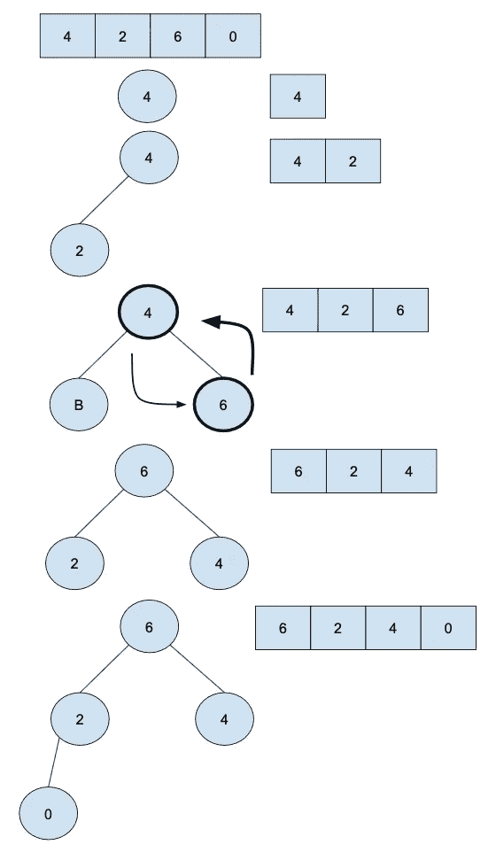

# 堆排序

> 原文：<https://medium.com/geekculture/heap-sort-6ee5206f0ba5?source=collection_archive---------21----------------------->

## 堆排序是基于(最大)堆数据结构的改进的选择排序；

它将元素分为两个子部分(已排序和未排序)。堆排序迭代地减少未排序的部分，删除“max”元素并将其移动到已排序的部分，直到未排序的部分为空。

**首先，构建最大堆:**

