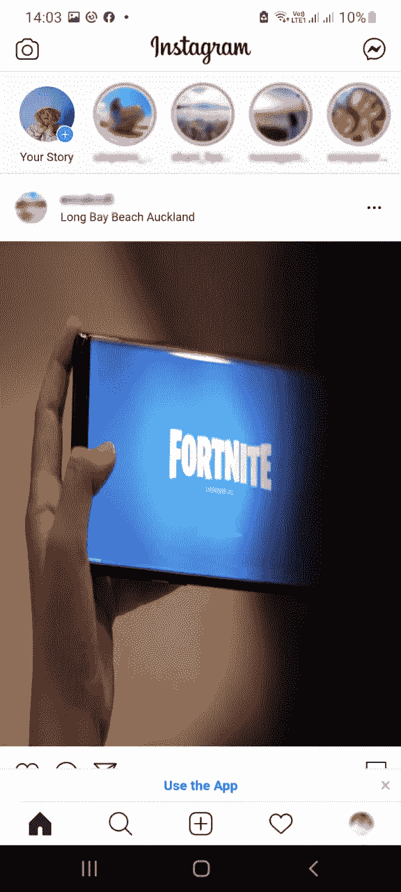

# 听说过渐进式网络应用吗？

> 原文：<https://medium.com/geekculture/heard-about-progressive-web-apps-aae6c26eeeba?source=collection_archive---------20----------------------->

你听说过渐进式网络应用程序(PWA)吗？我最近才知道这件事，并想写一篇关于 PWA 的小短文。

Different types of devices: different sizes, versions, OSs, and capabilities

随着时间的推移，移动应用程序开发已经成熟，但是跨平台应用程序开发仍在发展。由于几个原因，应用程序开发在技术上变得越来越复杂。诸如设备碎片、多个版本的并行使用以及可能的特定于供应商的添加等原因使应用程序开发变得复杂。应用程序需要在不同的设备上运行，如智能手机、平板电脑、电视、游戏机、可穿戴设备或物联网设备，这使得开发人员的生活很艰难。

几年前，当您构建一个移动应用程序时，如果您希望同时支持 Android 和 iOS，您可能会为 Android 和 iOS 开发单独的应用程序。但是今天，如果我们正在构建一个 web 应用程序，我们仍然可以进行以平台为中心的或本地的开发，或者有跨平台的应用程序开发，它只有一个代码库，用于多个操作系统。渐进式 web 应用程序是我们可以用来构建跨平台应用程序的另一种方法。如果多讲这三类手机 app 开发方式，

**以平台为中心的或本机的**应用仅针对一个特定的操作系统而构建。例如，Android( *Java、Kotlin* )、iOS( *iOS、Objective-C 和 Swift* )或 Windows( *C++、C#、Visual Basic 和 JavaScript)*

**跨平台**应用程序提供统一的开发接口来构建可以在多种操作系统上运行的应用程序。(框架:Flutter、React Native、Ionic、Xamarine、PhoneGap)

**PWA** 结合网络技术实现原生应用的功能。

# 什么是 pwa？

如果我们将 PWA 与基本的 web 应用程序进行比较，主要区别在于 PWA 提供的附加功能和 UX，更接近于本机应用程序。常规的网络应用程序要求用户每次访问时都要打开浏览器，输入网址，等待下载内容。因此，这阻止了用户离线使用应用程序。PWA 可以下载所有必要的详细信息、文件和图像，并将它们存储在用户的设备中，这允许用户离线或在低连接性区域使用应用程序。

如果我们将 PWA 与本机或跨平台应用程序进行比较，主要优势是 PWA 在用户手机中留下的足迹最小。PWA 和本机应用程序之间的其他主要区别是 PWA 非常小，只有本机应用程序的一半大小。

如果从技术上讲，Progressive Web App 是一个常规的网站，有一个基于 JSON 的元数据文档(manifest)，一个应用外壳和一个用 JavaScript 编写的后台脚本(Service Worker)。

服务工作器是用来处理所有网络、缓存逻辑和后台任务的脚本。所有现代浏览器都支持这个服务工作者。你可以从[这里](https://jakearchibald.github.io/isserviceworkerready/)看到服务人员对浏览器的支持。

为了测试这类应用，Google 发布了一个面向开发者的 PWA 测试工具 Lighthouse。

# PWA 的技术限制

原生或跨平台开发允许在原生 SDK 中使用大多数开放设备 API。对于 pwa，应该可以通过浏览器访问这些 API。但是浏览器不断地增加支持，并引入支持模块来实现它们。另一个限制是操作系统数量的增加，同一操作系统的不同版本，使用的不同浏览器。这些碎片化使得使用 PWA 作为移动应用程序的统一开发机制变得更加困难。

# PWA 示例

*   中等
*   优步
*   拼趣
*   照片墙
*   Spotify

PWA 还在发展。它需要如此多的改进，而大多数提供 PWAs 的应用程序并不支持本机应用程序提供的所有功能。但是我们可以希望 PWA 最终会被改进成为移动应用程序的统一开发机制。

最后，如果您想知道如何在您的移动设备上安装 PWA，请遵循以下步骤。

# 如何安装我的 Instagram PWA？

打开浏览器，输入 instagram.com

一旦页面加载完毕，点击 Chrome 浏览器中的三个点。点击“安装应用程序”

然后，该应用程序将被添加到您的主屏幕。点击应用程序图标并打开应用程序。

Instagram PWA

这是你的 Instagram PWA，和原生应用很像。你看不到屏幕顶部的地址栏。

希望你从中学到了新的东西。我认为，作为下一步，最好将 PWA 的性能与本机或跨平台应用程序进行比较🙂 🙃

## 基于:

Majchrzak、Tim A、Andreas birn-Hansen 和 Tor-Morten grn Li。“渐进式 web 应用:跨平台开发的确定方法？."(2018).