# 统一 HDRP 的高度图和位移

> 原文：<https://medium.com/geekculture/height-and-normal-maps-in-unity-hdrp-324fefb0d188?source=collection_archive---------2----------------------->

## HDRP 允许一些令人印象深刻的图形功能。纹理高度图和像素/顶点位移就是这样的特征。

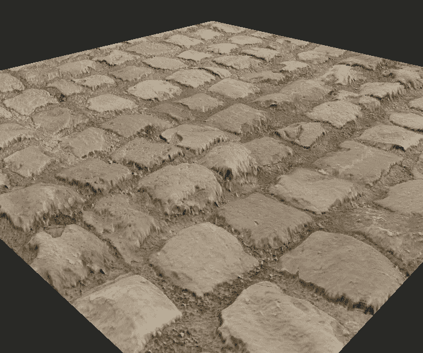

**今天的目标** e:探索纹理高度贴图、法线贴图和置换选项，创建逼真的视觉效果。

# 什么是高度图？

高度贴图不是 Unity/HDRP 特有的功能，而是大多数材质/环境创建软件的常见部分。

简而言之，高度贴图是应用于材质的图像，以及单独的纹理(外观)图像，它使用该材质为 2D 形状提供深度/高度的错觉。

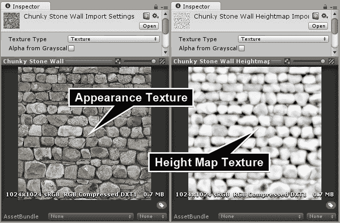

[https://docs.unity3d.com/540/Documentation/Manual/StandardShaderMaterialParameterHeightMap.html](https://docs.unity3d.com/540/Documentation/Manual/StandardShaderMaterialParameterHeightMap.html)

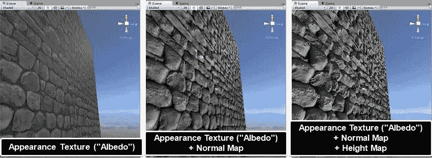

[https://docs.unity3d.com/540/Documentation/Manual/StandardShaderMaterialParameterHeightMap.html](https://docs.unity3d.com/540/Documentation/Manual/StandardShaderMaterialParameterHeightMap.html)

考虑到我们最喜欢的现代 AAA 游戏如果只使用左图所示的反照率纹理会是什么样子，这已经很令人惊讶了。

更令人惊奇的是:

> 不管它看起来如何，上面显示的所有物体仍然是 2D 平面，没有三维几何什么的！

但是它们看起来真的是 3D 的，不是吗？

# 不同选项如何影响材质:

## 没有法线或高度图的反照率:

表面纹理逼真，但看起来完全平坦和 2D，这是事实。

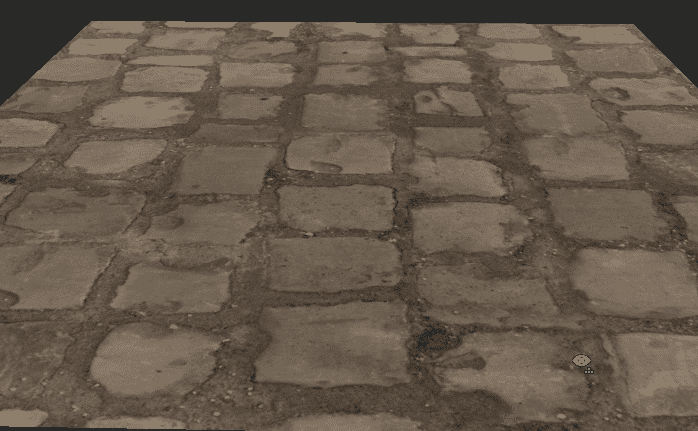

Albedo✅ Normal❎ Height❎

## 有法线贴图但没有高度贴图的反照率:

这个稍微好一点，个别岩石周围出现轻微的阴影和较亮的灯光，给人的感觉是稍微凸起的。

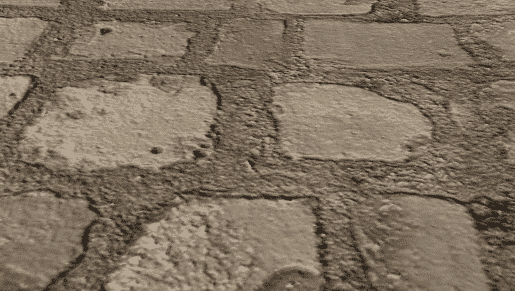

Albedo✅ Normal✅ Height❎

## 法线和高度图的反照率:

现在它真的开始看起来像一个 3D 鹅卵石表面。即使对象和材质仍然是 2D，渲染器也使用高度图数据来更改特定像素的渲染位置，给人一种它们比其他像素高的印象。

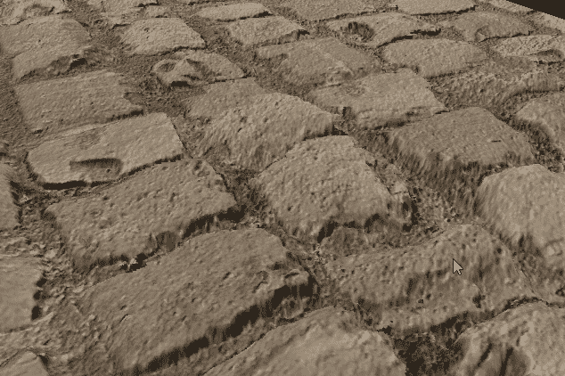

Albedo✅ Normal✅ Height✅

**注意:**这只是我设置的一个简单的例子，远没有达到预期的效果。你可以看看这篇文章顶部的 Unity 官方文档中的图片。
高度贴图级别的急剧变化有时会使结果看起来有点糟糕，所以建议使用像 Unity Docs 那样更平滑的图像。

# 要创造这样的材料:

(这些种类的材料也可以在非 HDR 管道中创建，但我目前正在使用 HDRP，所以如果你不是，我的选项可能看起来有点不同。)

基本(反照率)贴图和法线贴图选项通常在大多数着色器上可用。
您可以只使用一种颜色来设置底图，或者使用纹理文件和颜色来设置底图。
法线贴图需要一个纹理(导入时标记为“法线”)和一个强度。

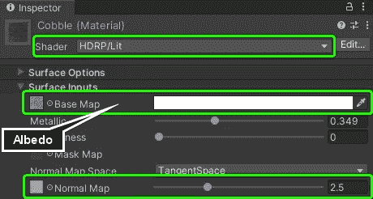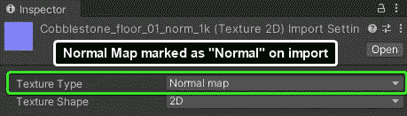

在 HDRP，默认情况下高度图选项不可见。您需要首先设置“置换模式”:

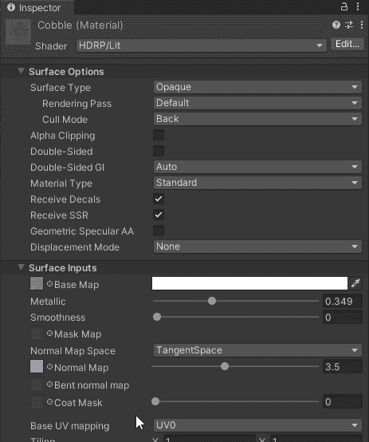

**像素置换:**纹理像素将被置换渲染，给 ***错觉*** 材质/物体是 3D 的。

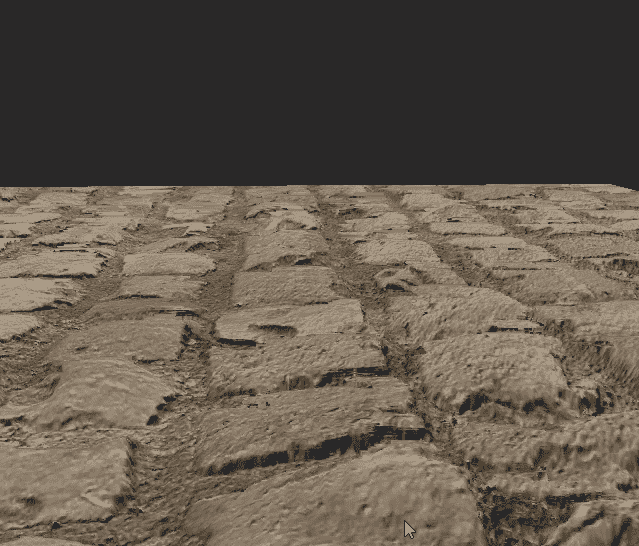

Pixel Displacement

**顶点位移:**物体的实际顶点**会根据高度图的数据移动**，**，*使物体 3D*** 。
这种方法非常依赖于对象网格中顶点的数量，因为单位越多意味着置换越精确。

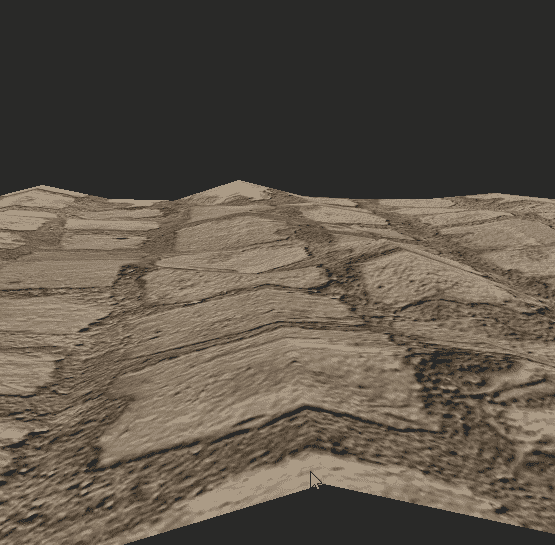

Vertex Displacement