# 你好█████魔方:三. js 场景角

> 原文：<https://medium.com/geekculture/hello-cube-your-first-three-js-scene-in-angular-176c44b9c6c0?source=collection_archive---------0----------------------->

Three.js 是一个 JavaScript 库，用于在 web 浏览器上创建和显示动画 3D 计算机图形，与 HTML5 canvas 元素、WebGL 和 SVG 兼容。

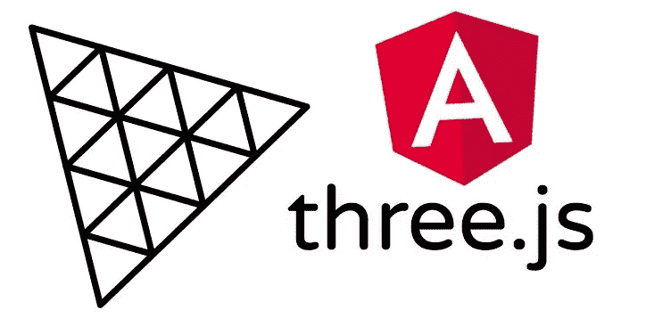

Three.js in Angular

在本教程中，我们将通过一个简单的例子。我们将渲染一个 3D 立方体，我们将学习 Three.js 的基础知识，并将 Three.js 场景集成到 Angular 中。

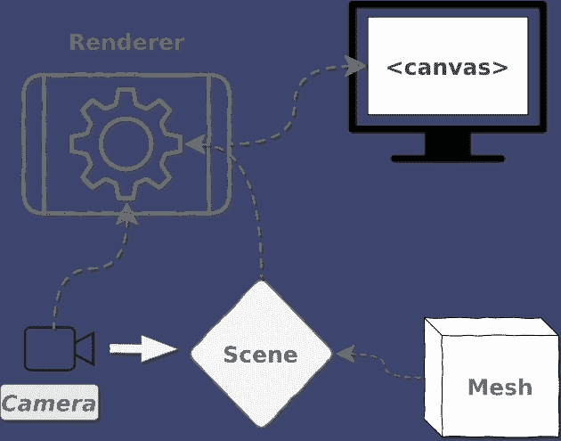

How Three.js Works

# **项目设置**

按照本教程，有必要在您的计算机上安装 node:[***node . js***](https://nodejs.org/en/)***。***

➡安装[***node . js***](https://nodejs.org/en/)并按照屏幕上的向导步骤操作。(按照使用 32/64 位)。

首先，打开您选择的终端并创建一个新的 angular 项目。(如果您想在现有项目中添加 three.js，可以跳过这一步)

➡要创建 Angular 项目，需要先安装[***angular CLI***](https://angular.io/cli)

> npm 安装-g @angular/cli

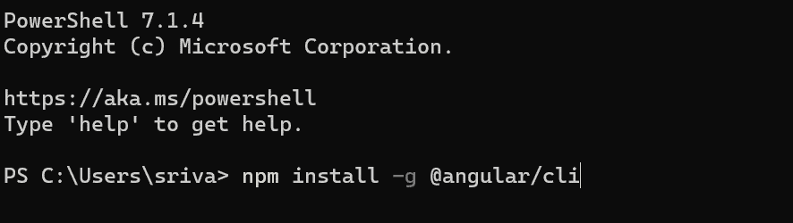

install angular cli

➡:你可以开始使用 CLI 创建一个 angular web 应用程序了。让我们通过在终端中键入下面的命令来创建我们的项目。

> ng 新 angular-three

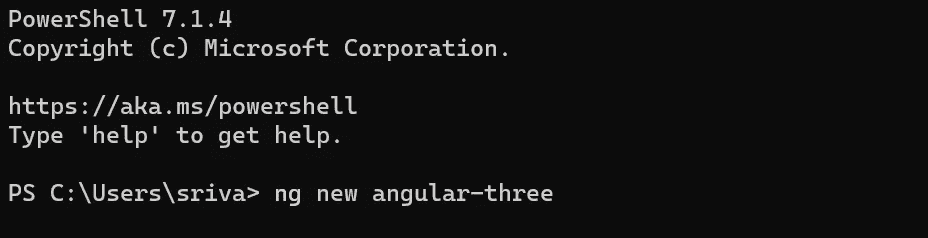

create angular project

➡在 CLI 完成项目设置后，我们将当前目录更改为项目目录，并通过在终端中键入以下命令安装 three.js 作为依赖项。

> cd 角度-三
> 
> npm 安装—保存三个

➡通过使用下面的命令你可以安装 Three.js 的类型定义

> npm 安装—保存@类型/三

Three.js 现在已经成功地添加到我们的 Angular 项目中，并且可以使用了。我们将使用一个**摄像机**和一个**立方体网格**来构建一个基本的**场景**来测试它是否有效。

让我们首先创建一个 angular 组件，它由一个我们将要渲染 3D 对象的 HTML 文件，一个**类型脚本**文件(**)组成。ts** )，我们将在其中导入 Three.js 功能和一个 CSS 或 SCSS 风格的文件。键入下面的命令创建一个 ***立方体组件*** 。

> ng 生成组件立方体

打开 HTML 文件，添加一个画布到我们的空场景中。我们可以在 HTML 模板中添加我们需要的任何大小的画布。

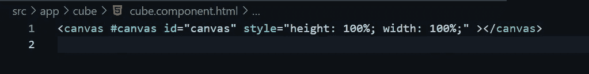

adding canvas in cube.component.html

迈出这一小步后，我们可以将注意力转移到 Typescript 文件上，实际的工作仍然需要完成，以获得我们的 3D 场景设置。

# 对 Three.js 场景进行编程

现在，要将 Three.js 与 Angular 集成，您必须将 Three.js 库导入到要渲染 3D 对象的组件中，即***cube . component . ts .***

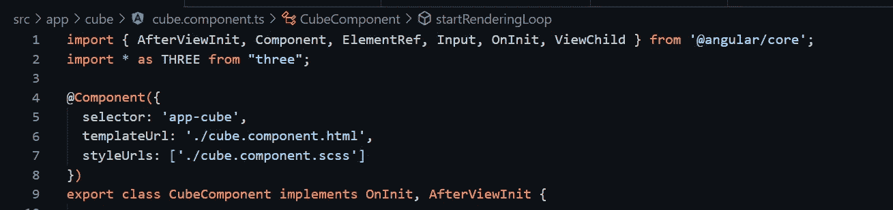

import three.js at the top

使用以下命令获取我们在 HTML 文件中添加的画布的引用

> [@ViewChild](https://angular.io/api/core/ViewChild) ('canvas ')私有 canvasRef:[element ref](https://angular.io/api/core/ElementRef)；

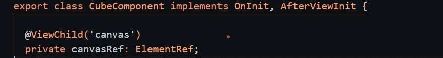

canvas reference in .ts file

**立方体属性:**

*   旋转速度:x 轴上立方体的旋转速度
*   旋转速度:-y 轴上立方体的旋转速度
*   大小:-立方体的大小
*   纹理:-如果你想给你的立方体添加纹理

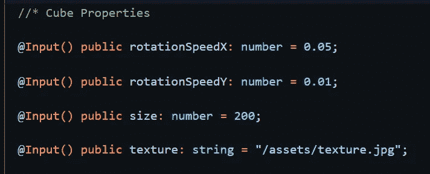

Cube Properties

**舞台属性:**

*   cameraZ:-z 轴上的摄像机位置
*   视野:-摄像机的视野

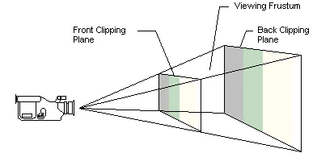

near and far clipping plane

*   近剪裁平面
*   farClipingPlane

近剪裁平面和远剪裁平面是假想的平面，沿着相机的视线位于离相机两个特定距离处。只有相机的两个剪裁平面之间的对象才会在该相机的视图中渲染。

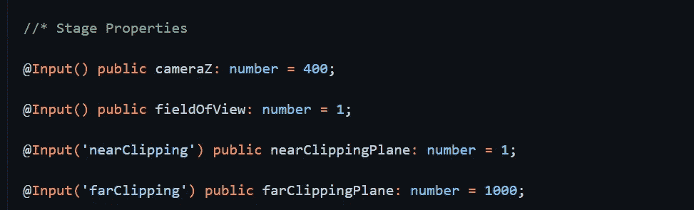

stage properties

**我们为什么要改变摄像机的位置？**

默认情况下，添加到场景中的元素在位置 **(0，0，0)** 生成，这就是为什么我们需要移动摄像机或元素，以便我们可以在画布上看到元素。

让我们创建一些辅助属性来帮助我们创建场景。

*   声明一个 **camera** 类型的变量 perspective camera :-它给出一个 3d 视图，在这个视图中，远处的事物看起来比近处的要小。**透视摄像机**定义了一个平截头体。
*   初始化 getter 函数以获取画布元素
*   初始化几何变量
*   初始化一个加载纹理图像的材质变量
*   初始化立方体，并声明渲染器和场景，如下所示

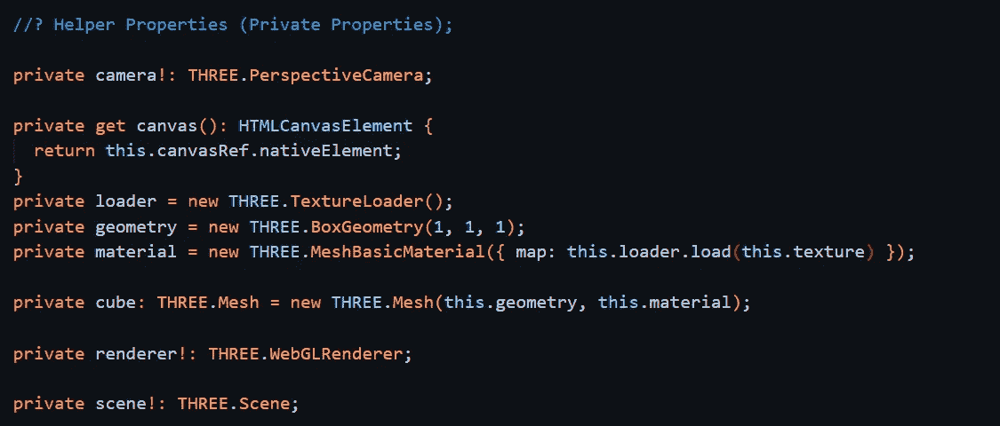

helper properties

# 什么是几何？

几何体是我们正在构建的渲染形状，就像一个盒子。几何图形可以从顶点构建，或者我们可以使用预定义的顶点。

BoxGeometry 是最基本的预定义选项。我们只需要设置盒子的宽度、高度和深度就可以了。还有其他预定义的几何图形。我们可以很容易地定义一个平面，一个圆柱体，一个球体，甚至一个二十面体。

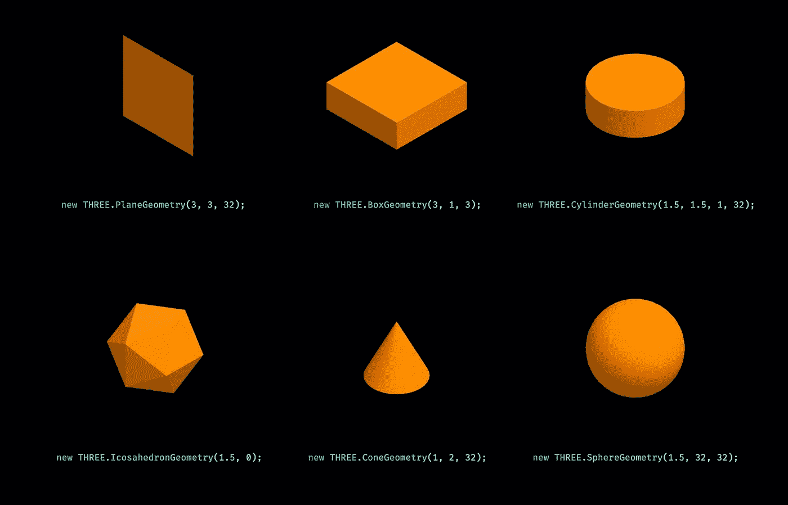

Three.js geometries

# 使用材料

材质描述了物体的外观。在这里，我们可以定义诸如纹理、颜色或不透明度之类的东西。

在这个例子中，我们将只设置一个纹理。材料还是有不同的选择。它们之间的主要区别是它们对光的反应。最简单的是 **MeshBasicMaterial** 。这种材质根本不在乎光，每一面都会有一样的颜色。不过，这可能不是最佳选择，因为您看不到盒子的边缘。

最简单的关心光的材料是 **MeshLambertMaterial** 。这将计算每个顶点的颜色，实际上是每个边。但并没有超出这个范围。

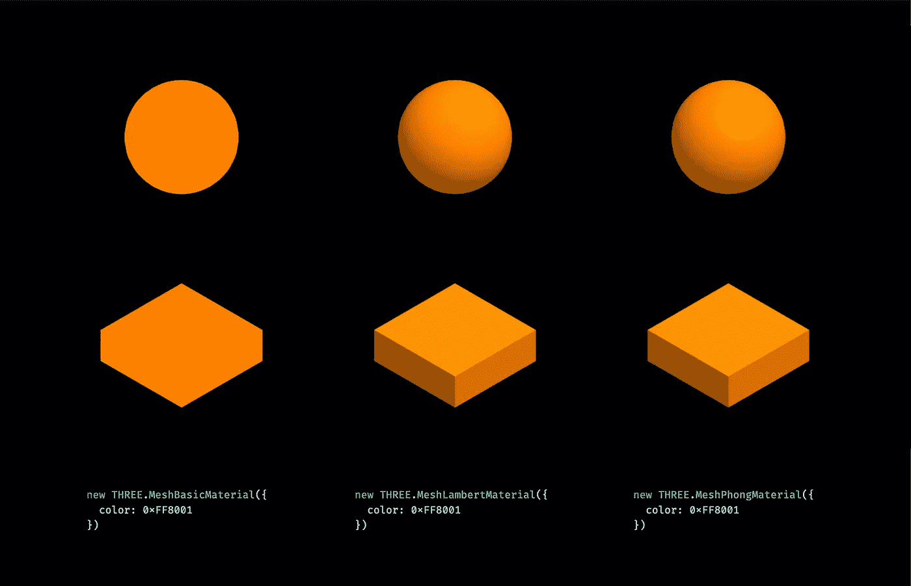

three.js mesh materials

# 定位网格(在我们的例子中是立方体)

我们可以在场景中定位它，并设置每个轴的旋转。稍后，如果我们想要在 3D 空间中制作动画，我们将主要调整这些值。对于定位，我们使用与设置尺寸相同的单位。不管你用的是小数字还是大数字，你只需要在自己的世界里保持一致。对于旋转，我们以弧度设置值。所以如果你有度数，你必须把它们除以 180，然后乘以圆周率。

让我们现在创建场景，场景是我们将添加不同的元素，我们想用像相机，立方体等。创建如下所示的函数:

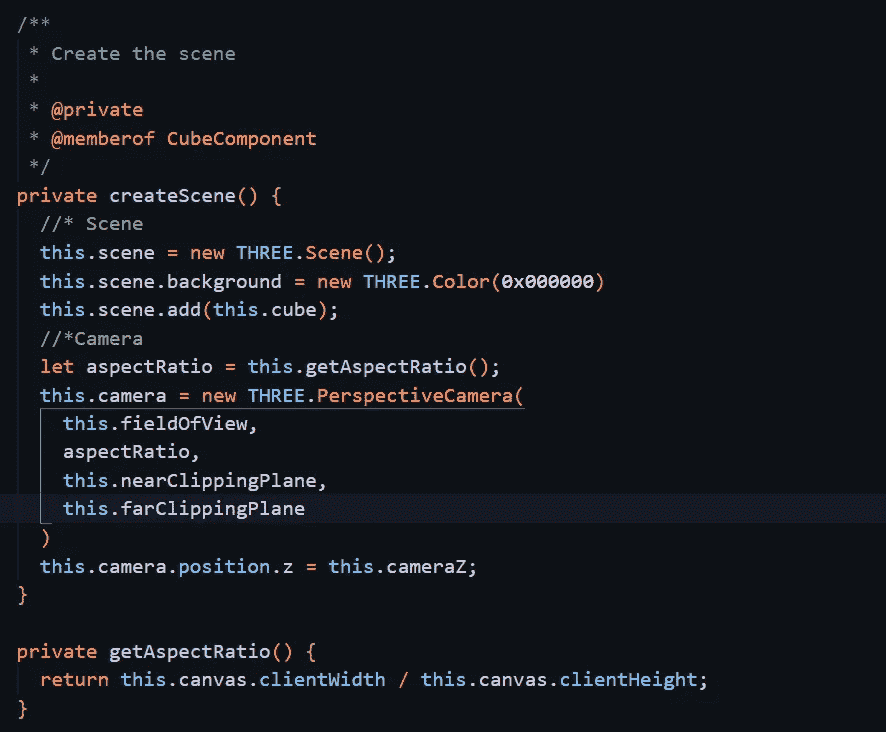

creating the scene

初始化一个函数动画立方体。调用此函数以增量方式在 x 轴和 y 轴上添加立方体旋转。

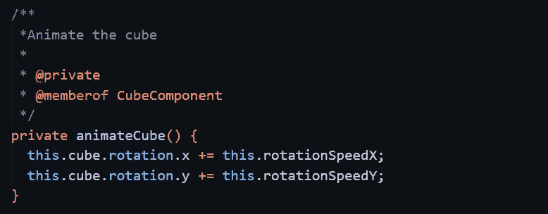

animateCube function

如果我们尝试启动应用程序，我们还看不到任何东西，因为 Three.js 可以工作并为我们提供一些东西。我们需要定义一个 WebGLRenderer。当我们提供一个场景和一个摄像机时，它能够将实际的图像渲染到 HTML 画布中。这也是我们可以设置画布实际大小的地方——画布在浏览器中显示的宽度和高度(以像素为单位)。

让我们创建一个 ***渲染器函数*** 。创建如下所示的函数。将 canvas 元素传递到我们之前声明的渲染器中，设置渲染器引擎像素比率并设置其大小。调用递归渲染函数来生成动画循环。

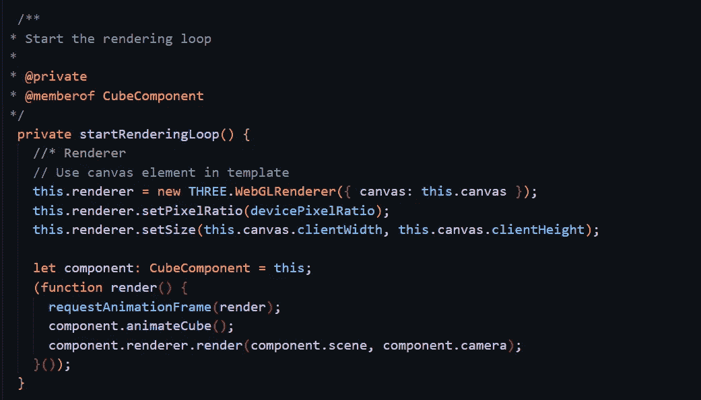

start the rendering loop

最后，调用 ngAfterViewInit()中的 createScene()和 startRenderingLoop()函数，在终端中使用 ***ng serve*** 启动项目。

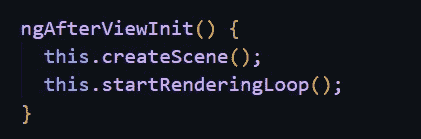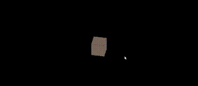

calling the scene and render loop

代码以这样的方式编写，您可以在任何父组件中调用此多维数据集组件，并从父组件中更改参数。

# **您已经准备好使用 Angular 开始下一个 Three.js 项目。祝编程愉快！！！**

下一个教程是关于如何在 Three.js 中渲染一个[**GLTF 模型**](https://srivastavaanurag79.medium.com/3d-model-three-js-scene-in-angular-7bcbc0d00c31)

**GITHUB 链接**对于这个项目:-[**srivastavaanurag 79/angular-three:在本教程中，我们将通过一个简单的例子，我们将渲染一个 3D 立方体，我们将学习 Three.js 的基础知识，并将 Three.js 场景集成到 Angular 中。**(github.com)](https://github.com/srivastavaanurag79/angular-three)

*参考资料:* [*Three.js 教程—如何在浏览器中渲染 3D 对象(freecodecamp.org)*](https://www.freecodecamp.org/news/render-3d-objects-in-browser-drawing-a-box-with-threejs/)

[*你的第一个 three.js 场景:你好，立方体！| Discover three . js(discoverthreejs.com)*](https://discoverthreejs.com/book/first-steps/first-scene/)