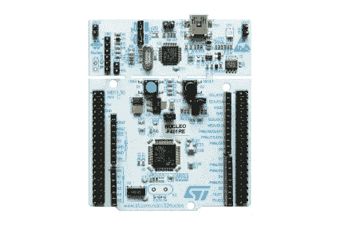

# 你好世界:艰难的道路

> 原文：<https://medium.com/geekculture/hello-world-the-hard-way-3db85931df9d?source=collection_archive---------14----------------------->

Arduino 让事情变得简单，我们已经习以为常。

您是否想过使用 Arduino 创建嵌入式系统原型有多简单？

一旦你有了 Arduino 兼容板，你就可以安装软件并快速运行 blinky 示例。然后，板载 LED 像变魔术一样打开和关闭。这怎么可能呢？

只需几行代码，我们就可以向任何外设发送数字信号，或从任何外设接收数字信号。这是什么巫术？

我说的是这个片段——或者我应该说，Arduino 世界中的草图:

```
void setup()
{
    pinMode(LED_BUILTIN, OUTPUT);
}void loop()
{
    digitalWrite(LED_BUILTIN, HIGH);
    delay(1000);
    digitalWrite(LED_BUILTIN, LOW);
    delay(1000);
}
```

这 11 行代码将使任何 Arduino 兼容板上的板载 LED 每秒闪烁一次。这就是我们在微控制器世界中所说的 hello world。

你不需要知道 pinMode 函数是如何在幕后工作的。你需要知道的是，你可以告诉任何通用 I/O 引脚作为输入或输出引脚。

digitalWrite 功能也是如此。你不需要知道它是如何工作的。您只需要知道您可以向任何通用 I/O 引脚发送高电平或低电平信号。

延迟功能完全符合您现在的想法:以毫秒为单位暂停微控制器一段时间。

你看，要欣赏 Arduino 和它背后强大的社区，你需要知道他们对你隐藏的东西。

而那个东西就是**实现细节。**

我将演示如何在不使用 Arduino 软件和硬件的情况下实现 blinky 示例。



NUCLEO-F446RE board. The picture belongs to ST Microelectronics.

[NUCLEO-F446RE](https://www.st.com/en/evaluation-tools/nucleo-f446re.html) 开发板是 NUCLEO 系列的一部分，由 STM32F446RE 微控制器供电。它有一个板载 ST-LINK v2.1 调试器，无需购买额外的硬件即可轻松调试。

ST 微电子为 STM32 微控制器提供了 IDE 和软件包，但出于这个目的，我将使用 PlatformIO IDE 和(部分)STM32 HAL 软件。

板载 LED 连接到 GPIO 端口 A 引脚 5，因此我们将该引脚设置为输出引脚，每秒发送一个高低信号。但是，在使用 GPIO 端口 A 上的任何引脚之前，我们需要启用该特定端口的时钟。

```
#include "stm32f4xx_hal.h"int main()
{
    HAL_Init(); **__HAL_RCC_GPIOA_CLK_ENABLE();** while (1)
    {
        // ...
    }
}
```

我们使用 HAL_Init 函数来初始化硬件抽象库。我们需要使用 HAL 中的一些 API 来启用 GPIO 端口 A 上的时钟，并在 1000 毫秒后暂停微控制器。

请记住，这里不需要设置和循环功能。你可以把无限循环之前的每一行代码想象成设置函数，把 while 循环块想象成循环函数。

我们需要从/向存储器中的特定地址读写位，以将 GPIO 端口 A 中的引脚 5 设置为数字输出引脚。以下代码相当于 Arduino 软件中的 pinMode 函数。

我们需要写入的第一个地址是 GPIOA_MODER 寄存器，该寄存器控制 GPIO 端口 a 的 16 个引脚的模式，每个引脚模式配置占用该寄存器的两位。

```
uint8_t temp = GPIOA->MODER;
```

我们可以使用全局结构 GPIOA 来访问 GPIOA_MODER 寄存器。现在，我们需要将引脚 5 的模式设置为通用输出模式(二进制 01)

```
temp &= ~(0b11 << (5 * 2));
temp |= (0b01 << (5 * 2));GPIOA->MODER = temp;
```

我认为，在向寄存器写入新的配置位之前，复位配置位始终是一种最佳做法。我们通过使用按位 and 运算符将位 10 和 11 重置为这些位的位掩码值。在这种情况下，二进制数格式的位掩码是 111111111111111100111111111111。然后，我们将 GPIO 输出模式(0b11)写入 GPIOA_MODER 寄存器的位 10 和位 11。

接下来，我们需要设置引脚 5 的输出类型。我们可以通过写入或复位该位来更改 GPIO 端口 A 的输出类型配置。这种情况下，我们将在引脚 5 上使用推挽输出类型(0)，因此需要复位 GPIOA_OTYPER 寄存器的位 5。

```
temp = GPIOA->OTYPER;
temp &= ~(1 << 5);
```

如果要使用开漏输出类型，需要设置位 5。

接下来，我们需要设置速度配置。我们可以通过将高速位(0b11)写入 GPIOA_OSPEEDR 寄存器的位 10 和位 11 来改变 GPIO 端口 A 的速度配置。

```
temp = GPIOA->OSPEEDR;
temp &= ~(0b11 << (5 * 2));
temp |= ~(0b11 << (5 * 2));
```

我们需要设置 GPIO 端口 a 的引脚 5 的拉模式，我们可以将上拉(0b01)、下拉(0b10)或不拉(0b00)位写入 GPIOA_PUPDR 寄存器的位 10 和位 11。

```
temp = GPIOA->PUPDR;
temp &= ~(0b11 << (5 * 2));
```

嗯，对于 pinMode 函数来说，这是很多代码。我们现在可以看到使用 Arduino 软件做这些事情是多么容易了吗？还没有？请继续阅读。

好了，我们已经到达了旅程的最后一段。

通过置位或清零 GPIOA_ODR 寄存器的位 5，我们可以将高电平或低电平信号写入 GPIO 端口 A 的引脚 5。

我们可以通过设置 GPIOA_BSRR 寄存器的高半部分的位 5 来发送低电平。同样，我们可以通过将 1 写入 GPIOA_BSRR 寄存器下半部分的位 5 来发送高电平信号。

```
GPIOA->BSRR = (1 << 5);HAL_Delay(1000);GPIOA->BSRR = (1 << (5 + 16));HAL_Delay(1000);
```

每秒钟都会打开和关闭 LED。

最后，我们需要实现 SysTick 中断处理程序并调用 HAL _ IncTick 函数，以便 HAL_Delay(1000)将微控制器暂停 1000 毫秒。

```
void SysTick_Handler()
{
    HAL_IncTick();
}
```

就是这样！

你可以在我的 GitHub 页面上找到完整的源代码。

[](https://github.com/alwint3r/NUCLEO-F446RE-Blinky) [## GitHub-alwint 3 r/NUCLEO-f 446 re-Blinky:Blinky，最难(但不是最难)的方法。

### 此时您不能执行该操作。您已使用另一个标签页或窗口登录。您已在另一个选项卡中注销，或者…

github.com](https://github.com/alwint3r/NUCLEO-F446RE-Blinky) 

让我们在这里回顾一下我们的旅程。

为了通过 GPIO 引脚配置、发送和接收数字信号，我们需要从地址 0x40000000 开始查找 GPIO 寄存器。在我们的例子中，GPIO 端口 A 配置寄存器位于存储器中的 0x40020000 地址至 0x400203FF。您需要阅读[参考手册文档](https://www.st.com/resource/en/reference_manual/dm00135183-stm32f446xx-advanced-arm-based-32-bit-mcus-stmicroelectronics.pdf)来找到该信息。这种情况只适用于 STM32F4xx 系列。其他微控制器可能有所不同。

您还需要知道如何从外设寄存器读取、写入和清零位，以配置 GPIOs 等外设。

两个版本的代码做了同样的事情，但是 Arduino 版本更短，更容易阅读。您可以编译相同的 Arduino 草图，并将其上传到不同的微控制器，它很可能不需要任何代码更改就可以工作。

我对这篇文章的最后一点看法是:Arduino 提供了很好的抽象，隐藏了实现细节的复杂性。您可以使用 Arduino 快速创建您出色想法的原型。但是，在某些时候，您可能需要查看实现细节，以了解微控制器是如何在您眼皮底下工作的。这样你会对某个具体的微控制器有一个坚定的认识，你会比以前更好的欣赏 Arduino。