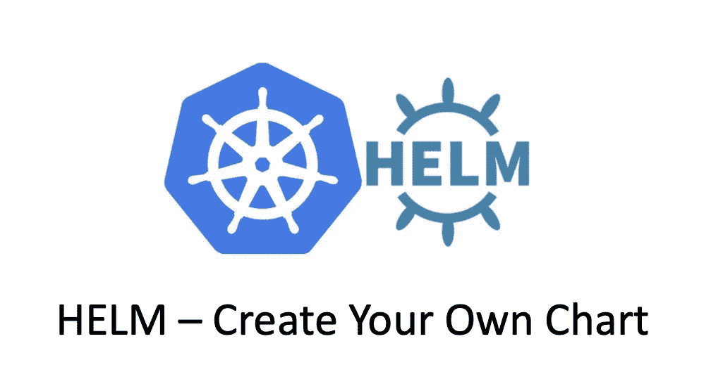

# 舵-创建舵图

> 原文：<https://medium.com/geekculture/helm-create-helm-chart-7084666fab90?source=collection_archive---------2----------------------->

## 如何创建自己的舵图

在我上一篇`Helm`文章“[掌舵操作](/geekculture/helm-helm-operations-d1f7dc9175cc)”中，我谈到了一些常见的`helm`操作，并向您展示了如何部署现有的示例`Helm`图表，这次让我们创建自己的`Helm Chart`。

在某一点上，你将需要创建你自己定制的`Helm Chart`，因为你总是可以在公共的`Helm`库中找到你需要的东西。