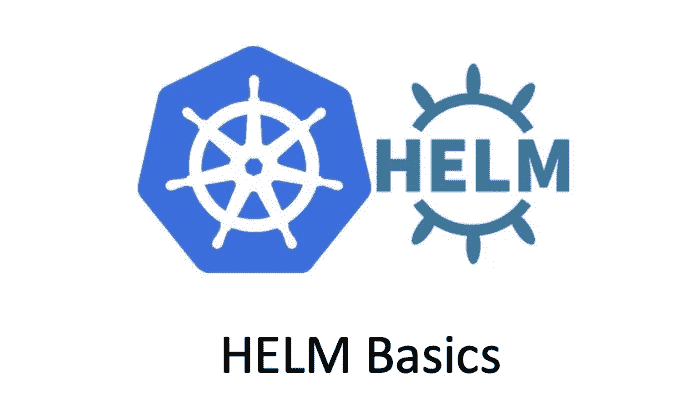

# 掌舵——掌舵操作

> 原文：<https://medium.com/geekculture/helm-helm-operations-d1f7dc9175cc?source=collection_archive---------6----------------------->

## K8s Helm 服务编排基础

在我之前的文章中，我介绍了一些关于`HELM`(【https://tonylixu.medium.com/helm-helm-basics-a366daec5a81】)的基础知识，现在让我们学习如何使用`Helm`来管理应用程序的生命周期。

# 前提

在开始之前，您需要确保您有一个工作的 K8s 集群。