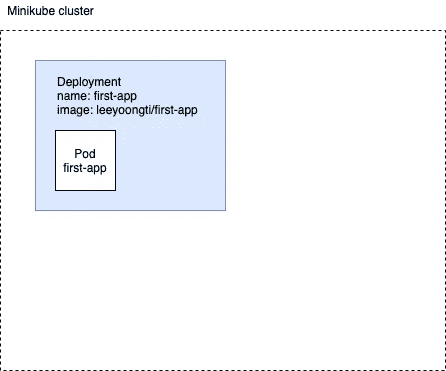
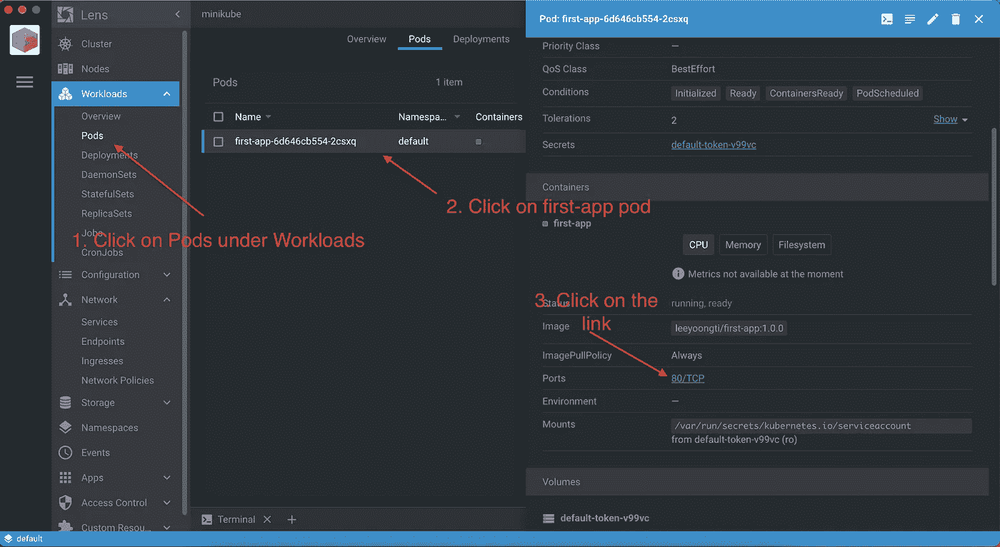
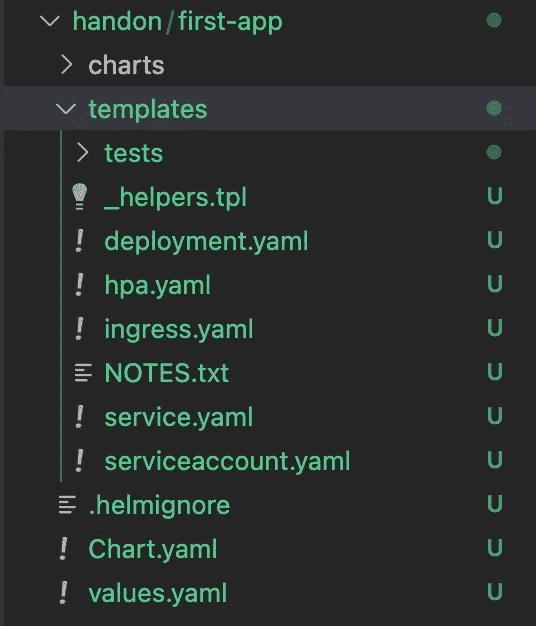
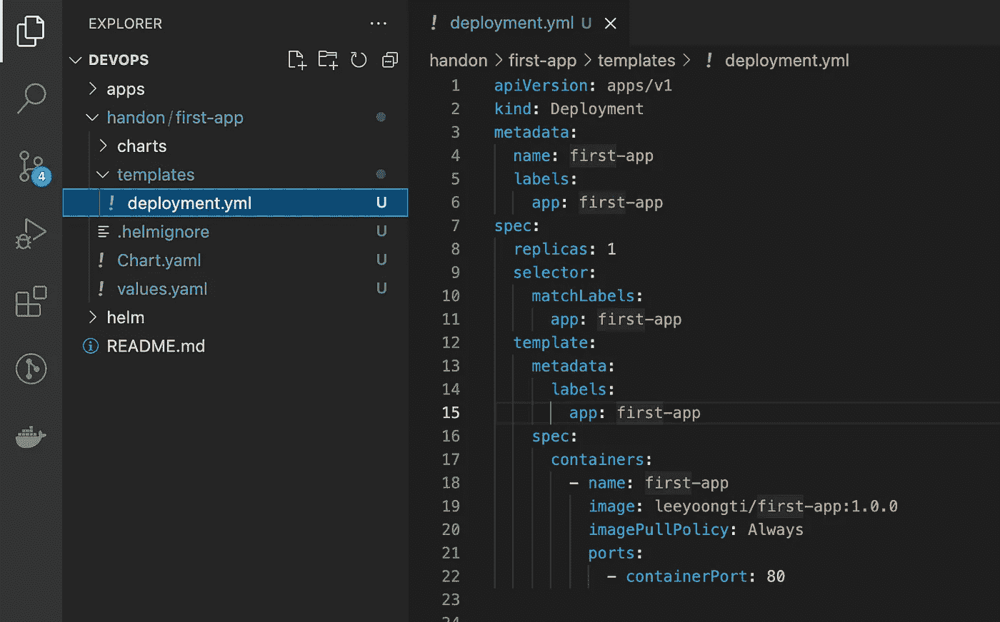
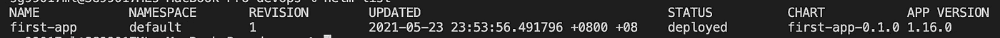
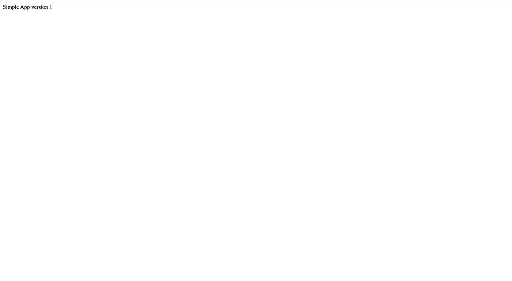
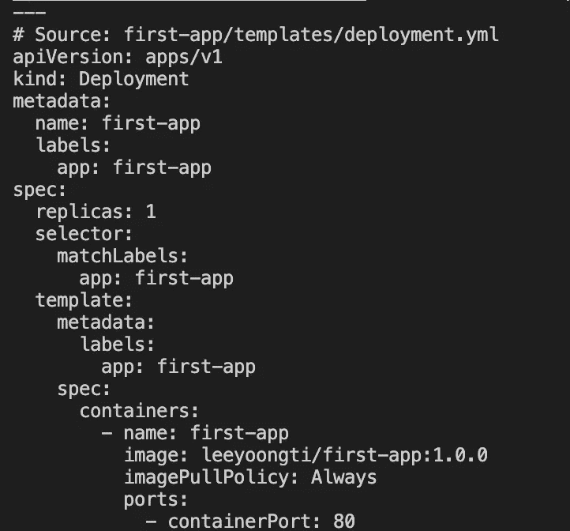
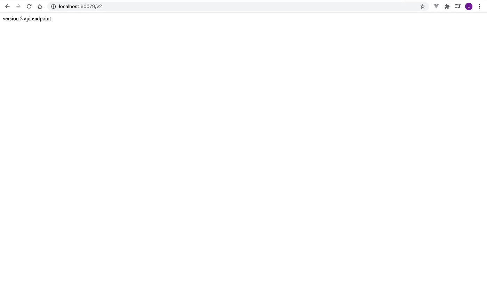
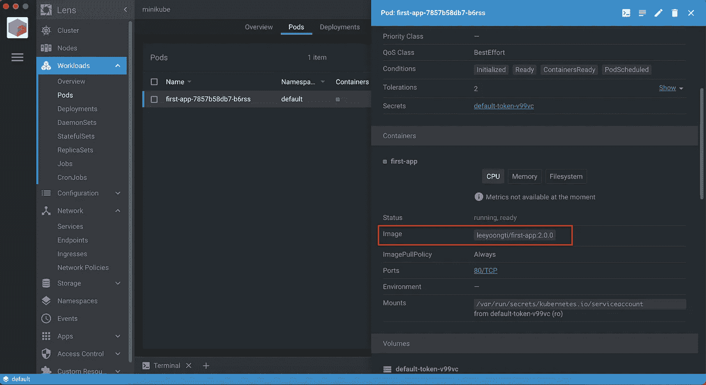
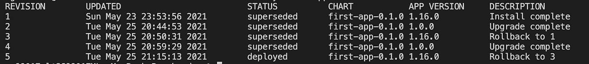

# Kubernetes 中的掌舵——第 2 部分:如何创建简单的掌舵图

> 原文：<https://medium.com/geekculture/helm-in-kubernetes-part-2-how-to-create-a-simple-helm-chart-af899fc2741d?source=collection_archive---------17----------------------->


Photo by [Loik Marras](https://unsplash.com/@loik_marras?utm_source=unsplash&utm_medium=referral&utm_content=creditCopyText) on [Unsplash](https://unsplash.com/s/photos/helm?utm_source=unsplash&utm_medium=referral&utm_content=creditCopyText)

现在我们已经了解了 Helm 可以为我们做什么，让我们从现有的 Kubernetes YAML 文件创建一个简单的 Helm 图表。在这篇文章的结尾，你会知道如何:

*   写一个简单的舵图
*   将值插入舵模板
*   安装、升级和回滚 Helm 版本

如果您愿意，可以随意下载回购协议和代码。你可以在这里找到回购[。我们将要体验的应用程序是`01-first-app`。](https://github.com/yoongti/devops)

您需要一些东西来开始:

*   [Minikube](https://minikube.sigs.k8s.io/docs/start/) —让你在本地运行 Kubernetes 的工具
*   [镜头](https://k8slens.dev/) -Kubernetes IDE
*   当然，还有[掌舵](https://helm.sh/docs/intro/install/)

确保通过运行以下命令启动 Minikube:

```
minikube start
```

# 使用 Kubectl 部署应用程序到 Minikube

在我们开始创建一个掌舵图之前，我们首先看看我们通常如何使用 Kubectl 来部署一个 Kubernetes 应用程序。

`first-app`是一个简单的节点 app。该应用程序被打包成一个名为`leeyoongti/first-app`的图像，我已经准备好并推送到 Docker Hub。

这是`first-app`的`app.js`代码。

**注:** `/v1`路径在`leeyoongti/first-app`的`1.0.0`版本上可用，`/v2`仅在`2.0.0`以上版本上可用，`/v3`仅在`3.0.0`以上版本上可用。

下图显示了我们希望部署到 Minikube 集群的内容。具有 1 个副本的`leeyoongti/first-app`的部署。



再来看`/01-first-app/yml/deployment.yml`。

几个要点:

*   部署名称是`first-app`(第 4 行)。
*   容器的名字也是`first-app`(第 19 行)。
*   容器的端口(应用程序运行的端口)是 80(第 21 行)。

我们可以通过运行以下命令，使用 YAML 文件创建部署:

```
kubectl apply -f apps/01-first-app/yml/deployment.yml
```

如果部署成功，您应该会看到以下消息

```
deployment.apps/first-app created
```

转到镜头，检查 pod 是否正常运行。



单击 80/TCP 将打开您的浏览器。


app running on Chrome

# 使用舵图部署应用程序

该应用程序工作正常，现在让我们看看我们如何使用 Helm Chart 部署应用程序。

首先，让我们通过运行以下命令来清理我们之前进行的部署:

```
kubectl delete deployment first-app
```

您应该会看到以下消息:

```
deployment.apps "first-app" deleted
```

您可以返回 Lens，再次确认删除的状态。可能需要一些时间来终止 pod。

转到您想要创建舵图的目录并运行:

```
helm create first-app
```

您将看到一个名为`first-app`的目录被创建。



让我们一次看一个。

*   `charts`是存储图表依赖关系的地方。
*   `templates`是存储部署、服务、配置图等模板的地方。
*   `.helmignore`基本上和`.gitignore`一样，包含打包舵图时忽略的模式。
*   `Chart.yaml`定义关于您的图表的信息
*   `values.yaml`定义图表模板将使用的值。

首先，删除`templates`目录下的所有内容，从`first-app`中复制`deployment.yaml`并粘贴到`templates`目录下，就像这样。



现在，运行以下命令来部署应用程序，假设我们在`devops`目录中:

```
// helm install [NAME] [CHART]
helm install first-app handon/first-app
```

*   第一个参数是我们想要的舵图表部署的名称
*   第二个参数是我们想要部署的图表。

您会看到下面的消息被打印出来

```
NAME: first-app
LAST DEPLOYED: Sun May 23 23:53:56 2021
NAMESPACE: default
STATUS: deployed
REVISION: 1
TEST SUITE: None
```

您可以运行以下命令来列出 Helm 发布的所有内容。

```
helm list
```



您可以返回 Lens 以检查部署是否成功。



Same thing, but deployed using Helm Chart

您已经学习了如何创建一个简单的 Helm 图表，并使用 Helm install 进行部署。干得好！

现在转到`/v1`路径(您的应用程序可能运行在本地主机的不同端口上)，您应该会看到


现在转到`/v2`


它将显示一个错误，这是因为`leeyoongti/first-app:1.0.0`没有这个 GET 响应，我们需要升级到`2.0.0`才能工作。现在`templates/deployment.yaml`上的一切都是硬编码的，让我们通过向它注入值来改变这一点。所以每当我们想要改变一些东西，比如这个例子中的标签，我们只需要更新`values.yaml`。

首先，将图表中的`templates/deployment.yaml`更改如下:

然后，将图表中`values.yaml`的内容更改为:

当我们想给模板注入值时，我们需要定义占位符，让 Helm 知道我们想把这些值放在哪里。在 Helm 中，占位符是这样的:`{{ .Values. }}`。

现在尝试运行以下命令，查看 Helm 将根据我们提供的模板和值生成的文件。

```
helm template first-app
```

你会看到



`helm template`是一个强大的命令，允许您在对模板/值不确定时查看生成的输出。

我们已经部署了`first-app:1.0.0`，让我们来升级一下。去`values.yaml`把`tag`换成`2.0.0`，像这样

那就跑

```
helm upgrade first-app first-app
```

您应该会看到以下消息

```
Release "first-app" has been upgraded. Happy Helming!
NAME: first-app
LAST DEPLOYED: Tue May 25 20:44:53 2021
NAMESPACE: default
STATUS: deployed
REVISION: 2
TEST SUITE: None
```

好了，让我们回到 Lens，点击 80/TCP(和之前一样)通过浏览器访问你的 pod。尝试访问`/v2`路径，您应该会看到以下内容。

**注意**:升级部署将导致创建新的 pod，因此您现有的 pod 将不复存在。这就是为什么你将需要通过镜头访问新的吊舱。



您也可以通过查看 Lens 上的 pod 来验证您是否已成功升级到`2.0.0`。



太好了！如果你想升级到`3.0.0`，你只需更新你的`values.yaml`并再次运行`helm upgrade first-app first-app`即可。

如果你想回滚到`1.0.0`怎么办？很简单。运行以下命令:

```
// helm rollback <RELEASE> [REVISION] [flags]
helm rollback first-app
```

如果您不提供`REVISION`，它将回滚到先前的版本。现在您应该看到:

```
Rollback was a success! Happy Helming!
```

检查镜头，你应该看到它回滚到以前的版本！

您可以通过运行以下命令来检查您对`first-app`的所有发布:

```
helm history first-app
```



**注意:**图表和应用程序版本看起来相同的原因是因为这些值是在`Chart.yml`中定义的，我们没有更新它们。(我在升级到`2.0.0`时更新了应用版本，因此它显示的是`1.0.0`而不是`1.16.0`。

# 结论

我们已经看到了如何为部署编写一个简单的舵图。我们学习了如何将值注入模板，这样我们就不必硬编码所有的值。最后，我们还研究了安装、升级和回滚 Helm 版本。

[](https://leeyoongti.medium.com/helm-in-kubernetes-part-1-introduction-81c810c8f486) [## 库伯内特斯头盔第 1 部分:简介

### 如果你使用 Kubernetes 已经有一段时间了，你可能听说过 Helm。但赫尔姆究竟是什么？什么……

leeyoongti.medium.com](https://leeyoongti.medium.com/helm-in-kubernetes-part-1-introduction-81c810c8f486) [](https://leeyoongti.medium.com/helm-in-kubernetes-part-3-hand-on-with-flow-control-and-pipelines-68a984a7e851) [## Kubernetes 中的头盔第 3 部分:流动控制和管道

leeyoongti.medium.com](https://leeyoongti.medium.com/helm-in-kubernetes-part-3-hand-on-with-flow-control-and-pipelines-68a984a7e851) [](https://leeyoongti.medium.com/helm-in-kubernetes-part-4-publish-helm-chart-to-artifact-hub-using-github-pages-ab7f55904faa) [## Kubernetes 中的头盔:第 4 部分——使用 Github 页面将头盔图发布到工件中心

leeyoongti.medium.com](https://leeyoongti.medium.com/helm-in-kubernetes-part-4-publish-helm-chart-to-artifact-hub-using-github-pages-ab7f55904faa) 

*感谢阅读！如果你喜欢这篇文章，留下一个赞，这样其他人也可以看到。*