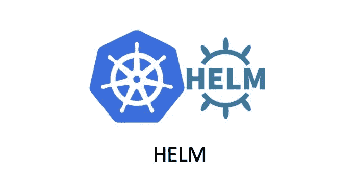

# Helm —模板功能和管道

> 原文：<https://medium.com/geekculture/helm-template-functions-and-pipeline-10e449552bc0?source=collection_archive---------4----------------------->

## 高级头盔用法

在我上一篇文章——《[Helm——内置函数和值](https://tonylixu.medium.com/helm-built-in-functions-and-values-2879ecd7fb37)》中，我们学习了如何将信息渲染到模板中，但是这些信息是直接传入模板引擎进行渲染的。有时候我们想在渲染之前转换这些数据，这就需要使用 Go 一些其他用途的模板语言。

# 模板功能