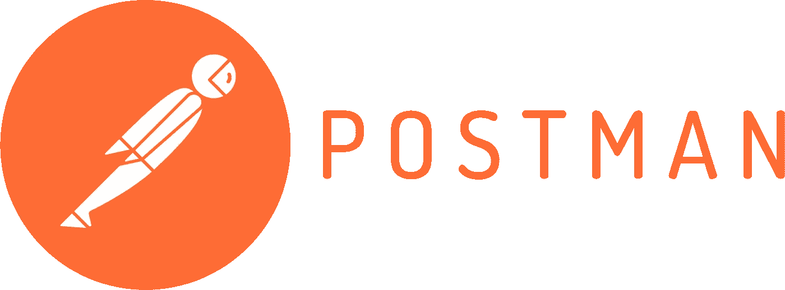
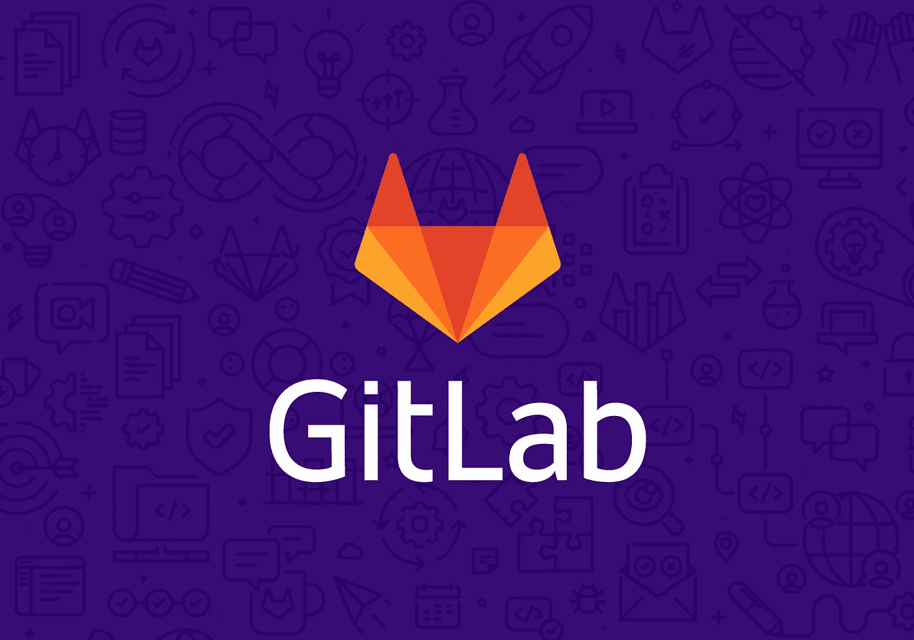

# Helm v3、Newman 和 Juxr 的 Helm 测试和报告

> 原文：<https://medium.com/geekculture/helm-testing-and-reporting-with-helm-v3-newman-and-juxr-3d8b2909a658?source=collection_archive---------21----------------------->


在你的管道中运行你的 **API** 或者**冒烟测试**的方式有很多。有时候，只需要给你部署的 Kubernetes **微服务**提供一组正确的 curl 命令。然而，根据应用程序的性质，您可能会以不同的方式来做，有几个有用的工具可以执行这些类型的活动，如运行 **Helm** 和 **Newman** 以及 postman 集合。

人们可能希望用 Newman 来自动化这些系列的测试集合，并且可能对在本地运行它们感兴趣。这完全取决于你的需求和要求。这绝不是一个银弹解决方案，而只是一个概念证明，可能会有所帮助。

# 先决条件

*   头盔≥ v3
*   码头工人
*   纽曼(可选)
*   邮递员 UI
*   Juxr

# 舵

[](https://helm.sh/) [## 舵

### Helm 是查找、共享和使用为 Kubernetes 构建的软件的最佳方式。Helm 帮助您管理 Kubernetes…

helm.sh](https://helm.sh/) 

管理测试套件和其他 Kubernetes 清单从来没有以一种好的方式被标准化过。人们可能最终会定义他们自己的结构来打包他们的应用程序。幸运的是，随着 **Helm(v3)** 的到来，尤其是它的最新版本，我们可以将我们的应用程序和我们的测试打包在一起，只需一个简单的 **Helm** 命令就可以运行它们。我们也可以相应地确定测试的范围。

这个命令基本上旋转了你在舵图中定义的任何测试舱。

```
$ helm test microservice-application
```

继续看**纽曼**



# 纽曼

> 纽曼是邮差的命令行收集亚军。它允许您直接从命令行运行和测试 Postman 集合。它的构建考虑了可扩展性，因此您可以轻松地将其与您的持续集成服务器集成并构建系统。
> 
> Newman 保持了与 Postman 相同的特性，并允许您像在 Postman 的集合运行器中那样运行集合。

Newman 本质上是运行 Postman collection 的 CLI 工具，它有来自其社区的各种不同的报告选项。我们只需使用这个命令就可以有效地运行它(或者使用 docker 命令作为更不可知的方法)

```
$ newman run mycollection.json
```

Docker 命令

```
$ docker run -t postman/newman run "https://www.getpostman.com/collections/0d0350a9a89d39fb6361"
```

我们可以运行本地收集，但这需要装载共享数据卷，稍后我们将使用我们的自定义映像演示这一点。

# 记者纽曼 HTML 号外

[](https://github.com/DannyDainton/newman-reporter-htmlextra#readme) [## 丹尼登顿/纽曼-记者-htmlextra

### 一个纽曼 HTML 报告器，已经扩展到包括迭代运行的分离，所以这些不再…

github.com](https://github.com/DannyDainton/newman-reporter-htmlextra#readme) 

如前所述，纽曼社区提供了各种集成，纽曼-记者-htmlextra 是其中之一，它提供了一种灵活的方式来定制模板和调整出站 html 报告。

我们可以启用完全可定制的 HTML 报告，而不仅仅是处理 CLI 输出和 junit。这只是提供一种习惯的问题。hbs 模板呈现出您选择的自定义参数。

```
$ newman run mycollection.json --reporters junit,cli,htmlextra --reporter-htmlextra-template /etc/newman/dashboard-template.hbs --reporter-htmlextra-title "Smoke API Tests"
```

现在应该一切都好了，我们可以使用自定义模板在本地运行 postman 集合，并对其进行相应的调整。我们甚至可以使用 **Newman** 建立管道来运行我们的 postman 集合，并呈现结果和工件。

然而，这意味着我们必须绑定结构，并依赖管道来提取结果。用**掌舵**的更不可知论的方法提取测试工件(甚至是本地的)出现了，这就是 Juxr 发挥作用的地方。

# Juxr

[](https://github.com/cloudbees-oss/juxr) [## cloudbees-oss/juxr

### 帮助管理 JUnit XML 格式报告的命令行工具。要在本地获得工具包，只需使用 Cargo:注意…

github.com](https://github.com/cloudbees-oss/juxr) 

**JUnit XML 报告工具包**是一个命令行工具，用于帮助管理 JUnit XML 格式的报告。它管理以下问题

> 作为一名开发人员，我有一些测试在一个临时的 Kubernetes pod 中运行，我需要提取测试结果和任何相关的[附件](https://plugins.jenkins.io/junit-attachments/)

Juxr 基本上支持通过标准 I/O 提取文件，而不是依赖测试容器的持久卷声明。它不仅适用于 JUnit。xml 文件，也适用于具有不同扩展名的其他类型的文件，例如 html。

但是，您并不一定要使用 **Juxr** 来输出到标准输出。您也可以使用这个命令将其输出为 Juxr 格式。

```
needle="[[juxr::stream::$RANDOM::junit-test-report::TEST-custom.xml]]"
# NOTE: there must be a new line before the needle
echo "" 
echo $needle
base64 < TEST-custom.xml
echo $needle
```

# 经营 **Juxr 和纽曼**邮差系列

Juxr 将使用与扩展名匹配的文件，并通过管道将其输出到标准输出。

```
$ juxr exec -r *.xml --files *.html -- newman run newman-collections.json --reporters junit,cli,htmlextra --reporter-htmlextra-title "Smoke API Tests" --reporter-htmlextra-template dashboard-template.hbs
```

查看 **Newman** 输出文件夹，我们可以看到以下工件。

```
newman
│   newman-run-report-2021-06-07-07-34-48-952-0.xml
│   Helm Testing-2021-06-07-07-37-44-931-0.html
```

这意味着我们可以运行我们的测试容器，让 **Juxr** 输出工件作为结果。让我们看一下我们将用于测试容器的图像。

# 与纽曼和 Juxr 一起运行 docker

```
$ docker build . -t juxrnewman:1.0.0
```

运行图像应该像这样。请记住，我们必须挂载一个本地卷，其中包含我们的 postman 集合。我们也可以添加提供我们的客户。hbs 模板，如果我们决定不将其包含在 docker 文件中。文件夹应包含以下内容。

```
dir
│   newman-collections.json
|   dashboard-template.hbs (Optional)
```

看，不用再依赖 npm 或纽曼了。只需运行 docker 命令。让我们来看看如何用**头盔**将它们打包在一起。

# 带头盔的包装

helm v3 格式的结构。

[https://helm.sh/docs/topics/charts/](https://helm.sh/docs/topics/charts/)

```
service/  
  Chart.yaml              
  README.md           
  values.yaml         
  charts/             
  crds/               
  templates/
  templates/tests # Folder containing the helm test pod definitions
  and config map
  collection/newman-collections.json # Our Postman collection
```

# 测试舱

在*模板/测试*下你的头盔图中的测试舱

Helm 使用**钩子注释**来设置 Pod 命令退出代码状态下钩子的结果。

# 配置映射

# 带舵和 Juxr 的运行测试容器

一旦使用 helm 安装了服务，我们就可以运行一组测试套件，并让 **Juxr** 导入工件，这一次，我们处于接收端，Juxr 将为我们处理解析。

```
$ helm test --logs | juxr import -o helm-test-results/
```

这应该像以前一样产生本地工件

```
newman
│   newman-run-report-2021-06-07-07-34-48-952-0.xml
│   Helm Testing-2021-06-07-07-37-44-931-0.html
```

很好，我们现在可以开始指南的自动化部分，将它与我们的 CI/CD 环境更好地集成。



这里有一个简短的例子，说明如何使用 **GitLab CI** stage 来处理管道工件，并将其用于覆盖和构建工件。目前，我已经编辑了 docker 文件，以便用 juxr 和 helm v3 构建 docker 映像。这仅仅是为了给自动化部分提供一个思路。

```
helm_test_dev:
  stage: smoke_test_helm
  image:
    name: <image with helm v3 and juxr>
    entrypoint: [ "/bin/sh", "-c" ]
  before_script:
    - echo $KUBE_CONFIG|base64 -d>helm_kubeconfig.yaml
  script:
    - helm --kubeconfig helm_kubeconfig.yaml test --logs my-service --timeout 300s --namespace my-name-space | juxr import -o helm-test-results/
  artifacts:
    expire_in: 1 day
    when: always
    paths:
      - helm-test-results/newman
    reports:
      junit:
        - helm-test-results/newman/*.xml
```

使用 **GitLab Pages** ，您可以直接从 GitLab 的存储库中发布静态网站。我们应该充分利用我们的工件，并将它们发布到 GitLab 内的静态内容目录中。艺名“pages”是 GitLab CI 中的一个关键字，因此是必需的。

```
pages:
  stage: publish_pages
  allow_failure: true
  script:
    - IMAGE_VERSION=${CI_COMMIT_SHA}
    - mkdir public
    - cp helm-test-results/newman/newman-report-${IMAGE_VERSION}.html public/index.html
  artifacts:
    paths:
      - public
    expire_in: 30 days
```

在这个阶段运行之后，我们可以开始在我们的存储库的主 GitLab pages 路径中看到新的 HTML 生成的报告。这总结了如何在本地和基于 CI/CD 的环境中提取定制报告。如果有任何不清楚的地方，请随时联系我们。祝驾驶和测试愉快！