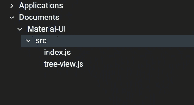
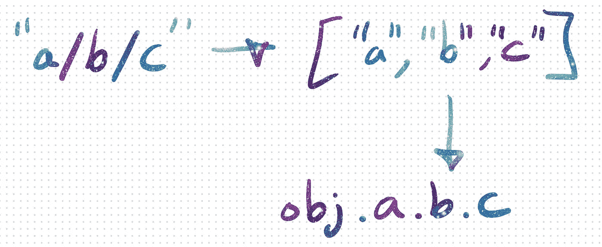

# 帮助用户查找东西—生成页面树

> 原文：<https://medium.com/geekculture/help-users-find-things-generate-a-page-tree-a87d946f906e?source=collection_archive---------44----------------------->

## 我如何使用 NextJS、MaterialUI 和一个递归 React 组件来制作页面树

[Accompanying video](https://youtu.be/p99iyVIk_wQ)

尽管我已经向我正在工作的参考站点添加了一系列特性，但是特性集中还是有一些明显的遗漏。主要是缺少在页面间导航的机制。页面的嵌套结构自然指向一个类似的导航结构，一个树。

# 探索材质 UI 的树



因为我使用的是 Material UI，所以看一下他们现有的树实现是很自然的。它由一个顶级的`<TreeView>`组件组成，并且可以有`<TreeItem>`子组件，子组件本身可以有`<TreeItem>`子组件。

```
<TreeView>
  <TreeItem>
    <TreeItem />
  </TreeItem>
  <TreeItem>
    <TreeItem />
    <TreeItem>
      <TreeItem />
    </TreeItem>
  </TreeItem>
</TreeView>
```

它们中的每一个都有几个属性(例如图标、标签和可访问性)。可以在这里查看:

*   [树形视图](https://material-ui.com/api/tree-view/)
*   [TreeItem](https://material-ui.com/api/tree-item/)

# 路径数组

之前，我使用了`globby`库来获得一个解析为文件路径数组的承诺。然后这些文件路径的`.md`扩展名被`/`删除并拆分。结果是一个由路径段数组组成的数组。

```
*import* { resolve, sep } *from* "path";*const* cwd = resolve("src", "data", "JavaScript");*const* filePathToPathArray = (path: *string*): *string*[] =>
  path.replace(/\.md$/, "").split(sep);*const* filePathsPromise = globby("**/*.md", {
  onlyFiles: *true*,
  cwd,
}).then(paths => paths.map(filePathToPathArray));
```

# 树形方法概述



输入是一个路径，它被分成一组路径段。我们如何将这个数组转换成看起来更像树的东西？访问对象属性的方式类似于访问文件路径的方式，但是没有使用`/`或`\`，而是使用了`.`。所以，树的结构可能是一个对象。

# 树代码实现

可以创建一个漂亮的干净的对象来表示路径树，但是，我希望能够在树中不仅仅存储路径信息。所以，我创建了一个稍微不同的模式。

```
*type PathTreeNode* = {
  page: *boolean*;
  children: {
    [k: *string*]: *PathTreeNode*;
  };
};
```

我创建了一个名为`children`的单独的键，而不是每个节点都是一个对象，键是子节点，这样就有空间添加更多的属性，比如`page`(我稍后会讲到)。

第一步是减少路径数组。

```
*type PathArraysToTree* = (pathArrays: *string*[][]) => *PathTreeNode*;

*export const pathArraysToTree*: *PathArraysToTree* = (pathArrays) =>
  pathArrays.reduce(pathArrayToNode, { page: *true*, children: {} });
```

`pathArrays`的每一次迭代都将消耗一个由路径段组成的路径数组。

```
*type PathArrayToNode* = (
  tree: *PathTreeNode*,
  pathArray: *string*[]
) => *PathTreeNode*;

*const* pathArrayToNode: *PathArrayToNode* = (tree, pathArray) => {
  *const* lastTreeNode = pathArray.reduce(segmentToNode, tree);
  lastTreeNode.page = *true*;
  *return* tree;
};
```

然后，每个片段用于遍历树。如果节点不存在，则创建它。

```
*type SegmentToNode* = (parent: *PathTreeNode*, segment: *string*) => *PathTreeNode*;

*const* segmentToNode: *SegmentToNode* = (parent, segment) => {
  parent.children[segment] ??= { page: *false*, children: {} };
  *return* parent.children[segment];
};
```

注意`page`最初是`false`。这是因为当我们遍历路径时，不能确定`.md`文件是否会存在于每一个路径中。这不是我期望会经常发生的事情，但是，这是一条重要的信息。

还有，既然我在变异树，我可以在`pathArrayToNode`最后一行把树还回去。为了使其不可变，可以使用递归函数代替`.reduce`。

# 与 NextJS 集成

这里需要做的就是使用`getStaticProps`为页面模板提供路径树。

```
*// ~/src/pages/JavaScript/[...path].tsx**import* { *getPathTree* } *from* "../../utils/data-path";*export const getStaticProps*: *GetStaticProps*<
  *JavaScriptPageTemplateProps*,
  *PathResult* > = *async* ({ params }) => {
  /* ... */
  *const* { path } = params;
  /* ... */
  *const* pathTree = *await getPathTree*();

  *return* { props: { /* ... */, path: ["/JavaScript", ...path], pathTree } };
};
```

# 递归路径树反应组件

除了材料 UI 样板代码，还有一个组件特别有趣:递归 React 组件。顾名思义，递归 React 组件是在组件内部某个地方调用自己的组件。

首先需要的是构造树中节点的路径。我通过组件 props 传递父路径，所以所需要的就是将`parentPath`展开到一个数组中，最后一项是当前段。该路径将用于创建页面链接(即`href`)并传递给孩子。

```
*export const PathTreeItem*: *FunctionComponent*<*PathTreeItemProps*> = ({
  path: parentPath,
  nodeChildren,
}) => (
  <>
    {Object.entries(nodeChildren).map(([segment, node]) => {
      *const* path = [...parentPath, segment];
      *const* href = path.join("/");
      *const* ContentComponent = createContentComponent({ href });
      *return* (
        <TreeItem
          *key*={href}
          *nodeId*={href}
          *label*={segment}
          *ContentComponent*={ContentComponent}
        >
          {Object.keys(node.children).length > 0 ? (
            <PathTreeItem *nodeChildren*={node.children} *path*={path} />
          ) : *null*}
        </TreeItem>
      );
    })}
  </>
);
```

# 我遇到的一个问题

下面这段代码有些地方让我不太舒服。它看起来有点笨拙——好像还可以改进。

我构建我的树的方式是孩子们总是有价值的。这意味着孩子的条目将总是产生一个数组，因此`PathTreeItem`将有一个非空的孩子。我将需要重新安排一些逻辑，这样就不会出现这种情况，但是现在我接受一些可读性的损失，通过窥视节点的`children`，看看我是否需要首先创建一个`PathTreeItem`。

```
{Object.keys(node.children).length > 0 ? (
  <PathTreeItem *nodeChildren*={node.children} *path*={path} />
) : *null*}
```

那些好奇的人可能会从查看资源库中受益，因为我可能已经提出了一个不同的解决方案。

# 你编码的方式总是在变化

学习编码的一个奇妙之处在于:几个月后，一个令人满意的解决方案可能看起来很糟糕。该解决方案甚至可能最终被完全重构。

如果没有更好的解决方案，不要纠结于此。随着时间的推移，更好的解决方案往往会出现。关键是要培养敏锐的代码嗅觉，并记住那些气味在哪里。

# TL；速度三角形定位法(dead reckoning)

我将文件路径的数组转换成树，并使用递归 React 组件来显示它。这样，网站的访问者就可以直接在网站的所有页面之间导航。

*最初来自:*

[](https://www.bayanbennett.com/posts/help-users-find-things-generate-a-page-tree) [## 帮助用户查找东西——生成页面树

### 虽然我已经在我正在工作的参考网站上添加了一系列功能，但还是有一些明显的遗漏…

www.bayanbennett.com](https://www.bayanbennett.com/posts/help-users-find-things-generate-a-page-tree) 

thumbnail