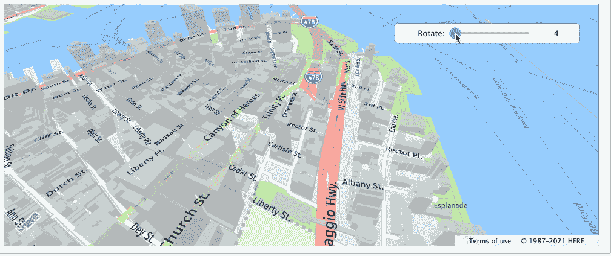
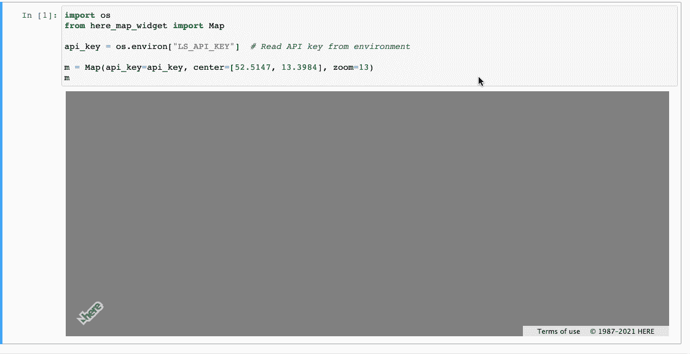
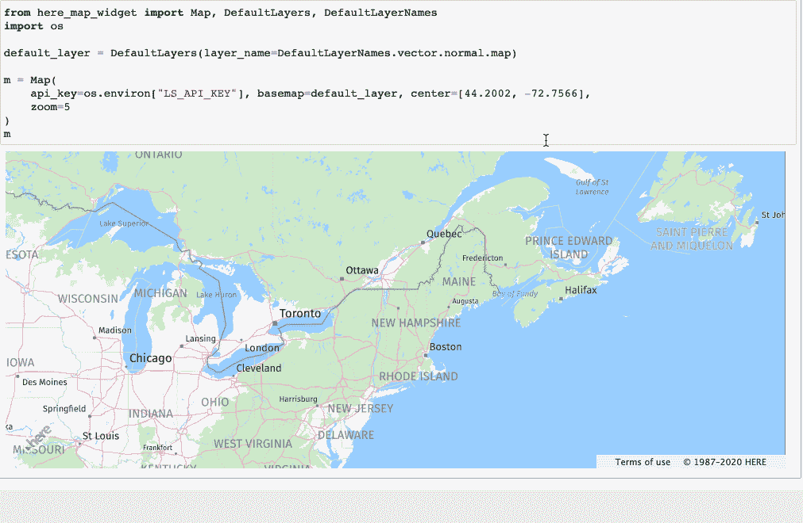
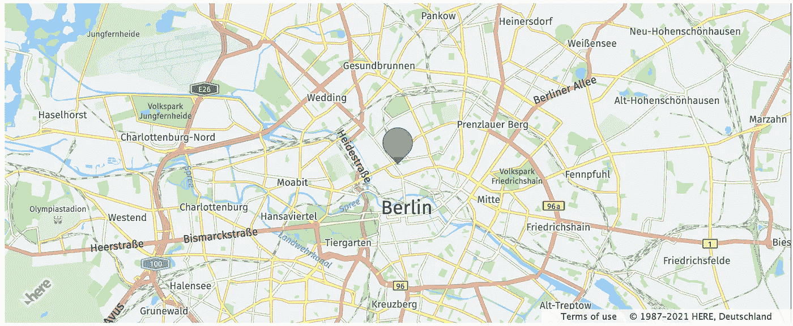
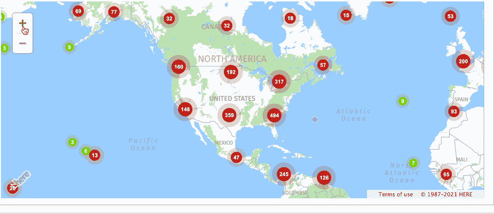
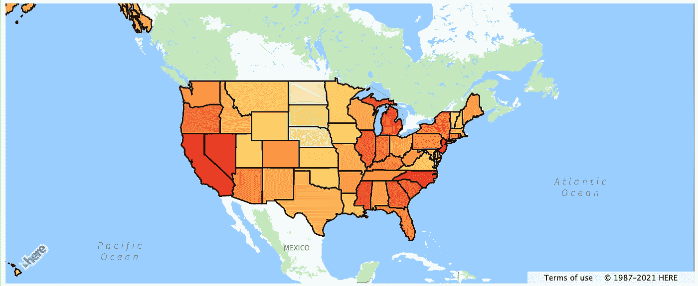
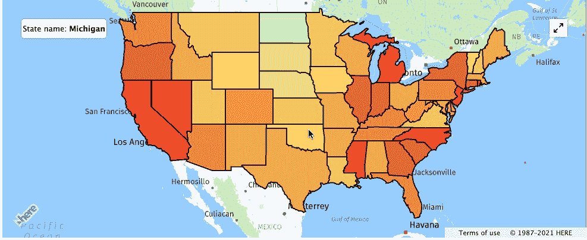
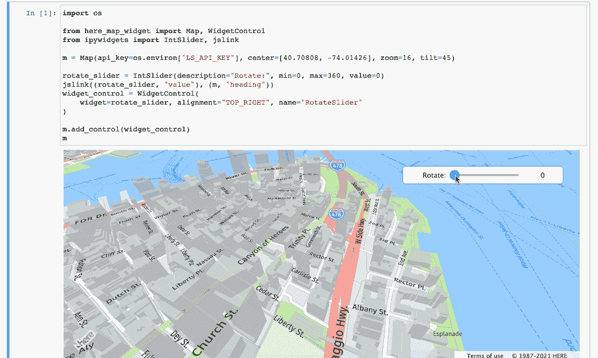

# 这里映射了你的 Jupyter 笔记本中的 JavaScript API

> 原文：<https://medium.com/geekculture/here-maps-api-for-javascript-in-your-jupyter-notebooks-6e012440a0d1?source=collection_archive---------10----------------------->



Here Map Widget for Jupyter

在地图上可视化地理空间数据是地理空间分析的一个非常重要的方面。由于 Jupyter 笔记本已经成为数据科学、数据分析、研究和开发的事实标准，因此在 Jupyter 笔记本中使用 HERE Maps API for JavaScript 使地理空间可视化更加直观和有趣！

[用于 JavaScript 的 HERE Maps API】是一组编程接口，使开发人员能够以功能丰富的交互式](https://developer.here.com/develop/javascript-api) [HERE Maps](https://www.here.com/) 为中心构建 web 应用。

今天，我们向您介绍开源 python 包[HERE-Map-widget-for-jupyter](https://pypi.org/project/here-map-widget-for-jupyter/)，它结合了 Jupyter widgets 和 HERE Maps API for JavaScript 的功能，结合这些功能，Here Map widget for Jupyter 可以在您的 Jupyter 笔记本中实现交互式地图和地理空间数据可视化。用于 Jupyter API 的 Here 地图小部件映射到用于 JavaScript 的 HERE 地图 API，将其核心功能引入 Jupyter 生态系统。

Jupyter 的 Here 地图微件的一些重要功能:

*   Jupyter 笔记本中的交互式地图
*   倾斜、旋转和 3D 地图外观
*   与 [HERE 位置服务](https://github.com/heremaps/here-location-services-python)集成
*   与此处的[数据中枢](https://github.com/heremaps/xyz-spaces-python)集成
*   这里是矢量瓷砖
*   这里是栅格切片

**先决条件:**

用于 JavaScript 的 HERE Maps API 具有 API 驱动的架构，因此要访问各种 HERE Maps API，您需要一个 API 密钥进行身份验证。API 密匙可以从 [HERE 开发者门户](https://developer.here.com/)免费获得。获取 API 密钥的指令在这里提到[。](https://developer.here.com/documentation/identity-access-management/dev_guide/topics/dev-apikey.html)

**安装:**

安装**here-map-widget-for-jupyter**:

使用 conda:

```
$ conda install -c conda-forge here-map-widget-for-jupyter
```

使用画中画:

```
$ pip install here-map-widget-for-jupyter
```

让我们一个接一个地看例子:

1.  地图:

可视化地图非常简单，在地图类上创建一个对象，如下所示:

```
import os
from here_map_widget import Mapapi_key = os.environ["LS_API_KEY"]  # Read API key from environmentm = Map(api_key=api_key, center=[52.5147, 13.3984], zoom=13)m
```

您可以缩放、平移和倾斜地图。



map

2.底图

底图使用栅格切片、矢量切片和地图切片 API 提供，如以下代码片段所示:

```
import os
from here_map_widget import Map, DefaultLayers, DefaultLayerNames, Platformapi_key = os.environ["LS_API_KEY"]default_layer = DefaultLayers(layer_name=DefaultLayerNames.raster.satellite.map)m = Map(api_key=api_key, basemap=default_layer, center=[52.5147, 13.3984], zoom=13)
m
```



Basemaps

3.标记:

当您有一组兴趣点时，您可以将其作为点标记添加到地图上。以下示例显示了如何使用标记在地图上表示单个点。

```
import os
from here_map_widget import Map, Markerapi_key = os.environ["LS_API_KEY"]
m = Map(api_key=api_key, center=[52.53075, 13.3851], zoom=12)marker = Marker(lat=52.53075, lng=13.3851)
m.add_object(marker)
m
```



除了默认标记，您还可以使用图标对象为标记定制图标，jupyter 的地图小部件也支持 SVG 和 DOM 标记。

markers

这里 Jupyter 的地图小部件有三个可以添加到顶部的元素。

一.对象:

对象是几何图形，例如:

*   要点
*   线串
*   多重字符串
*   多边形
*   多重多边形
*   矩形
*   圆
*   多叉线

二。图层:

图层是添加在地图顶部的叠加层。这里，Jupyter 的地图微件支持以下图层:

*   杰奥森
*   地理数据框架(地理数据库数据框架)
*   数据中枢空间层
*   Choropleth
*   KML
*   热图
*   市场集群

**MarkerCluster 层:**

在下面的示例中，我们将世界上所有的机场作为标记聚类图层添加到地图上。



markers_cluster

**Choropleth 层:**

以下是基于美国各州失业指数的 choropleth 地图示例。失业数据为 CSV 格式，用于定义 choropleth 图层。



choropleth

让我们扩展上述示例并创建一个交互式地图，将鼠标指针悬停在州上方时，在 ipywidgets 的帮助下，通过在 Choropleth 层上注册 on_hover 回调，州的名称将显示在地图的左上角。



interactive

三。控件:

控件提供各种控制功能。

*   全屏
*   地图设置控件
*   尺寸
*   比例尺
*   搜索
*   拆分地图控件
*   缩放控制
*   缩放矩形控件
*   小部件控件

**控件控制:**

借助 widget 控件，可以在地图上添加 ipywidgets，链接地图的性状来控制地图。在下面的例子中，我们将地图的标题特征链接到 ipywidgets 的 IntSlider，这样我们就可以使用滑块旋转地图。



在这篇文章中，我展示了 Jupyter 的 Here 地图小部件的基本示例，你可以使用这个小部件实现一些高级的 GIS 功能。

在这里，Jupyter 的地图小部件有大量的文档和更高级的例子。下面是一些重要的链接，可以获得关于这个小部件的更多信息。

*   [GitHub](https://github.com/heremaps/here-map-widget-for-jupyter)
*   [文档](https://here-map-widget-for-jupyter.readthedocs.io/en/latest/index.html)
*   [PyPI](https://pypi.org/project/here-map-widget-for-jupyter/)