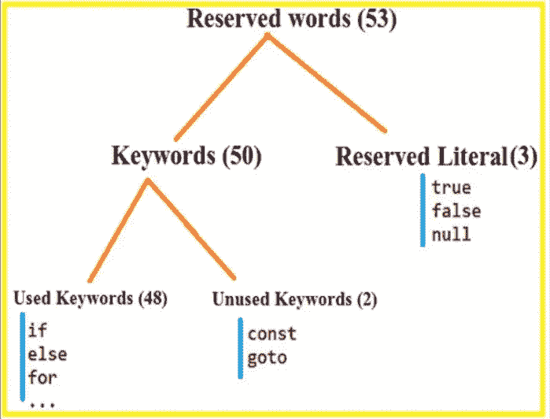
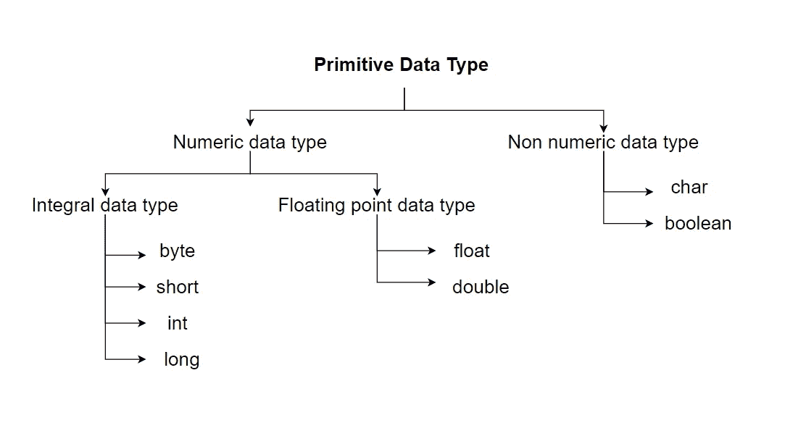

# Java 基础第一部分

> 原文：<https://medium.com/geekculture/here-we-are-going-to-learn-some-important-java-fundamentals-that-every-java-programmer-should-learn-a1aad466b26a?source=collection_archive---------43----------------------->

每个 java 程序员都应该知道的一些重要的 java 基础知识。

有 10 个 Java 基础

1.  标识符
2.  保留字
3.  数据类型
4.  文字
5.  数组
6.  变量的类型
7.  var-arg 方法
8.  主要方法
9.  命令行参数
10.  Java 编码标准

## *在这里我们看到了****Java 的前 4 个基础***

# 1)标识符

java 程序中的名字被称为标识符，可以用于识别目的。它可以是方法名、变量名、类名或标签名。

示例:

在本例中，有 5 个标识符→ Myclass、main、String、args、x

**定义标识符的规则**

1.  允许的字符

> 从头到尾
> 
> 手册
> 
> 0 到 9
> 
> $
> 
> _

2.标识符不能以数字开头

3.Java 标识符区分大小写

4.标识符没有长度限制。但是为了良好的实践，不要使用太长的标识符

5.我们不能使用保留字作为标识符

例如:int if = 10int int = 10

这些会导致编译时错误。

6.但是我们可以使用预定义的类名和接口名作为标识符。作为一种好的做法，我们也可以避免这种情况。

检查这个代码。它将打印 88。因为字符串是一个类名

# 2)保留字

在计算机语言中，保留字(也称为保留标识符)是**一个不能用作标识符**的字，如变量、函数或标签的名称——它是“保留使用”。这是一个句法定义，保留字可能没有意义。

在 Java 中有 53 个保留字

> **数据类型的关键字(8)**

1.  字节
2.  短的
3.  （同 Internationalorganizations）国际组织
4.  长的
5.  漂浮物
6.  两倍
7.  布尔型
8.  茶

> **流量控制关键字(11)**

1.  如果
2.  其他
3.  转换
4.  情况
5.  系统默认值
6.  在…期间
7.  做
8.  为
9.  破裂
10.  继续
11.  返回

> **修饰词的关键字(11)**

1.  公众的
2.  私人的
3.  保护
4.  静电
5.  最后的
6.  摘要
7.  同步的
8.  当地的
9.  strictfp
10.  短暂的
11.  不稳定的

> **异常处理的关键字(6)**

1.  尝试
2.  捕捉
3.  最后
4.  扔
5.  投
6.  维护

> **类相关关键词(6)**

1.  班级
2.  连接
3.  延伸
4.  工具
5.  包裹
6.  进口

> **对象相关关键词(4)**

1.  新的
2.  实例 of
3.  极好的
4.  这

> **返回类型关键字(1)**

1.  空的

在 Java 中返回类型是强制的，如果我们什么都不返回，我们需要使用 void。

> **未使用的关键词(2)**

1.  转到
2.  常数

使用 **goto** 会在旧语言中引起几个问题。因此为了避免这些问题，它在 java 中是被禁止的。

我们可以用 **final** 关键字代替 **const** 关键字。

所以这两个关键字在 java 里是不用的。如果您尝试使用，它会给出编译时错误。

> **用于文字的关键字(3)**

1.  真实的
2.  错误的
3.  空

> **其他(1)**

1.  列举型别

它用于定义一组命名常数

**关于保留字的结论**

所有 53 个保留字仅使用小写字母。

java 中没有 delete 关键字。因为这是垃圾收集器的职责。

# 3)数据类型

Java 是一种强类型语言

原因:

1.  在 Java 中，每个变量和表达式都有某种类型。
2.  编译器应该检查每个赋值的类型兼容性
3.  int x = 10.5bool b = 0；→在 Java 中给出编译时错误。但是它在 C/C++这样的老语言中是可用的。

Primitive data types in Java

这里除了 char 和 boolean，其余都被认为是有符号数据类型

## 整数数据类型

> **字节**

用于处理文件系统和网络领域

第一个 msb 位用于存储符号，其余 7 位用于存储值。

在第 1 个 msb 中，0 表示正值，1 表示负值。

大小→ 1 字节(8 位)

范围→ -128 至 127

> **短**

Java 中很少使用的数据类型

大小→ 2 字节(16 位)

范围→ -32768 到 32767

> **int**

Java 中最常用的数据类型

大小→ 4 字节(32 位)

范围→ -2147483648 到 2147483647

> **龙**

大小→ 8 字节

范围→ -2⁶到 2⁶ -1

## 浮动数据类型

> **浮动**

5 到 6 位小数精度

大小→ 4 字节

范围→ -3.4e38 至 3.4e38

> **双**

14 到 15 精度

大小→ 8 字节

范围→ -1.7e308 至 1.7e308

## 布尔数据类型

只有可接受的值为真/假

java 中不允许 0 和 1

For boolean only true/false are allowed

如果你尝试这段代码，它会抛出编译时错误，说“不兼容的类型，类型:整数，必需的:布尔”

## 字符数据类型

大小→ 2 字节

范围→ 0 到 65535

# 4)文字

可以赋给变量的常数值称为文字。

在上面的例子中，

int →数据类型/关键字

x →变量的标识符/名称

10 →文字/常数值

## 整数文字

> **十进制文字(基数为 10)**

int x = 10

> **八进制文字(基数 8)**

int x = 010

它以零(0)为前缀

> **十六进制文字(基数 16)**

int x = 0x10

int x = 0X10

可以以 0 和小 **x** 或大写 **X** 为前缀。

而且我们可以用小写 **a-f** 或者大写 **A-F** 来指定十六进制数。

> **二进制文字(基数 2) →来自版本 1.7**

int x = 0b10

int x = 0B10

可以以 0 和小 **b** 或大写 **B** 为前缀。

当我们打印这些值时，它只被打印成十进制数。在编译时，JVM 将八进制、十六进制和二进制数字转换成十进制数字。

默认情况下，所有的积分都是 int 类型的。但是我们可以明确地转换它。例→长 x = 10l

## 浮点文字

**1。**默认情况下，每个浮点文字都是双精度类型。因此，我们不能将一个十进制数直接赋给浮点变量。但我们可以用后缀 f 或 f 来指定它。

*浮点 f = 123.456→给出错误，“发现:双精度，要求:浮点”*

*浮点 f = 123.456f→这里可以，因为我们指定了一个浮点数。*

**2。我们只能以十进制形式指定浮点文字。我们不能用八进制、十六进制和二进制形式来指定。**

双 d=123.456 →工作正常

double d = 0123.456 →不是八进制，只存储 123.456

double d = 0x123.456 →它给出错误:“格式错误浮点文字”

**3。**我们可以把整数赋给 float 和 double 类型，但要在范围内。然后我们可以指定二进制，八进制和十六进制形式的整数。

双 d = 10→商店 10.0

双 d = 010→商店 8.0

double d = 0xFace→商店 64206.0

## 布尔文字

如前所述，对于布尔值，只允许真/假

## 字符文字

**1。我们可以在单引号中指定字符文字。**

char a = ' a

char a = " a→抛出不兼容类型错误，因为它是字符串。

**2。**我们可以将字符文字指定为整数文字，表示字符的 unicode 值，整数可以以二进制、八进制和十六进制形式指定，但允许的范围是 0 到 65535(字符的大小)

char ch = 97→商店“a”

char ch = 65 商店' A '

**3。**我们也可以指定它有' \uXXXX '，其中 XXXX 是十六进制表示法

char ch = ' \ u0061→ 0061(十六进制)表示 97，因此它存储“a”

**4。**然后我们也可以在字符中存储所有转义序列

char ch = ' \ n

char ch = ' \ t

## 字符串文字

字符串在双引号中指定。

String s= "Java 基础第一部分"

## 版本 1.7 的增强功能

1.  仅在此版本中允许二进制文字
2.  允许在数字之间使用下划线。这是为了代码可读性而引入的。

双 d = 1 _ 23 _ 456.7 _ 8 _ 9；→编译后删除下划线。

双 d = _ 1 _ 23 _ 456.7 _ 8 _ 9；双 d = 1 _ 23 _ 456 _ . 7 _ 8 _ 9；双 d = 1 _ 23 _ 456.7 _ 8 _ 9 _→这三句话抛出编译时错误。规则是我们只需要在数字之间使用下划线。