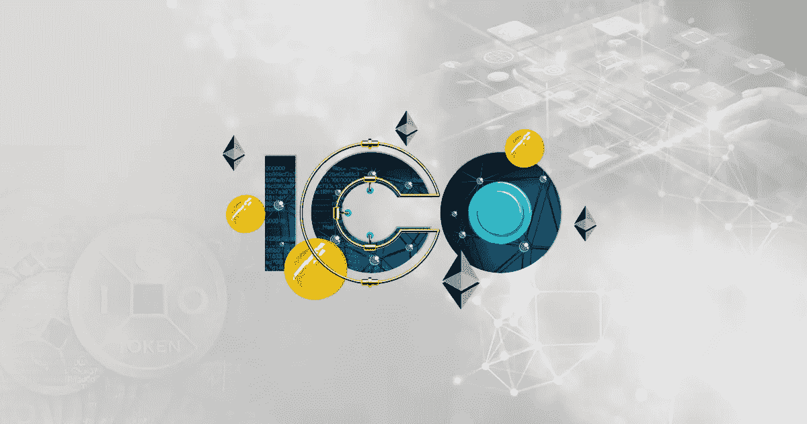

# 这是一本关于战略性推广你的首次硬币发行(ICO)平台的手册

> 原文：<https://medium.com/geekculture/heres-a-manual-on-strategically-promoting-your-initial-coin-offering-ico-platform-fe703f9adcec?source=collection_archive---------22----------------------->

我们都知道资本在商业中的重要性。一个企业的基础取决于投入其中的资金。ICO- Initial Coin 产品在加密产品中起着至关重要的作用。由于加密项目刚刚出现一段时间，人们完全信任它并投资它是不可能的。当你有一个 ICO 平台时，你需要拥有加密项目的人和信任你平台上所列项目的投资者来投资。然而，找到这样的人并不是一件容易的事。那么，你能做些什么呢？让我们看看。

# **ICO- an 简介**

ICO(初始硬币发行)平台的推出是加密领域有史以来最美妙的事情之一。最初的硬币提供平台是一个筹款论坛，在这里你可以列出你的加密项目，并找到一个潜在的投资者来投资它。随着加密项目的需求和受欢迎程度不断提高，ICO 平台不断涌现。如果你想增加你平台的流量，你需要的不仅仅是效率和质量。是的，你需要杀手级的营销策略。

# **ICO 的营销策略**

营销策略的问题在于，你永远无法确定它会不会奏效。你不可能对所有的产品都采用相同的技术作为目标受众，而且影响范围也不会相同。某些产品需要某些方法才能到达目的地。然而，这里有一个策略列表，ICO 推广服务公司可以用它来提高销售和知名度。

# **你可以采用的营销方法**

**社交媒体营销**

我们都知道人们在社交媒体上花了多少时间。从统计数据来看，智能手机用户平均每天在社交媒体上花费至少三个小时。他们从脸书一路冲浪到推特，在 Youtube 上狂看视频。Twitter 营销帮助虚拟收藏品到达像阿姆这样的山羊(有史以来最伟大的)说唱歌手手中。所以，在社交媒体上营销你的 ICO 平台，最好能让你的品牌有更好的曝光度。

**不和谐营销**

不和是新的敲门声。该平台越来越受欢迎，使用案例也越来越多，这使其成为营销不可替代令牌的最佳平台之一。这个平台给人最深刻的印象是它不需要任何算法。因此，您在服务器上发布的任何内容都不会被忽略。您还可以构建任意数量的服务器，并构建您的社区来有效地推广您的产品和业务。

**内容营销**

内容营销可能会成为一种旧策略。然而，它并没有失去生存能力。有没有注意到，同样的内容从你的物理老师嘴里说出来，当它来自一个受欢迎的 YouTube 创作者时，会变得有趣十倍？这就是传递的力量。如果你能塑造能打动人心的内容，你就能通过它来推销你的产品。即使是最愚蠢的笑话，只要表达得当，也会让人捧腹大笑。因此，通过内容的正确传递，你可以立刻提升你的产品销售。

**SEO 营销**

谷歌是如今人们信任的新医生。即使人们感到轻微不适，他们的第一反应也是在搜索引擎中搜索他们的经历。因此，战略性地使用关键词和内容，通过搜索引擎优化为你的 ICO 平台带来更多流量，是一种有效的数字化营销方式。雇佣一个有经验的搜索引擎优化分析师团队，用最吸引人的关键词来吸引你网站的流量。当人们开始浏览你的网站时，你可以期待你的销售额会有很大的增长。

**公关管理**

没有其他营销策略能比得上人际互动的效果。你越是亲自接触人们，向他们宣扬投资一个加密项目的重要性，你就越能增加你的品牌价值。公共关系管理一直是最有效的策略之一。让您的受众了解加密领域的最新动态以及投资的益处，这将有助于您赢得目标受众的信任，并接触到更多潜在的投资者和买家。

**影响者营销**

影响力这个词概括了这种营销策略的作用。当你发现自己成为品牌 ICO 平台的影响者时，你要确保他们的影响会增加你的品牌知名度。还记得 c 罗让全世界对可口可乐说不吗？这就是有影响力的人的力量。他们在世界上的影响力越大，当你用他们来推销你的产品时，你的品牌就越受欢迎。当谈到最初的硬币提供平台时，影响者营销仍然是目前最成功的策略之一。

**结论**

比方说，你不确定你可以采用什么样的营销策略。没有一个 ICO 营销策略可以让你在整个创业过程中坚持下去。因此，你需要随时了解市场的需求和要求。在这种情况下，您可以随时向指导您完成这一过程的 ICO 营销服务机构寻求帮助。选择一家在该领域有丰富经验的知名机构是确保你获得预期结果的一种方式。