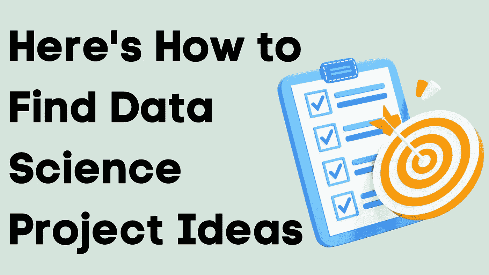

# 以下是如何找到数据科学项目的想法

> 原文：<https://medium.com/geekculture/heres-how-to-find-data-science-project-ideas-a1f52c2df743?source=collection_archive---------11----------------------->

从事 [**数据科学项目**](https://thecleverprogrammer.com/2022/03/09/data-science-projects/) 是提高数据科学技能的最佳方式之一。这不仅能提升你的技能，还能强化你的简历。所以，如果你是一个数据科学初学者，想知道如何找到数据科学项目的想法，这篇文章就是为你准备的。在本文中，作为初学者，我将带您了解寻找数据科学项目想法的一些最佳方法。

# 以下是如何找到数据科学项目的想法

以下是作为数据科学初学者寻找数据科学项目想法的一些最佳方法。

## 关注发布数据科学的社交媒体账户

社交媒体是获取任何话题想法的最佳途径之一。如今，Instagram 上有如此多的账户在积极发布关于数据科学的信息。如果你在 Instagram 上关注这样的账户，你会获得数据科学项目的想法和很多作为数据科学从业者应该知道的技巧和知识。

以下是一些在 Instagram 上积极发布数据科学的账户:

1.  [amankharwal . official](https://www.instagram.com/amankharwal.official/)
2.  [**数据科学**](https://www.instagram.com/datasciencebrain/)
3.  [**数据证明**](https://www.instagram.com/dataspoof/)

## 积极参与 Kaggle

[**Kaggle**](https://www.kaggle.com/) 是 Google 旗下的数据科学社区。你可以在 Kaggle 上找到数千个独特的数据集、竞赛和展示你的数据科学技能的平台。当你活跃在 Kaggle 上时，你将每天浏览数百个新数据集，这将为你的下一个数据科学项目提供许多想法。

我每个周末都用 Kaggle，不到 10 分钟就找到至少两个新的项目创意。因此，请在 Kaggle 上积极寻找数据科学项目创意。

## 查找关于趋势事件的数据

基于趋势事件查找数据集将帮助您获得创建独特数据科学项目的想法。比如 ICC 男子 T20 世界杯 2022 即将在 10 月开赛。这将是 10 月份的热门事件。

当你发现趋势事件时，在 [**谷歌数据集搜索**](https://datasetsearch.research.google.com/) 上搜索基于这些事件的数据集。您总能找到数据集，帮助您基于趋势事件创建独特的数据科学项目。

# 摘要

这就是你作为一个初学者如何找到数据科学项目想法的方法。甚至我也用这些策略来寻找新的独特的项目想法。作为一名数据科学初学者，参与项目是有价值的，因为它可以提升你的技能，强化你的简历。我希望您喜欢这篇关于寻找数据科学项目想法的最佳方法的文章。欢迎在下面的评论区提出有价值的问题。