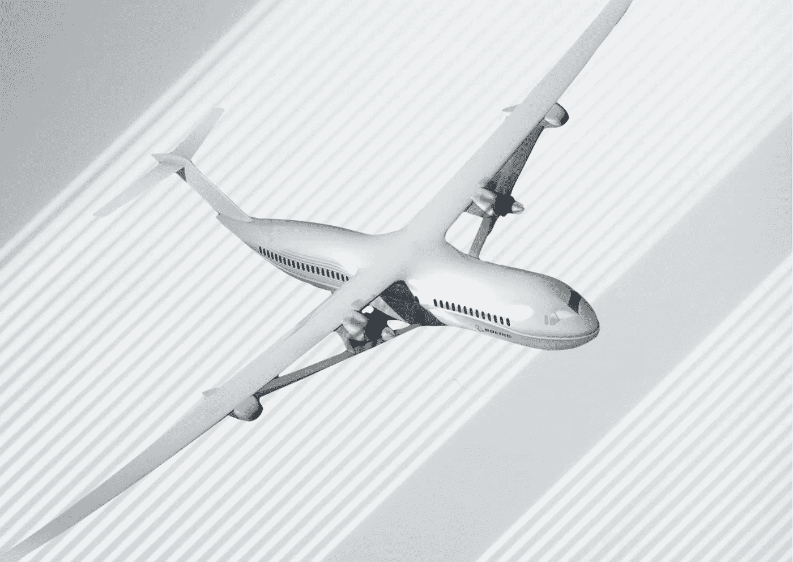

# 这是清洁飞机的下一项颠覆性技术

> 原文：<https://medium.com/geekculture/heres-the-next-disruptive-technology-for-cleaner-aircraft-6e698cbead2b?source=collection_archive---------0----------------------->

## 不，这与氢或燃料电池无关

**Figure 1**. The Subsonic Ultra Green Aircraft Research, or SUGAR, Volt design concept. Credit: Adapted by the author from NASA.

我们生活在一个激动人心的快节奏时代，绿色创新正在彻底改变我们的旅行方式。

在过去的十年里，飞机制造商大力推动绿色创新，以重塑民用航空的未来。