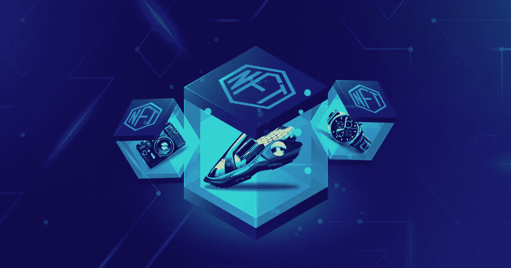

# 以下是你需要了解的实物资产 NFT 市场！

> 原文：<https://medium.com/geekculture/heres-what-you-need-to-know-about-physical-assets-nft-marketplaces-d0fed235b53c?source=collection_archive---------14----------------------->

还记得人们曾经疯狂地为他们的孩子和家人积累资产吗？我们都见过中年人如何努力节省资产。我们可能还注意到，我们努力保存的有形资产是如何被政府或骗子拿走的。大多数时候，这种灾难只发生在你没有适当的文件证明你是财产的所有者的时候。然而，人们总是可以操纵信息，改变文件中的所有权细节。就在这时，NFTs 前来救援。在我们深入这个主题之前，让我们看看什么是 NFT。

# **NFTs 快速介绍**

不可替换的令牌通常被称为 NFT。这些代币最令人惊奇和与众不同的特点是它们的不可替代性。你可以把任何东西的数字拷贝变成虚拟收藏品。他们的市场似乎在增长，这种增长对数字世界的每个人来说都是显而易见的。不可替代的收藏品吸引人们的另一个方面是他们使用区块链网络，这是最安全的交易技术。这种区块链技术提供了交易过程中的安全性，并给你真实性和所有权。是的，确实如此。

# **NFT 是如何认证的？**

由于虚拟收藏品运行在区块链技术上，你不能篡改它们来窃取或修改数据。例如，如果你把你的数据输入一个区块链，你所有的细节都将被储存在里面，并且不可能被侵入和编辑。人们声称即使是最熟练的黑客也无法侵入你的区块链。这样，您在注册过程开始时输入的详细信息会一直保持不变。

# 实物资产——一个完美的组合。

我们都知道数字资产如何在世界上创造了一场全新的革命。他们仍然不断创造奇迹，让世界肃然起敬。他们并没有就此罢休。他们通过步入实物资产的世界，成为了令人欣慰的财产所有者。对许多人来说，罗密欧和朱丽叶是完美的一对。然而，在当今时代，没有比虚拟收藏品和实物资产更好的组合了。当你实际拥有一项财产时，有许多方法可以利用它。例如，欺诈可以改变你的财产所有权细节，并声称这是他们的。然而，随着 NFT 有形资产市场的引入，你将永远不会面临这种威胁。让我们看看 NFT 实物资产交易市场需要什么。

# **NFT 有形资产基地必备的东西。**

如您所见，您还可以为物理资产开发[NFT。你所需要做的就是在 NFT 的任何一个交易场所注册虚拟的实物财产。您将看到虚拟代币被铸造，所有权被转移到实际拥有者手中。一天下来，你拥有的任何文件的照片都足以成为虚拟收藏品。它将保护您的所有权细节，并随时随地验证您的所有者身份。现在让我们看看用例。](https://www.appdupe.com/physical-assets-nft-marketplace-development)

# **您可以留意的用例**

**可穿戴设备**

虚拟服装是这个用例的最好例子。有一些游戏像“分散之地”,那里有一个特殊的游戏内 NFT 市场来交易收藏品。当你虚拟地存在于一个像分散的世界中，并代表一个角色时，你可以在那里拥有自己的虚拟衣橱。你可以用你最喜欢的服装来装扮你的虚拟形象，让它符合你喜欢的时尚感。你可以每天访问独特的虚拟可穿戴设备，如牛仔裤、鞋子、运动鞋、夹克、帽子等。

**房地产**

当我们考虑房地产领域时，实物资产 NFT 的用例非常多。只需轻轻一刷，你就可以交易房产瓷砖和文件，这让这个行业变得疯狂。有了 NFT 参与鉴定您的财产，您永远不会面临盗窃或欺诈的威胁。

**工件**

现实世界的人工制品，无论是史前的再现还是当时的经典(例如报纸专栏)，都可以被制作成具有高价值的非功能性翻译。将这些不朽的文物数字化成不可替代的收藏品会给你带来无尽的版税。

# **NFT 实物资产市场发展-3 步流程。**

**第一步:数字化**

第一步是将现实世界的实物资产数字化。想象一下，有一张包含资产所有权信息的纸。在开始数字化过程之前，您需要获得一个虚拟的描述，以确保您选择了正确的媒体来数字化您的物理资产。

**第二步:选择区块链**

选择一个高效的区块链是发展 NFT 市场最关键的一步。你的市场提供的所有功能取决于你选择的区块链网络的潜力。当它拥有高效的智能合约，并能提供更顺畅的交易时，你可以放心，因为你知道自己的交易平台无论如何都会表现出色。

**3。构建**

这最后一步留给你两个选择。您可以选择白标解决方案，也可以从头开始构建整个平台。最可取的方法是采用白标解决方案，因为它相对更具成本效益和时间效益。

**最后说，**

[NFT 实物资产开发](https://www.appdupe.com/physical-assets-nft-marketplace-development)是对人类最有益的事情之一。现在，随着各个领域的欺诈率不断上升，这就更有意义了。