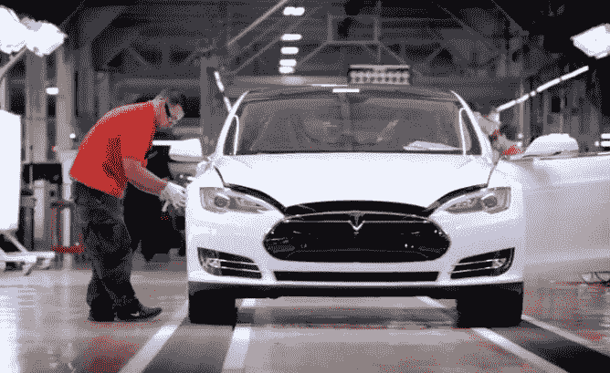

# 这就是为什么质量控制可能会导致特斯拉的灭亡

> 原文：<https://medium.com/geekculture/heres-why-quality-control-might-be-the-demise-of-tesla-b878a4b581f?source=collection_archive---------9----------------------->

## 当车企开始追赶百亿美元的公司，会发生什么？

Photo by Hybrid Cars/ Jeff Cobb

目前，特斯拉几乎没有竞争对手。特斯拉的汽车拥有独一无二的体验。他们的汽车在软件、范围、功能和风格方面都很出色。这些创新的特性让他们…