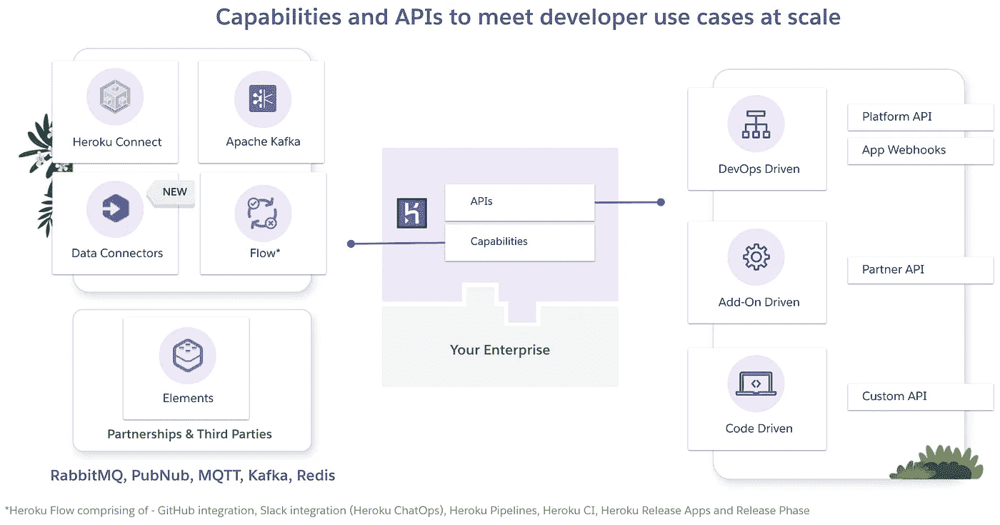
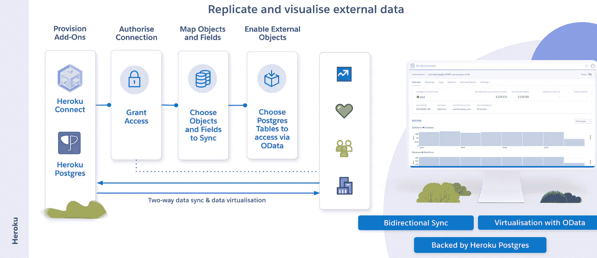
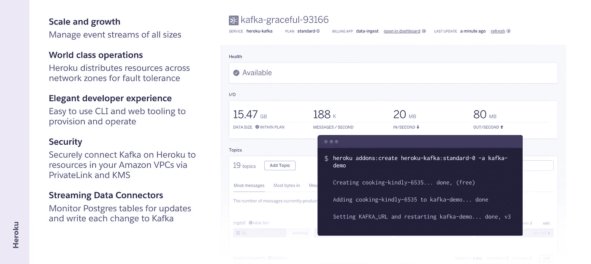
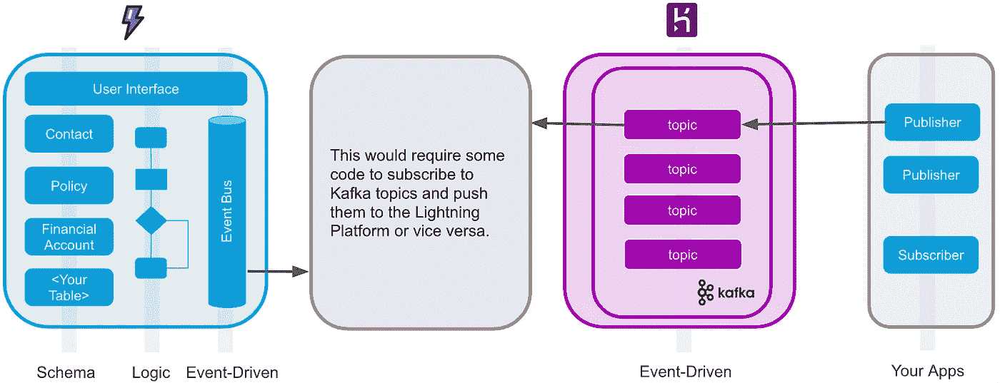
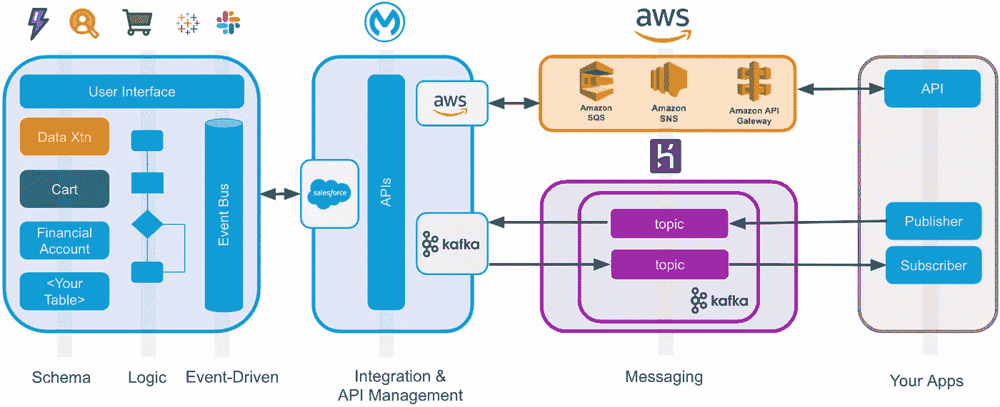
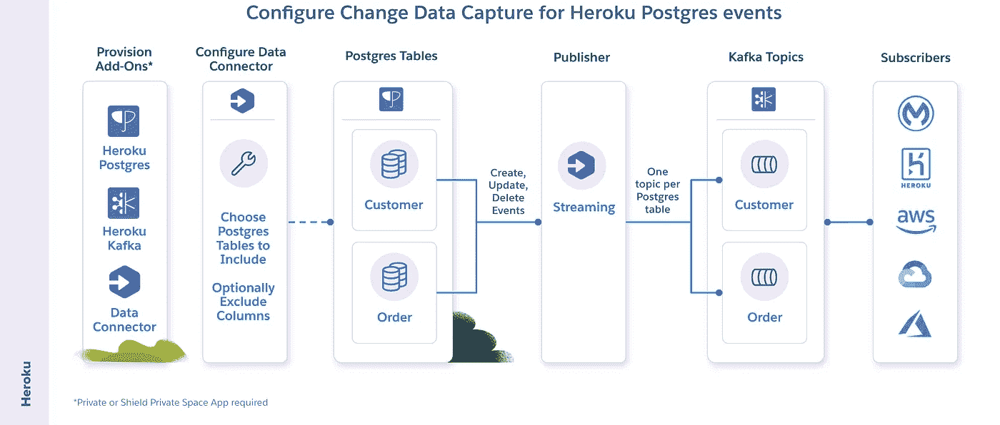
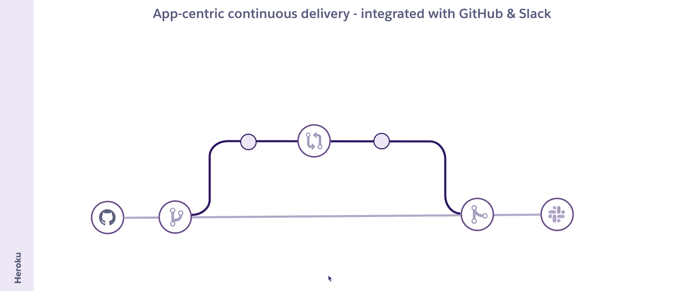
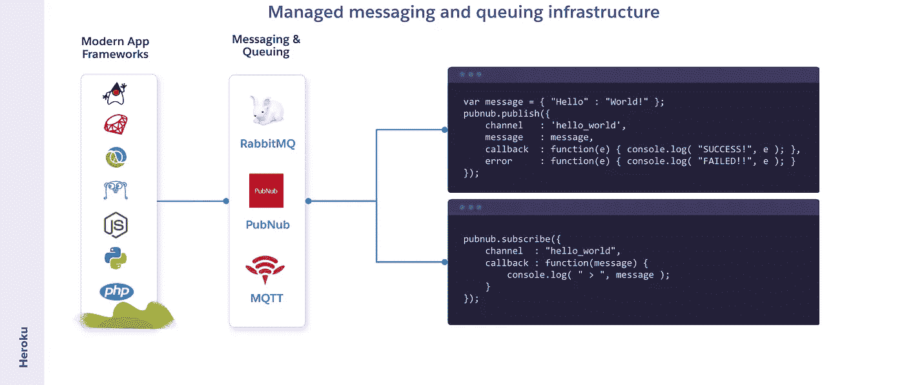
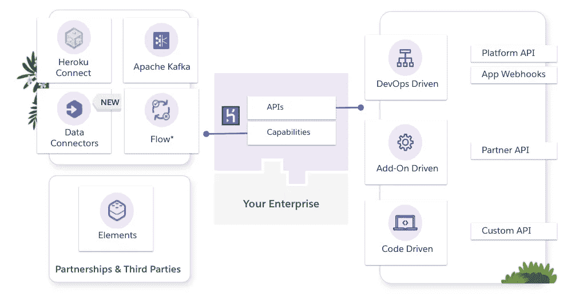

# Heroku 集成能力:迷你指南

> 原文：<https://medium.com/geekculture/heroku-integration-capabilities-the-mini-guide-b8ce745faad1?source=collection_archive---------8----------------------->

## Heroku Connect，Heroku 上的 Apache Kafka，MuleSoft 的 Kafka 连接器，流数据连接器，Heroku Flow 等等。

在上一篇文章中，我们讨论了构成 Salesforce 平台的[互连部分，并总结了 API 和功能。](/geekculture/salesforce-apis-and-integration-capabilities-the-pocket-guide-2a1a8e97603d?source=friends_link&sk=8bc83d17960cd031782b0ea2e3011f8c)

在本帖中，我们将双击 Heroku 来更深入地了解它的**集成能力**。

Heroku APIs and Key Integration Capabilities

# Heroku 连接

Heroku Connect 使您可以轻松构建 Heroku 应用程序，与您的 *Salesforce* 部署共享数据。

Heroku Connect 有两个核心功能。

*1。* ***您可以从***[***sales force Lightning 平台***](/geekculture/lightning-platform-integration-capabilities-the-mini-guide-e9a407a20eba) ***和托管的 Heroku Postgres 数据库—双向*** 复制数据。

例如，如果您使用 Ruby on Rails 创建一个应用程序并将其托管在 Heroku 上，您可以将您在该应用程序中捕获的数据复制到 Lightning 平台(反之亦然)，在那里您可以为您的前台和后台办公室添加声明性工作流和流程。

> 这有助于在无需编写代码的情况下将 Lightning 平台和 Heroku 的功能结合起来。

2.**将数据保存在 Heroku Postgres 数据库中，但直接从 Salesforce 创建、读取、更新和删除数据**。Heroku External Objects 使 Postgres 数据库中的表可以通过 OData Provider 使用，只需点击设置和配置即可。

所需的步骤非常简单。

1.  创建一个 Heroku 应用程序，并为 Heroku Postgres 和 Heroku Connect 提供附加组件
2.  连接到您的核心 Salesforce 部署并授权连接
3.  选择标准和自定义对象，以及其中的字段以与 Postgres 数据库同步
4.  可以选择 Postgres 数据库中的表，以便通过 OData 提供程序使用

Heroku Postgres 数据库中的表在 Lighting Platform 中显示为外部对象——这使得用户体验与存储在平台上的数据很难区分。

> 这有助于跨系统边界实现数据虚拟化的用例。可以与数据进行交互，而没有跨两个不同数据库复制数据所带来的集成挑战。

# Heroku 上的阿帕奇卡夫卡

Heroku 上的 Apache Kafka 是一个附加组件，它将 Kafka 作为一种服务完全集成到 Heroku 平台中。

Kafka 为构建能够处理数十亿事件和数百万事务的分布式应用程序提供了消息传递主干，旨在以高度的可靠性和容错能力移动大量的短暂数据。

Kafka 资源分布在不同的网络区域以实现容错，不同的[计划](https://elements.heroku.com/addons/heroku-kafka)满足高度安全的使用案例——提供多达 8 个 Kafka 代理、最少 6 周的数据保留和 HIPAA 合规性。

> Heroku 上的 Apache Kafka 在几分钟内构建了一个分布式的、可伸缩的、安全的 Kafka 消息传递主干。

## MuleSoft 的阿帕奇卡夫卡连接器

将 Heroku 上的 Kafka 中的事件与 Salesforce jigsaw 的其他部分联系起来可能会很有挑战性。没有直接的方式从闪电平台或营销云订阅 Kafka 事件——这是一个需要一些代码的灰色区域。

There is currently no way to directly subscribe to Kafka events in other parts of the Salesforce platform.

为了弥合这一差距，MuleSoft 提供了一个 Apache Kafka 连接器，可以连接许多不同类型的应用程序，包括 Salesforce jigsaw 组件。

MuleSoft has connectors that can bridge between systems whilst monitoring those APIs

创建这些类型的集成可以通过免费试用 [MuleSoft 的 Anypoint 平台](https://anypoint.mulesoft.com/login/signup?apintent=generic)和 [Anypoint Studio](https://www.mulesoft.com/lp/dl/studio) 来完成。

# 流式数据连接器

流数据连接器使 Heroku 上的变更数据捕获(CDC)变得可能，只需很少的努力。任何拥有私人或屏蔽空间的人，以及在该空间中的 Postgres 和 Apache Kafka 附加软件，都可以免费使用流数据连接器。

在 Salesforce 和外部商店之间构建流数据管道，如雪花数据湖或 AWS Kinesis 队列，以便与其他数据源集成。将 monoliths 重构为微服务，实施基于事件的架构，在低成本存储服务中归档数据，等等。

连接器的其他用途是从多个 Salesforce 和 Work.com 组织中的数据构建统一的事件源，这提供了基于 Kafka 的集中式事件总线来对所有组织活动采取行动——这是可能的，因为 Heroku Connect 提供了易于设置的双向同步并将该数据存储在 Heroku Postgres 数据库中。

# 赫罗库流

Heroku Flow 支持优化的开发发布路径。让我们通过一个典型的发布路径来强调 Heroku 的主要功能。

Heroku Pipelines 让您为软件开发生命周期设置阶段——评审、开发、试运行和生产。虽然您可以手动将代码从一个阶段提升到下一个阶段，但是您也可以将您的管道与一个 **GitHub** 库连接起来，并使其自动化。

因此，让我们假设我们是一个团队的新开发人员，通过使用上面的动画来看看流程是什么样子的。

第一步:首先，我会检查主要分支

第二步:然后我会为我想做的变更创建一个特征分支

步骤 3:我将在本地测试这个更改，然后将我的更改提交回 GitHub

第四步:然后我会创建一个拉请求——此时, **Heroku 管道**拾取拉请求并自动创建一个**评审应用—** 评审应用用于提议、讨论并决定是否将变更合并到您的代码库。它还可以选择运行 **Heroku CI** 一款低配置的测试车。Heroku CI 使用与您的试运行和生产版本具有字符串奇偶校验的应用程序，以零队列时间运行您的测试脚本。

步骤 GitHub 的所有后续提交都创建了一个新的评审应用。

步骤 6:接下来通常是代码审查。有了 Heroku ChatOps，开发者可以跟踪代码的变化。拉式请求通知、合并和 CI 构建都显示在 Slack 中。

第 7 步:假设审查是好的，我的 CI 测试通过了，然后我将我的更新合并回 main。这将触发另一个自动构建来创建一个临时应用程序。这现在允许在推广到生产之前进行进一步的测试。

步骤 8:最后，开发团队可以将代码推广到产品中。使用 Heroku 的**发布阶段**，开发人员可以在发布进入生产之前运行任务，从而消除维护窗口并降低部署风险。迁移数据库、将资产上传到 CDN、使缓存失效或运行应用程序需要的任何其他任务。

提升可以使用 Heroku 仪表板和 Heroku 管道手动完成，也可以使用 Slack 命令通过 Heroku ChatOps 完成。

> Heroku Flow 的目标是使高质量变更的部署和监控尽可能容易。

# 元素市场

Heroku Elements Marketplace 提供易于集成的技术解决方案，支持应用程序开发和运营的多个阶段。一些元素由 Heroku 创建和管理，而其他元素则由生态系统合作伙伴、开源社区或个人开发者贡献。

使用 CloudAMQP 之类的插件来自动化 RabbitMQ 集群的设置、扩展和运行。它为您的开发人员提供有序、无重复的保证和高可用性，内置或发布可托管实时 API，使用应用内聊天、推送通知、位置跟踪等功能构建引人入胜的远程体验，同时使用强大的数据流网络。

> Heroku Elements marketplace 让您专注于构建应用程序，而不是运行和操作复杂的集成基础架构。

# 摘要

对于您企业中的定制应用程序或全新应用程序，需要 B2C 规模的充分弹性和使用现有的现代编程语言，如 Go、Scala、Ruby、Python、Node.js 等，Salesforce 提供了在完全托管的基础架构上托管这些应用程序及其相应数据服务的能力。能够利用您现有的开发人员技能集，并根据需要进行垂直和水平扩展，这开辟了新的集成用例。运行完全托管的 Kafka 实例或将数据双向同步到 Lightning 平台的集成服务使得数据交换可扩展且易于设置。

