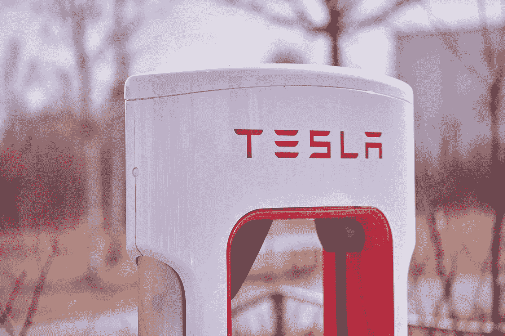

# 嘿，埃隆·马斯克，这个简单的想法值得你赠送 1 亿美元吗？

> 原文：<https://medium.com/geekculture/hey-elon-musk-is-this-simple-idea-worth-your-100-million-giveaway-81ef84f636c3?source=collection_archive---------17----------------------->

## 这是我拯救压板成为百万富翁的机会

Photo by [Michael Förtsch](https://unsplash.com/@michael_f?utm_source=medium&utm_medium=referral) on [Unsplash](https://unsplash.com?utm_source=medium&utm_medium=referral)

特斯拉首席执行官兼首席执行官埃隆·马斯克(Elon Musk)对气候变化颇为担忧。他最近宣布了一项被称为“XPRIZE”的 1 亿美元奖金，奖励开发出“最好的”二氧化碳减排技术。