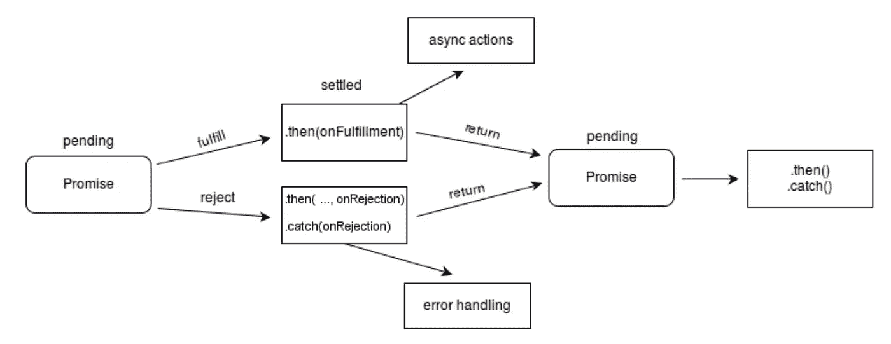
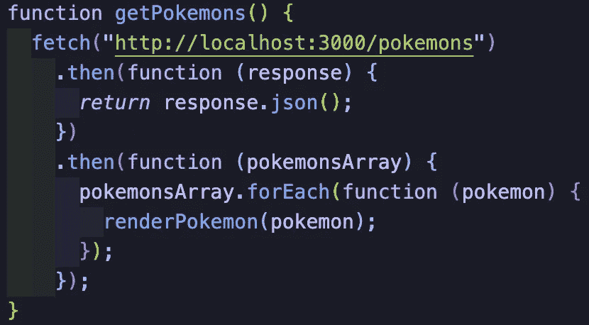
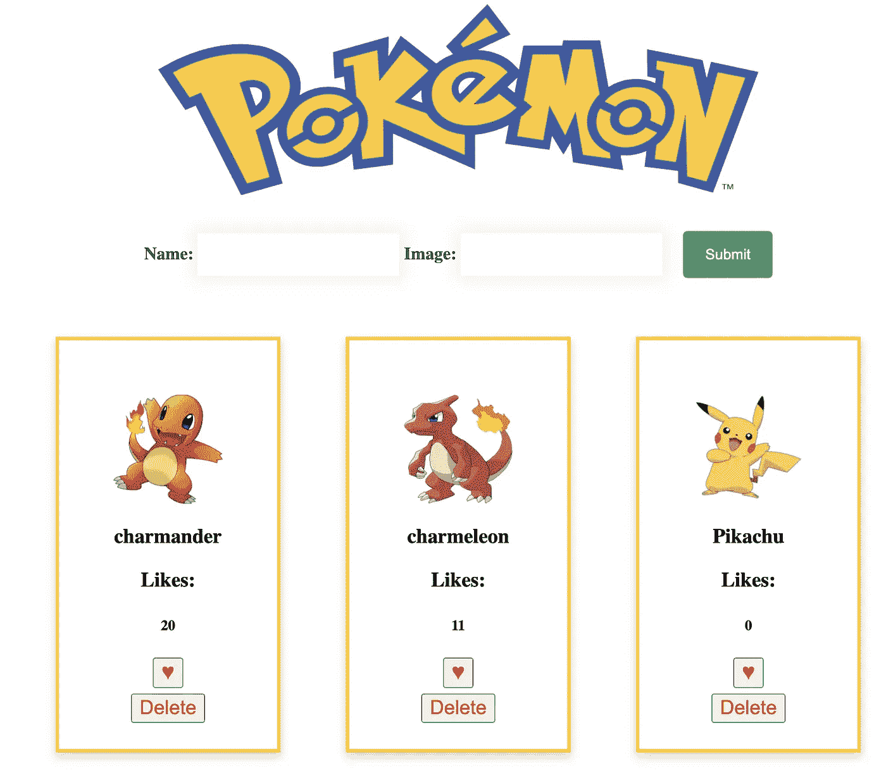
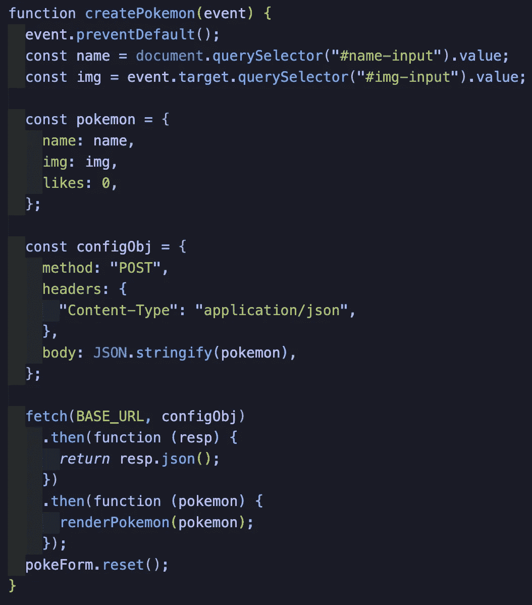
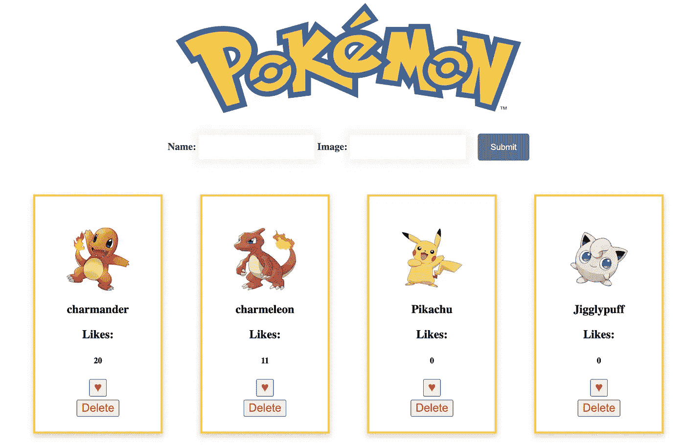
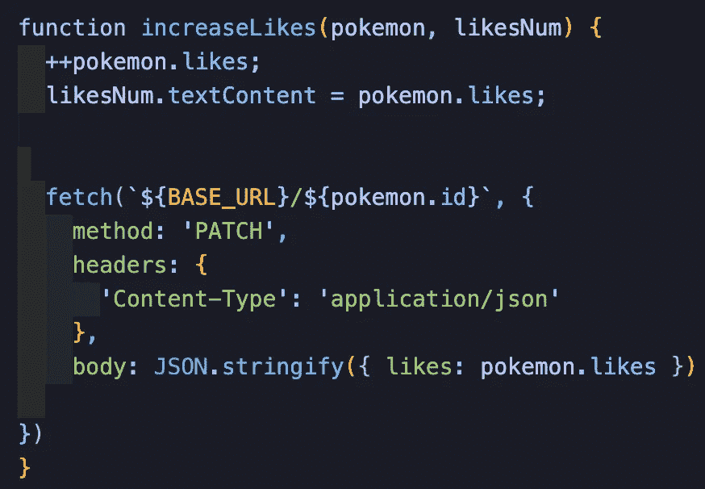
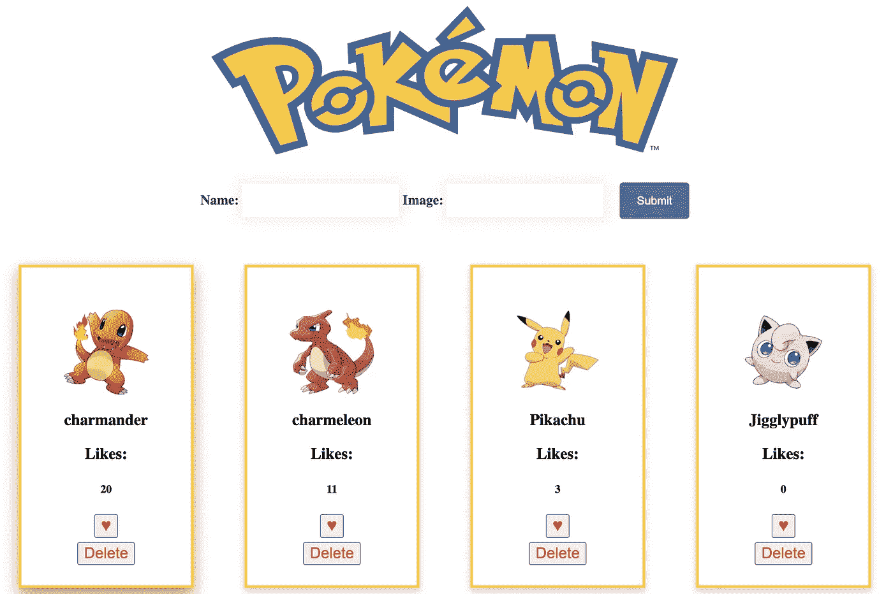
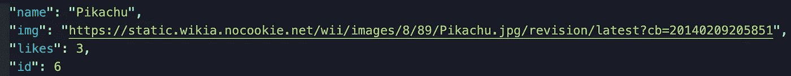
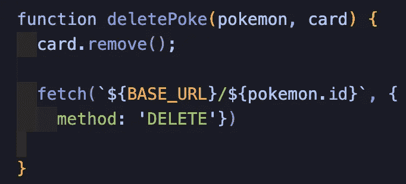
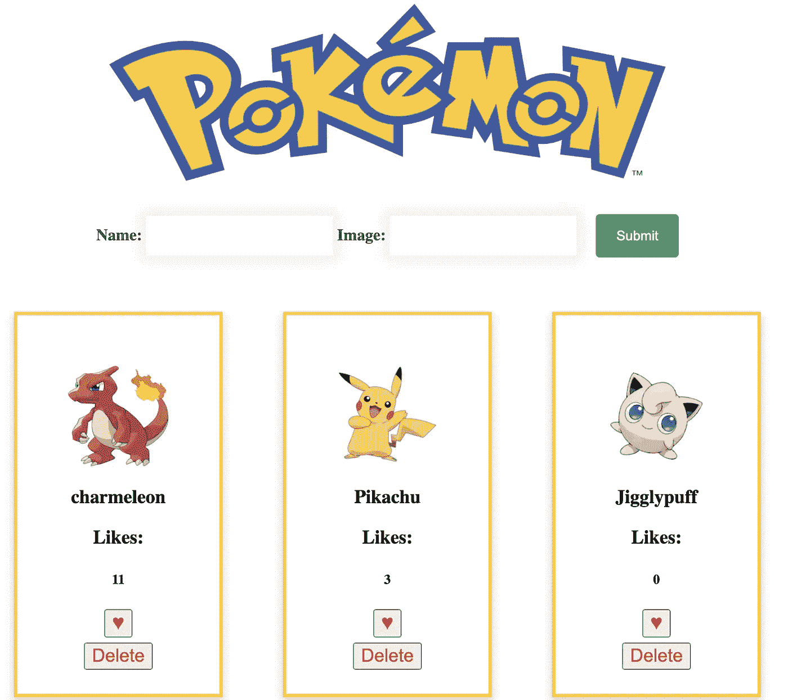

# 嘿人类，去捡回来！

> 原文：<https://medium.com/geekculture/hey-human-fetch-9da171e62fd6?source=collection_archive---------34----------------------->

## 使用 CRUD 和 fetch & JavaScript 的指南

作为一个狗主人，我教我的狗的第一件事就是如何成功地去捡一个网球。

对于我们这些开发者来说， *fetch* 的含义略有不同。在编程中，fetch API 被用作在发出请求后获取资源的一种手段。为了使用 fetch()，我们传入第一个参数，一个指向我们想要的数据的 URL，类似于我的狗嘴里的球。

# 接下来会发生什么？

发出请求后，fetch 响应返回一个 Promise 对象。这基本上是一个来自异步方法的借据，*承诺*某个值要么在未来某个时间成功实现，要么被错误拒绝。发生这种情况时。然后调用()方法，获取响应并将其转换成 JSON，以匹配正在使用的数据。现在，这个返回什么？如果你猜对了另一个承诺，你答对了！

如上图所示，另一个。然后()方法需要处理第二个承诺，这可以用来操纵用户认为合适的数据。

现在我们已经讨论了 fetch API 的逻辑，让我们看看如何使用它来处理 HTTP 请求。

# 什么是 CRUD？

CRUD 是一个奇特的缩写词，象征着我们可以对数据存储执行的四种类型的操作。

**C** —创建→过账

**R** —读取→获取

**U** —更新→打补丁

**D** —删除→删除

值得注意的是，默认情况下，如果给定第一个必需的参数，即 URL，fetch()将发出 GET 请求。对于其他三种类型的请求，需要第二个参数:一个控制几种设置类型的配置对象。

在接下来的例子中，我将从我在 Flatiron 的演讲中演示如何使用所有四个请求来创建和操作 Pokédex web 应用程序。

> **1。** **搞定**

第一步是*获取*项目所需的数据。

GET request

在这个函数 *getPokemons* 中，我们首先使用 fetch 来获取包含关于 Pokemon 角色的所有信息的 URL。下一个语句是第一个。then()方法处理响应参数，并在响应被转换成 JSON 供我们使用后返回响应。接下来，我们链另一个。then()方法将收集的数据传递到一个函数中，该函数遍历每个元素，并分别将其传递给在页面上创建物理 Pokemon 卡的 *renderPokemon* 回调函数。当我们刷新我们的 html 时，我们将得到如下所示的内容:

Webpage after Pokemon cards are rendered

> **2。帖子**

现在，让我们试着在我们的牌组中加入更多的牌。在页面顶部，用户可以通过输入所需角色的名称和图像 URL 来添加口袋妖怪卡片。我们可以通过发起 POST 请求来实现这一点！

POST request

在上面的 *createPokemons* 回调函数中，我们写出了在*‘提交’*事件之后发生的动作，也就是说，当用户将想要的角色信息输入到 HTML 表单中时。首先，我们希望防止元素的默认行为，并防止页面在新信息提交后刷新，这样用户就可以在它被添加到 DOM 后实际看到它停留在页面上。接下来，我们希望从用户那里收集信息，并将这些值保存到变量中，以便创建包含新细节的*口袋妖怪*对象。这就是 GET 请求与其他所有请求不同的地方:在我们的 POST 请求中，需要第二个参数来指定方法、头和主体，在这里传递的对象被转换为 JSON 字符串。然后一切照常——获取步骤 1 中显示的基本 URL 并链接第二个。then()方法将数据传递给 *renderPokemon* 函数，并显示在 dom 上。现在，如果我想添加一张胖丁卡片，我可以输入它的名称和图片网址，然后…

> **3。补丁**

假设我们希望更新每个角色的赞数，并让这些更改即使在页面刷新时也保持不变。

PATCH request

我们的 increaseLikes 函数从前面的代码块中获取 *pokemon* 对象，以及一个变量 *likesNum* ，该变量表示 *pokemon* 对象中的原始赞数。接下来，我们再次获取基本 URL，但是这次使用字符串插值添加 pokemon 角色 ID 的特定端点，这样服务器就知道要修改哪个卡。对于这个对象，我们更新方法以符合补丁请求，并将数据转换成对象格式的 JSON 字符串，以便 JSON 文件可以相应地更新。让我们看看给皮卡丘一些爱会发生什么..

皮卡丘现在有 3 个赞了！如果我们看一下我们的 JSON 文件，我们会看到那里的赞数也更新了:

> **4。删除**

最后但同样重要的是，让我们看看如何从我们的网页上完全删除口袋妖怪卡。

DELETE request

我们的 *deletePoke* 函数像以前一样接受同一个 *pokemon* 对象和需要删除的卡片，并在卡片上调用 *remove()* 方法。接下来，我们获取带有 ID 端点的基本 URL，并指定“删除”的方法您可能想知道为什么在这一点之后没有更多的代码，那是因为因为我们从我们的页面中删除了这个元素，没有必要为我们的数据指定细节，因为它现在已经不存在了。让我们看看如果我们现在从网页上删除一张卡片会发生什么…

就这样，小火龙走了。

快乐的烹饪！