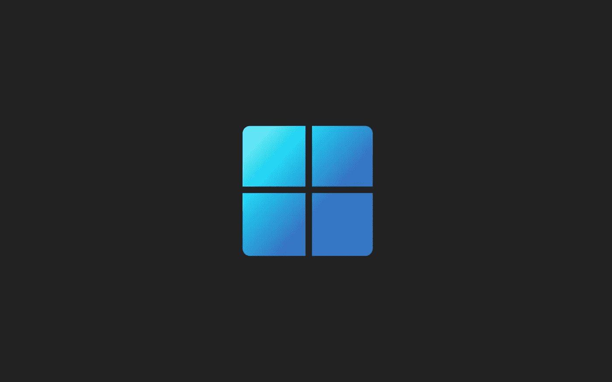

# 嘿，微软，不要再玩那些阴暗的策略了。够了。

> 原文：<https://medium.com/geekculture/hey-microsoft-enough-with-the-shady-tactics-enough-26e78596b429?source=collection_archive---------14----------------------->

## 该公司最新的 Windows 11 选择暴露了它的虚伪，现在是时候全盘招供了

As if Microsoft had not already caused enough skepticism and confusion with its questionable choices regarding Windows 11, in the last 48 hours decided to take things even further. Quite possibly too far for its own good. (Image: Microsoft)

在 Windows 11 展示周期间，看似完全没有从[他们的错误](/geekculture/windows-11-communication-disaster-in-microsofts-amateur-night-c1b14dd596fb)中吸取任何教训——实际上甚至犯了一些新的错误——微软高管选择在这一周进一步迷惑消费者…