# 隐藏的 C# Gem 代码

> 原文：<https://medium.com/geekculture/hidden-c-gem-codes-932757391478?source=collection_archive---------1----------------------->


嗨，今天我们将谈论有趣和有用的不太为人所知的 C#代码。

> **1。第一个例子是关于在类构造函数中使用“out 参数”:**

所以当我们向类构造函数发送任何 out 参数时，我们不需要返回任何东西。只需要改变 *array3List* 的引用就可以了。

*   我们将使用“ *arrayList* 获得 int[ ]参数，并将其除以 3，最后我们将把所有数组部分放到 out 参数 2 维 int[，]”*array 3 list*。

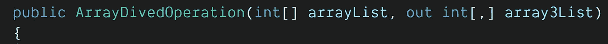

*   我们将对数组进行切片，并将每个部分的长度设置为 3。我们将设置 int[，] 2 维数组的长度，第一列是数组的个数，第二列当然是数组的长度，所以 3。我们将使用一个计数器来迭代数组列表的每一项。

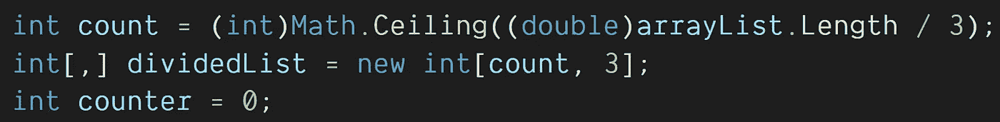

*   我们将循环直到数组列表计数。我们将从 arrayList 中为每个 out 参数数组 array3List 获取 3 项。
*   “如果 counter ≥arrayList。Length" = >我们将编写这个条件，因为有些数组计数可能小于 3。
*   " dividedList[i，num] = arrayList[counter]":我们会将 arrayList 中的每一项设置为 int[，] 2 维数组。
*   “array3List = dividedList”:最后我们将为结果设置 array3List。

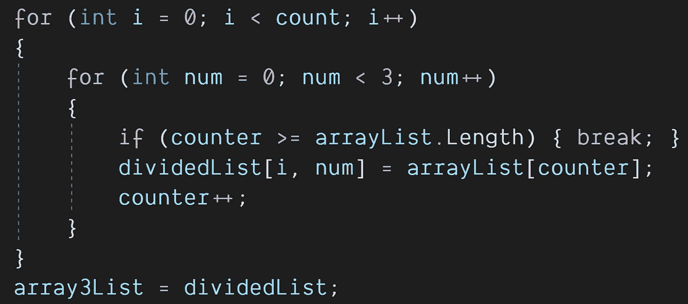

**Program.cs/ArrayDivedOperation:**

```
public class ArrayDivedOperation
{
   public ArrayDivedOperation(int[] arrayList, out int[,] array3List)
   {
      int count = (int)Math.Ceiling((double)arrayList.Length / 3);
      int[,] dividedList = new int[count, 3];
      int counter = 0;
      for (int i = 0; i < count; i++)
      {
         for (int num = 0; num < 3; num++)
         {
            if (counter >= arrayList.Length) { break; }
            dividedList[i, num] = arrayList[counter];
            counter++;
         }
    }
    array3List = dividedList;
}
```

*   int[]数组是我们的测试数组。
*   int[，] list3Group 是我们的 out 参数结果数组。
*   ArrayDivedOperation arraydived = new(array，out list3Group):我们将创建 ArrayDivedOperation 类并在构造函数上发送参数。
*   列表 3 组。GetLength(0):我们将在 list3Group 的每个数组中循环。
*   for(int I2 = 0；i2 < 3; i2++): We will get every column per array in list3Group
*   Console.Write(list3Group[i, i2] + “,”): We will write every item by 3 groups on console.

**Program.cs/Main() :**

```
static void Main(string[] args)
{
    int[] array = new int[] { 1, 2, 3, 4, 5, 6, 7, 8, 9, 10, 11, 12, 13 };
    int[,] list3Group = new int[array.Length, 3];
    ArrayDivedOperation arrayDiveded = new(array, out list3Group);
    for (int i = 0; i < list3Group.GetLength(0); i++)
    {
       for (int i2 = 0; i2 < 3; i2++)
       {
          Console.Write(list3Group[i, i2] + ",");
       }
       Console.WriteLine();
    }
 }
```

**结果:*最后，我们改变了类构造函数上 out 参数“array3List”的引用。所以我们不需要返回任何参数。***

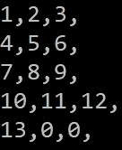

> **2。当您使用“；”时，C#可以识别正数、负数和零字符串格式。**

**程序. cs:**

```
int[] arr = { -1, -3, 0, 0, 2, 5};
foreach (var item in arr)
{
   Console.WriteLine($"{item} is {item:positive number;negative number;zero}");
}
```

**结果:**

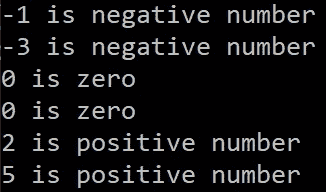

> **3。**在 C#11 上预览你可以使用*【列表模式】中的 ***模式匹配*** 。并且可以“ **Sum()** ”数组中间的数字。我认为微软在未来会将“列表模式”发展得更远。*

***Program.cs:***

```
*int[] arr = { 4, 6, 2, 8, 10 };
int result = arr switch
{
   [] => 0,
   [_, int second] => second,
   [_, .. int[] middle, _] => middle.Sum(),
   _=>-1
};
Console.WriteLine(result); //16*
```

***结果:***

*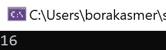*

> ***4。在 C#11 预览版中，你可以创建通用属性。将复杂类型参数设置为自定义属性类怎么样:)***

*   *“基础模型”是我们的根模型。所有的 Bussines 模型都继承自“BaseModel”。用户模式和产品模式是我们的商业模式。*

*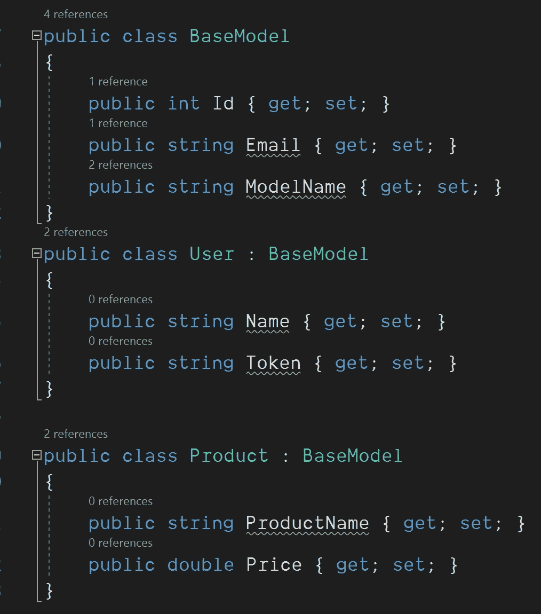*

*   *IResponseModel <t>是我们的通用属性类 interface。t 继承自 BaseModel。所以用户或产品型号可以用“T”代替。</t>*
*   *泛型 ResponseAttribute <t>继承自 IResponseModel，因此 T 也必须来自“BaseModel”。</t>*
*   *ResponseAttribute 在构造函数上接受 3 个参数。字符串消息、成功和测试数据属性。“数据”参数将通过使用反序列化<t>()方法来设置。字符串参数转换为类。在本例中，它是用户或产品类别。</t>*
*   *最后，由于 IResponseModel <t>继承，必须实现 WriteModel()方法。它用于将“T”型号名称、电子邮件和 Id 打印到控制台。</t>*

*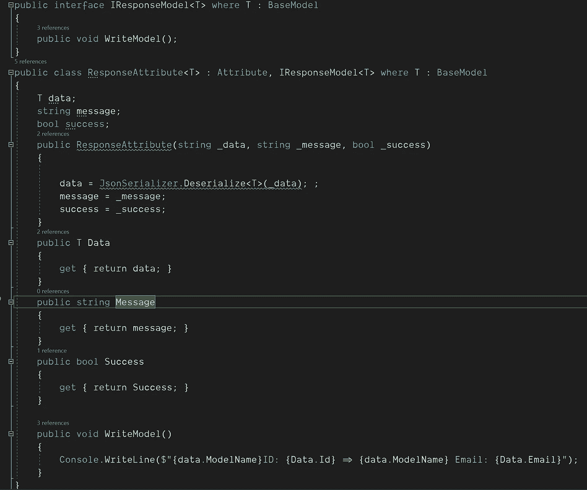*

*   *只能将 string、int 或 date 等基本类型设置为属性类的参数。因此，要将用户或产品类设置为 **< T >** 数据的参数，我们必须将它们转换为 JSON 字符串，如下所示。接下来，我们为用户和产品 ResponseAttribute 设置字符串消息参数和 bool 成功参数。*

*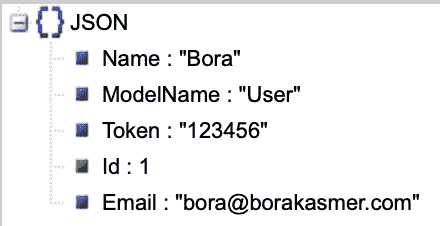*

***Json String Example T Data “User”***

*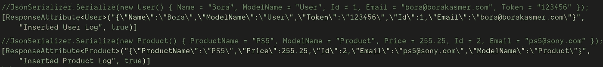*

*   *SaveUserLog()方法表示<user>，SaveProduct()方法表示<product>表 ResponseModel。我们将得到这些方法的引用，通过使用“***【GetRuntimeMethod】****()*”反射方法。而我们将通过使用“***GetCustomAttribute***()”反射方法获得它们的属性。</product></user>*
*   *最后我们会得到 ResponseAttribute <user>和 ResponseAttribute <product>类，并调用它们的 WriteModel()方法，该方法继承自“IResponseModel <t>”。</t></product></user>*

*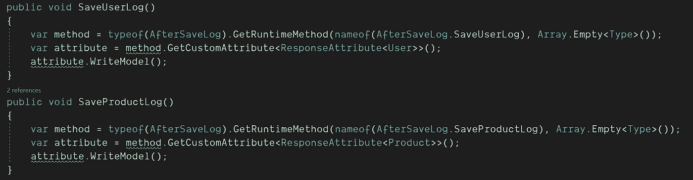*

*   *这是我们的静态 Main()方法。我们在这里将这些方法称为“ *SaveUserLog()* ”和“ *SaveProductLog()* ”进行测试。*

*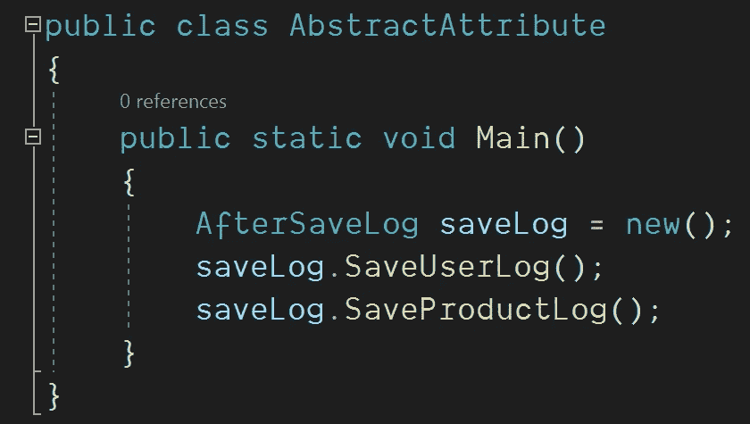*

***Static Main() Method***

***这是结果屏幕:**我们将从方法属性(***response Attribute<T>***)中获取用户和产品模型，并使用 Deserialize()方法将这个< T >数据参数打印到控制台。*

*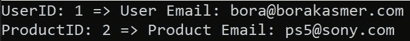*

***Final Result Screen***

*在这个例子中，我们使用通用的 CustomAttribute 将一个类作为参数。通常在 C#中，CustomAttribute 类不能将复杂类型作为参数。但是使用 GenericAttribute <t>，可以通过使用 Deserialize <t>()方法将 string json 转换为 spesific 类。</t></t>*

***程序. cs:***

***结论:***

*即使我已经写了 20 年的 C#，它仍然让我感到惊讶。这是因为除了持续创新和改进之外，它还被设计用于许多不同的领域。*

*下一篇文章再见。*

***Thank You For Reading..***

**“如果你读到现在，首先感谢你的耐心和支持。欢迎大家来我的博客*[](http://www.borakasmer.com/)****了解更多！”*****