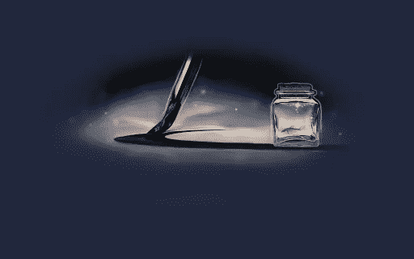
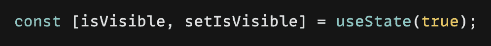
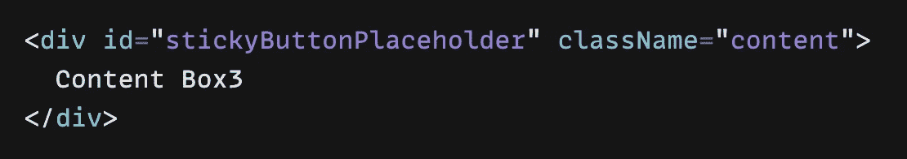
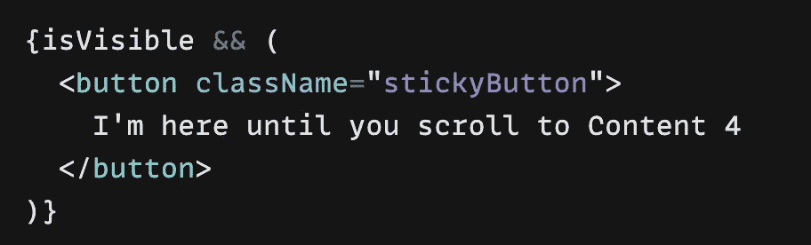
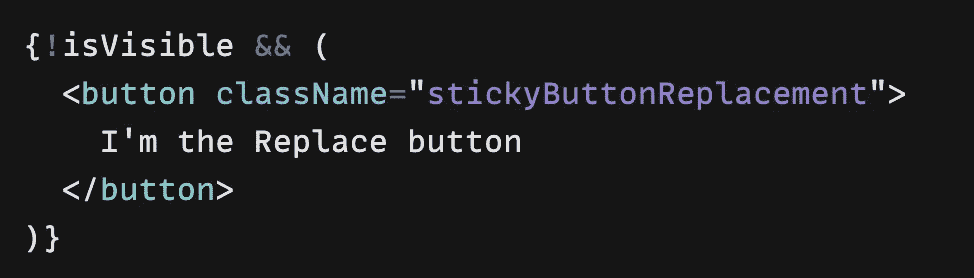
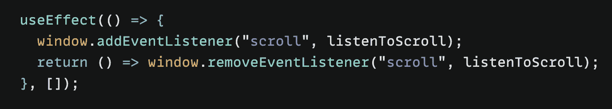
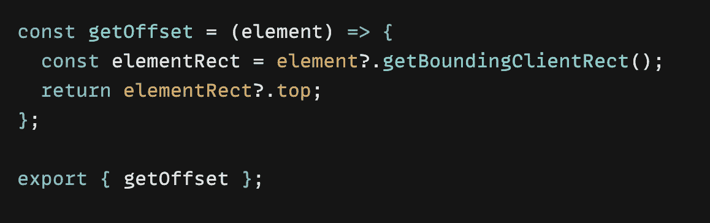
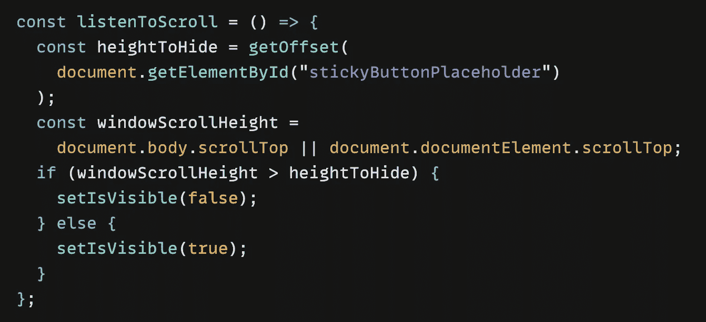
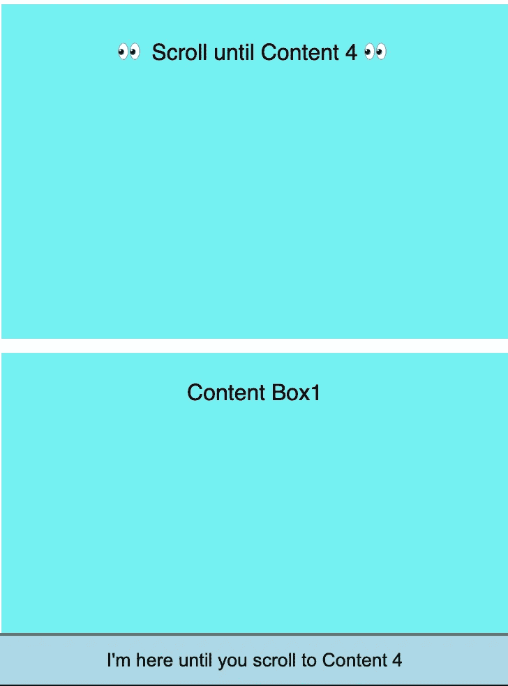

# 以反应方式隐藏和替换滚动时的粘性元素

> 原文：<https://medium.com/geekculture/hide-and-replace-sticky-element-on-scrolling-in-a-react-way-8bc3f04e2a81?source=collection_archive---------4----------------------->

—棘手但有趣🍡

最终，我们都将抵达终点 —We will all reach the end

在我工作的一个项目中，我面临一个非常有趣的任务，在一个移动页面的底部有一个粘性按钮，要求是获得如下效果:✨

当用户将手机上的页面滚动到某个**位置**时，这个按钮应该不会再粘在底部，换句话说，**会从这个位置**开始跟随滚动。

这看起来有些棘手，但经过一番分析，我发现通过以下步骤应该是可以实现的，例子如下:

☘️首先，给这个粘性按钮一个可见性状态和 Id，这样我们就可以定位它了

visibility state for the sticky button

give the button an id

☘️其次，使用可视状态有条件地呈现这个粘性按钮，类似于:

conditional render sticky button

conditional render **scrolling** button

☘️下一步，立即跟踪用户滚动**的位置**，我们可以添加一个**事件监听器**，它应该在组件挂载时添加，在组件卸载时删除，我们给它起个名字"**listentoscroll**"**。**

**🌸*在 React 功能组件中，该步骤可以使用****use effect***来实现**

****

**event listener to track the instant position**

**☘️最后一步也是最有趣的一步，我们将实现这个 **listenToScroll** 函数:**

**我们需要两个值👇**

*   **该粘性按钮的隐藏位置(例如**高度到隐藏****
*   **用户滚动的即时位置(例如 **windowScrollHeight****

**我们需要创建一个函数来获取 **heightToHide** (我们将其命名为" **getOffset** ")，并将其与 **windowScrollHeight** 进行比较:**

*   **如果 windowscrollheight< heightToHide, then the sticky button will always be displayed at bottom ⏹**
*   **if windowScrollHeight >heighttohide，那么底部的粘性按钮应该会消失，但在这一点上显示为跟随滚动⬆️的 ***无粘性*** 按钮**

****

**get the information about the size of the element and its position**

****

**compare the two values**

**👉上面的 **getOffset()** 函数是使用[**getBoundingClientRect**](https://developer.mozilla.org/en-US/docs/Web/API/Element/getBoundingClientRect)方法来获取元素的大小及其位置的信息(在我们的例子中是 id 为**stickyButtonPlaceholder**的 **< div >** )，该信息包含**左、上、右、下、x、y、宽度、高度**属性。**

**👓我们用 *import { getOffset } from "导入这个函数。/getOffset"* 并使用 div **id** 执行它，以获得**隐藏**的位置—在我们的示例中是 **heightToHide** 。**

**👓使用[**scroll top**](https://developer.mozilla.org/en-US/docs/Web/API/Element/scrollTop)**方法，我们可以获得元素内容垂直滚动的像素数——在我们的例子中是 **windowScrollHeight** 。****

****👉我们**比较**这两个值并且**更新**粘性按钮的可见性状态，然后有条件的渲染它！****

****🍄结果:向上滚动到这个特定的 **<格>** ，底部的粘性按钮消失，从这个位置开始跟随滚动，作为替换按钮。****

********

****sticky button at bottom****

********

****button will follow user scrolling and no more sticky at bottom****

****非常感谢你耐心阅读我的文章，希望你喜欢。👐****

****如果你对我的其他文章感兴趣:****

**** [## 用对话框覆盖反应电子邮件验证

### —电子邮件验证有时令人头疼，🧊

medium.com](/geekculture/react-email-validation-with-dialog-overlay-472ee564d585)  [## 用 CSS 防止换行

### —reactcomponent🧚中的 css 技巧

medium.com](/geekculture/prevent-line-breaks-with-css-68a9f066db60)  [## Css 技巧:给背景图片添加颜色和线性渐变

### —一个可以节省您时间的 css 技巧🦋

medium.com](/geekculture/css-trick-add-colour-and-linear-gradient-to-a-background-image-2dd0fe6125a8)  [## 以反应的方式找到最近的位置

### —️地理定位 API

javascript.plainenglish.io](https://javascript.plainenglish.io/find-the-nearest-location-in-a-react-way-9ed51a999807)  [## 边做边学——使用 Gatsby 创建您的第一个网站

### 一步一步来，是的。

javascript.plainenglish.io](https://javascript.plainenglish.io/learn-by-doing-use-gatsby-to-create-your-first-site-af7bfb7a8a6f)  [## 用 gatsby-source-filesystem 和 GraphQL 获取 JSON 数据

### 学习盖茨比第二步

javascript.plainenglish.io](https://javascript.plainenglish.io/sourcing-json-data-with-gatsby-source-filesystem-and-graphql-6fc7cef2a49e)****