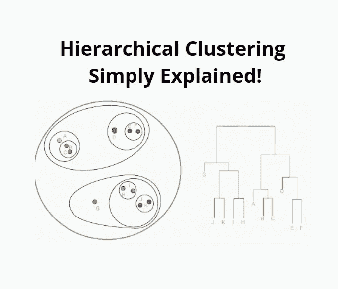

# 机器学习的层次聚类算法

> 原文：<https://medium.com/geekculture/hierarchical-clustering-simply-explained-f86b9ed96db7?source=collection_archive---------17----------------------->

**机器学习快速指南**

分层聚类算法寻求建立聚类的层次结构。它适用于具有嵌套聚类的数据集，例如几何数据。

它从一些初始簇开始，逐渐收敛到解。层次聚类有两种类型:凝聚型和分裂型。