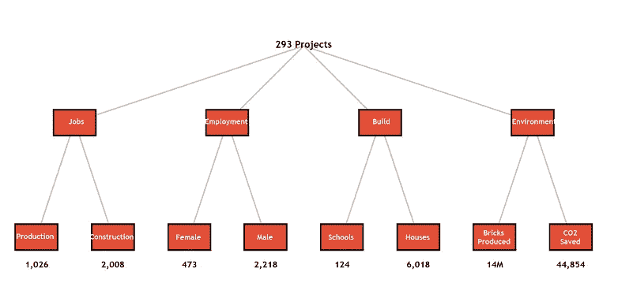
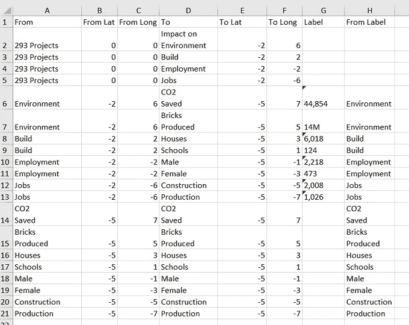
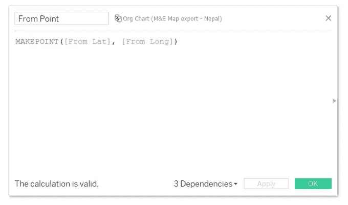
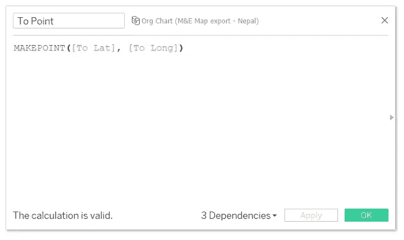
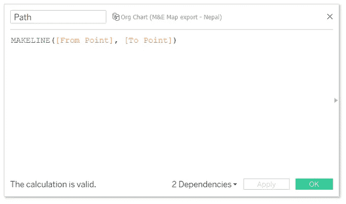
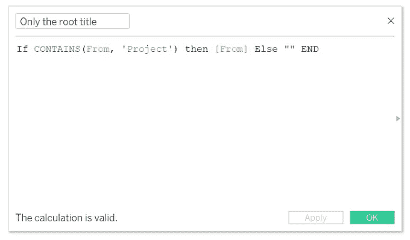
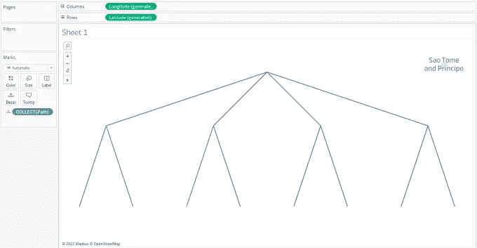
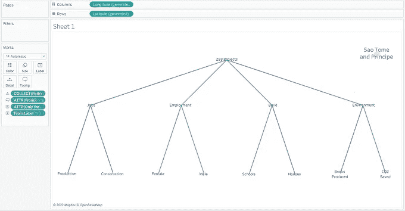
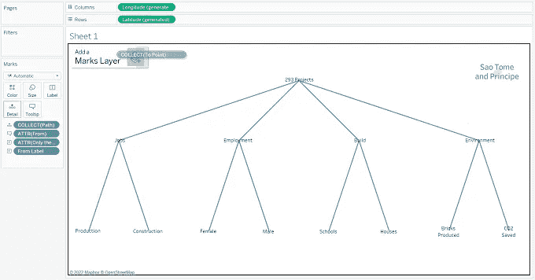
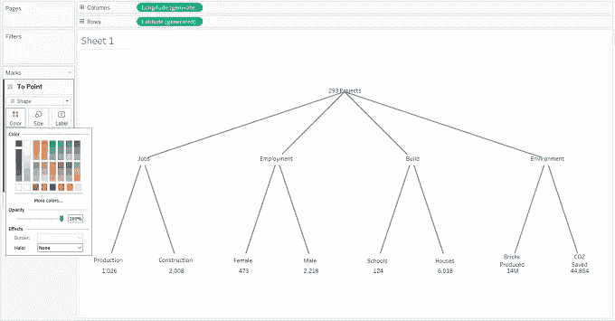

# Tableau 中带有层的层次结构图

> 原文：<https://medium.com/geekculture/hierarchy-chart-with-layers-in-tableau-dedcd4a4bede?source=collection_archive---------5----------------------->

Hierarchy Chart (Pic by Author)

有没有在 Tableau 中想到一个带有一些空间功能和图层的层级(组织)图？

最近，#vizforsocialgood 的一个视觉效果要求展示收益和受益人以及他们的价值观。由于受众是普通大众，在一个层级中展示同样的内容会很容易传达信息。像其他时候一样，我从简单的方法开始——在互联网上为组织结构图提供解决方案。当没有一个可行的选择对我有用时，富有挑战性的“自己做解决方案”是唯一的选择。

# 后端准备工作

主要准备工作在后端完成。在这里，您必须指定层次结构。层级总是有一个根点，第一层，第二层，等等。但是为了能够定义层次结构，我们需要两列来清楚地定义起点和终点。在我们这里的例子中，列“From”和“To”分别是点。对于每个点，我们需要指定纬度和经度坐标，即从 Lat，从 Long，到 Lat 和 To Long。在这里，我建议将根保持在(0，0)，然后围绕它规划其余的结构。但是，请记住，要连接第二层或任何最后一层，如下所示，以便能够显示最终值。现在，我们来到标签栏。这是非常特殊的情况。在提到的#vizforsocialgood 案例中，需要两列——您的需求可能会有所不同。这将取决于你想显示的标签、颜色和位置。在下表中，其中一列“标签”是层次结构中最后一层的值。参见图 2。

Fig 2 (Pic by Author)

# 计算字段

我们将需要 3 个相同的计算字段。上面提到的坐标不会变成一个点，直到我们把它‘变成’一个点。因此，同样地，请参考图 3 和图 4。

Fig 3 (Pic by Author)

Fig 4 (Pic by Author)

现在，我们已经有了点，我们需要指定路径来清楚地划分哪个点连接到另一个点。Makeline 函数允许您这样做。参见图 5。

Fig 5 (Pic by Author)

最后一个计算字段是非常特殊的。原因是，我希望根点文本是黑色的。参见图 6。

Fig 6 (Pic by Author)

# 填充工作表

1.将“路径”计算字段拖到标记架的详细信息卡上。你会注意到三件事同时发生。地图符号和经纬度的下拉更改出现在顶部的列和行工具架中。您还会注意到工作表中的层次结构图，背景是地图。在这里，如果你觉得需要调整结构或增加或减少点之间的距离，然后这样做，刷新它。参见图 7。

Fig 7 (Pic by Author)

2.现在将“仅根标题”、“来自标签”字段放在标签卡中，将“来自”字段放在工具提示卡中。对于“仅根标题”，取消选择工具提示中的“包含”选项。在标签框中，将字段“仅根标题”的颜色设置为黑色(html 代码— #000000)，将“来自标签”的颜色设置为白色(html 代码— #ffffff)。这最后一步是非常具体的情况。参见图 8。

Fig 8 (Pic by Author)

3.现在拖动计算字段“指向”添加另一个层。参见图 9。

Fig 9 (Pic by Author)

4.将“至”字段拖至详细信息，将“标签”字段拖至“至点”标记架的标签卡。不要担心，如果您将在最下面一行的标签中看到重叠。

5.转到地图菜单选择地图层，并设置冲洗选项为 100%。

6.在同一个“指向”标记架中，将下拉列表从“自动”更改为“形状”。你选择你想要的形状。您可以选择透明形状或填充形状，将填充颜色设置为白色，将光晕设置为无。根据您的要求增加尺寸。这使它看起来更专业。参见图 10。

Fig 10 (Pic by Author)

7.在视觉上，要求是一个特定的形状，随着尺寸的增加，最终的图像看起来就像标题上方主图片中的图像。根据需要设置工具提示。

8.在你将图表居中对齐并处理好整体尺寸后，进入地图菜单，选择地图选项并取消所有复选框。

简而言之，图层有助于选择形状和标签的大小和颜色，否则这是不可能的。

就这样，我的这篇博文写完了。网上也有其他的图表教程，我强烈建议你在决定什么能满足你的需求之前至少浏览几本。再见！！