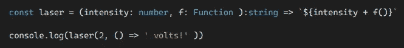
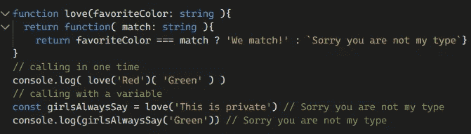
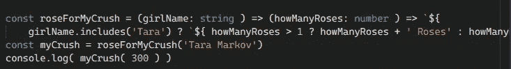
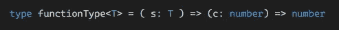
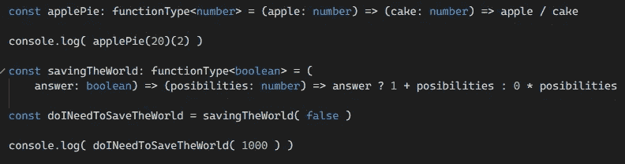
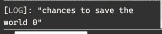

# TypeScript 中的高阶函数

> 原文：<https://medium.com/geekculture/high-order-functions-in-typescript-23dfe2ed8bd5?source=collection_archive---------2----------------------->


高阶函数在 TypeScript 中工作很有趣，我们如何在它们上面管理多种类型。

# 什么是高阶函数？

高阶函数是一个可以返回另一个函数的函数，或者您可以将一个函数作为参数传递，让我们看看这个简单的例子:

```
const laser = (intensity: number, f: Function ):string => `${intensity + f()}`console.log(laser(2, () => ' volts!' )) // "2 volts!"
```



Example High order function In TypeScript

另一个可以返回另一个函数，你可以用 function()()调用第二个函数，或者你可以把它保存在一个变量中，你也可以用它:

```
function love(favoriteColor: string ){
  return function( match: string ){
    return favoriteColor === match ? 'We match!' : `Sorry you are not my type`}
}// calling in one time
console.log( love('Red')( 'Green' ) )// calling with a variable
const girlsAlwaysSay = love('This is private') // Sorry you are not my typeconsole.log(girlsAlwaysSay('Green')) // Sorry you are not my type
```



High order function calling a function inside

# 在 TypeScript 中使用高阶函数

如果你想在 TypeScript 上使用这种函数，你可以像这样在一个箭头函数上使用它，添加一个具有各自类型的参数，我使用这个箭头函数是为了更简洁:

```
const roseForMyCrush = (girlName: string ) => (
 howManyRoses: number ) => `${girlName.includes('Tara') ? `${                                     howManyRoses > 1 
? howManyRoses + ' Roses' 
: howManyRoses + ' Rose' 
} `: 'Sorry You Broke my heart :C'}`const myCrush = roseForMyCrush('Tara Markov')console.log( myCrush( 300 ) )
```



Example high order function in TypeScript with variables

我们想让这个高阶函数用不同的类型调用，这就是为什么我们需要一个显式类型的通用函数

```
type functionType<T> = ( s: T ) => (c: number) => number
```



Generic Type Function

这将有助于我们了解函数的参数，因为我们可以使用显式变量添加字符串或其他参数，因此我们可以对不同的函数使用更多的参数，我们可以非常容易地管理高阶函数，不会出现太多错误，例如:

```
const applePie: functionType<number> = (apple: number) => (cake: number) => apple / cakeconsole.log( applePie(20)(2) )const savingTheWorld: functionType<boolean> = (answer: boolean) => (posibilities: number) => answer ? 1 + posibilities : 0 * posibilitiesconst doINeedToSaveTheWorld = savingTheWorld( false )
console.log( doINeedToSaveTheWorld( 1000 ) )
```



Example High Order Functions With TypeScript and Generic Functions

在上面的例子中，我使用了 functionType，并在其上添加了 number 类型，因此这个函数的第一个参数必须是 number，第二个参数和返回必须是 number，因为我们在泛型类型函数中以这种方式编写，尽管下一个名为 savingTheworld 的函数与第一个完全不同，它为第一个参数接收了一个布尔值，第二个参数和返回必须是 number，这是正确的，

没有错误！我们没有机会拯救世界



0 chances with Generic function on high order functions

还有太多馅饼了！


Example Generic functions with Apple Pies

# 结论

TypeScript 中的高阶函数是惊人的，使用泛型函数会使它们变得更好，因为我们可以很容易地信任它们，我们可以用泛型类型参数在各个方面控制它们，这也很方便，因为你可以不止一次地使用这个泛型函数！！

# 来源

[](https://typeofnan.dev/what-is-a-higher-order-function/) [## 什么是高阶函数？

### 在 JavaScript 世界中，您可能会听到一个术语“高阶函数”今天，我们将探索成为一名…

typeofnan.dev](https://typeofnan.dev/what-is-a-higher-order-function/) [](https://www.typescriptlang.org/) [## 带有类型语法的 JavaScript。

### TypeScript 通过向语言中添加类型来扩展 JavaScript。TypeScript 通过以下方式加速您的开发体验…

www.typescriptlang.org](https://www.typescriptlang.org/) [](https://www.amazon.com/TypeScript-Quickly-Yakov-Fain/dp/1617295949) [## 快速打字

### 在 Amazon.com 上快速打字[费恩，雅科夫，莫伊瑟夫，安东]。*符合条件的优惠可享受免费*运输。打字稿…

www.amazon.com](https://www.amazon.com/TypeScript-Quickly-Yakov-Fain/dp/1617295949)