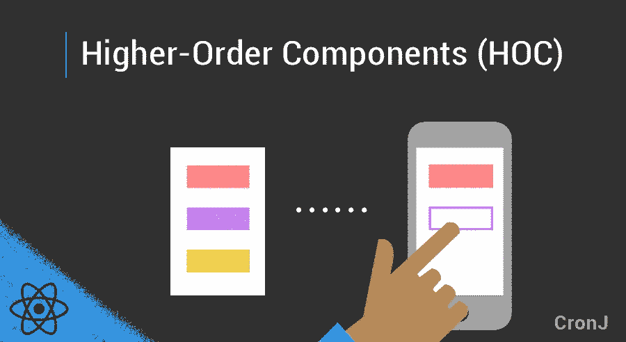
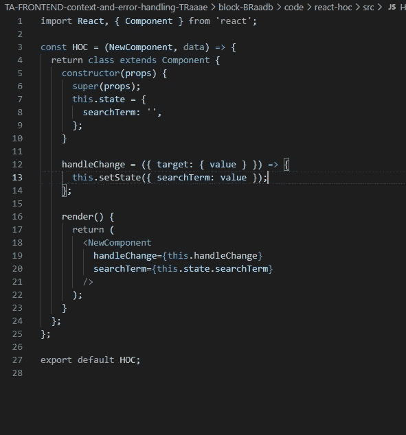
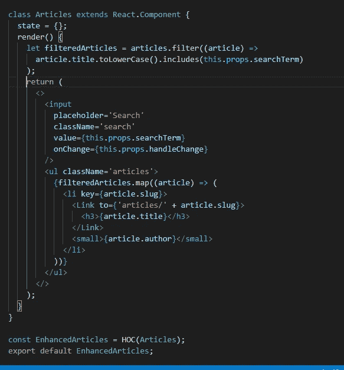

# 电抗器中的高阶元件(HOC)。

> 原文：<https://medium.com/geekculture/higher-order-components-hocs-in-reactjs-c405d7d6a8cd?source=collection_archive---------19----------------------->

HOC’s

# 1)什么是反应堆中的 HOC？

*   HOC 是 reactJS 中的组件，它用一些新的逻辑返回新的组件。
*   当项目中的一些组件有一些共同的逻辑并共享相同的状态值时，使用 HOC。
*   在这种情况下，我们可以将通用逻辑(**函数**和**状态**)放入 HOC 中，并返回一个“增强的”新组件，该组件的**道具**中将包含该逻辑。

# 步骤:- 1 通过创建新的功能组件来创建 HOC。

*   现在创建一个名为 HOC.js 的普通**函数组件**。
*   HOC 将接受作为第一个参数返回的组件和一些值(如果需要)作为第二个参数。
*   现在要记住的重要事情是 HOC 返回类组件。
*   现在我们必须在从 HOC 返回的类组件中添加状态和公共函数。
*   现在，返回的类组件中的 render 方法将返回被 HOC 接受的组件。这个返回的组件将接受一些值作为道具。

Creating HOC Component.

# 步骤:-2 在组件中调用 HOC。

*   现在，要使用 HOC，我们必须在想要添加额外逻辑的组件内部调用 HOC()。
*   如果我们想要传递，HOC()函数将接受组件的名称和一些值。
*   按照命名约定，我们必须通过带有“增强 _ _ _ _”字的 HOC()函数调用返回的组件。
*   ex:-" const enhanced Articles = HOC(Articles)；"。
*   现在我们必须导出这个增强的组件。

Calling HOC() inside Components.

# 步骤:-3 使用由 HOC 内部组件传递的数据和函数。

*   我们可以通过使用“ **this.props** ”关键字来访问组件内部由 HOC 传递的数据和函数。
*   假设我们要访问组件内部由 HOC 传递的**数据**数组。在这种情况下，我们可以通过使用“ **this.props.data** ”来访问它。
*   同样，我们可以通过使用“ **this.props.getSum()** ”来访问组件内部名为“ **getSum()** ”的函数。