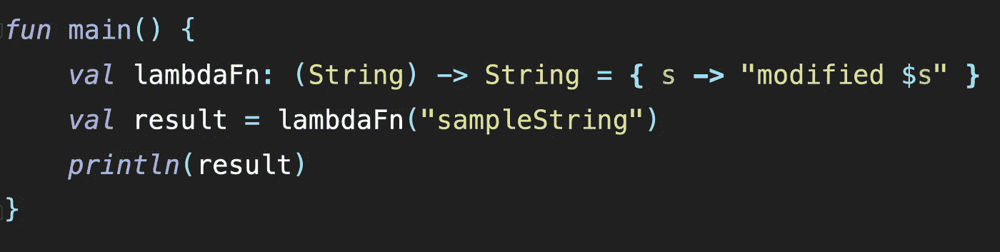
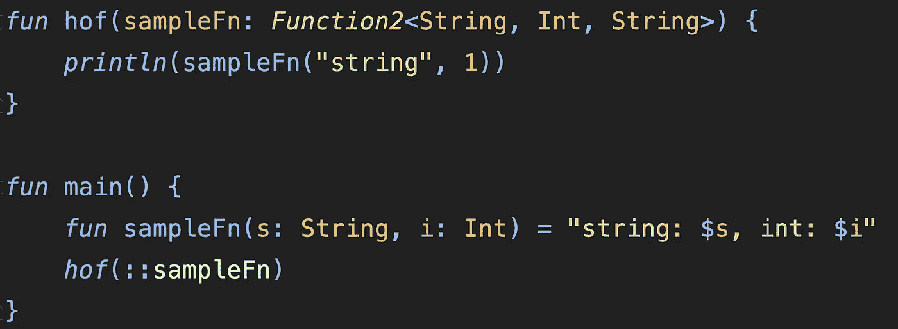
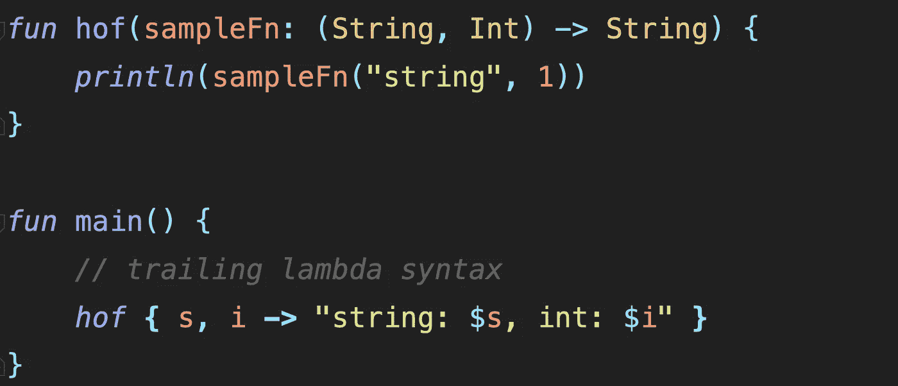
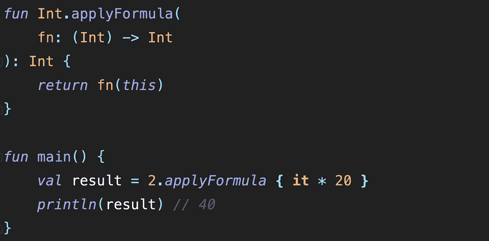

# 科特林中的高阶函数

> 原文：<https://medium.com/geekculture/higher-order-functions-in-kotlin-a65653a24b19?source=collection_archive---------9----------------------->

**高阶函数是这样一种函数，它要么接受一个函数作为自变量，要么返回一个函数作为值，或者两者都做。**


kotlin 中的 lambda 在编写和调用高阶函数时被大量使用，因为 **we** **可以自由地将 lambda 函数作为表达式传递，而无需实际声明它。**

这是 lambda 函数在 kotlin 中的写法

```
val lambdaFn: (String) -> String = { s -> "modified $s" }
```



sample code for lambda function

```
output of above sample code: "modified sampleString"
```

> 关于 lambda 函数的更多细节可以在 https://kot linlang . org/docs/lambda . html # lambda-expressions-and-anonymous-functions 找到

**当定义一个函数作为一个高阶函数的参数时，我们使用一种叫做函数类型的东西。**

> [https://kotlinlang.org/docs/lambdas.html#function-types](https://kotlinlang.org/docs/lambdas.html#function-types)

**函数类型优于普通函数参数，因为它们在语法上更容易编写和理解。**

我们通过一个例子来理解上面的说法——

## 具有正常函数自变量的高阶函数:



normal function as argument

## 具有 lambda 函数自变量的高阶函数:



lambda function as argument

如果你看一下上面的两个代码片段，我们就能理解 lambda 函数是如何更直观，以及它们是如何用更少的代码完成工作的。

现在我们明白了如何用 kotlin 编写高阶函数，以及如何调用它们。

```
// sample higher order functionfun hof(fn: (String) -> String) = println(fn("sample_string"))// invocationhof { s -> "modified $s"}output : modified sample_string
```

在上面的代码中我们可以看到，在调用高阶函数时，我们没有写括号。这是 kotlin 中的结尾 lambda 语法**,它说**如果我们把函数作为高阶函数的最后一个参数，那么我们可以简单地用花括号调用 hof。****

```
// trailing lambda syntaxfun hof(
   s: String,
   fn : (String) -> String
) {
   println(fn(s)) 
}// invocation where the lambda function is passed 
// outside the parenthesis inside curly braceshof("sample_string") { s -> "modified $s" }output: modified sample_string
```

在用 kotlin 编写扩展函数时，我们还可以利用高阶函数，使代码看起来更有功能性。



higher order extension function

这就是用 kotlin 编写基本高阶函数的方法。更多信息可在[https://kotlinlang.org/docs/lambdas.html](https://kotlinlang.org/docs/lambdas.html)找到。