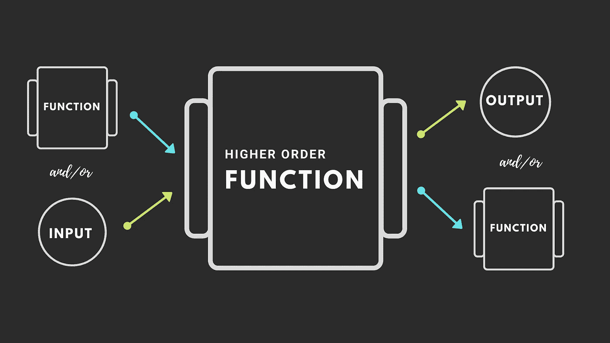

# JavaScript 中的高阶函数

> 原文：<https://medium.com/geekculture/higherorderfunctionsjs-b6e9cb22aa42?source=collection_archive---------2----------------------->

> 高阶函数是将“函数”作为其参数之一和/或返回“函数”的函数。所以，现在真正的问题是，你为什么要这么做？我们来探索一下。”

我第一次看到将一个函数传递给另一个函数或者从一个函数获得一个返回值的概念。它让我大吃一惊。我无法理解它，但当我理解了它背后的主要思想。高阶函数的逻辑变得非常直观和简单。虽然听起来很复杂，但事实并非如此。

为了充分理解这个概念，我们首先要理解一等公民的概念。

# 一等公民是什么意思？

> 在程序设计语言设计中，给定程序设计语言中的一等公民是支持其他实体通常可用的所有操作的实体。**这些操作通常包括作为参数传递、从函数返回、修改和赋给变量。**

# 这种一等公民身份和功能有什么关系？

> “当一种编程语言中的函数被像其他变量一样对待时，我们就说这种语言有**一级函数**。例如，在这种语言中，函数可以作为参数传递给其他函数，可以由另一个函数返回，也可以作为值赋给变量。”

JavaScript 函数是一种特殊类型的对象。它们是函数对象。使它们特殊的唯一属性是它们可以被调用(执行)。

为了证明函数是 JavaScript 中的对象，我们可以这样做

> **注意:** ***不要给函数对象添加随机属性，如有必要使用对象。***

在 JavaScript 中，可以用其他类型做的一切都可以用函数来做。您可以将它们作为参数传递给其他函数(回调)，将它们赋给变量，传递它们，等等。这就是 JavaScript 中的函数被称为一级函数的原因。因此 JavaScript 给函数赋予了头等公民身份。

## 在讨论高阶函数之前，让我们回忆一下-

# 为什么我们会有函数？

创建一个返回 125，63，2，5 的平方的函数……

我们可以一整天都这样做，创建一个特定数字的平方函数。我们违反了什么原则？干(不重复)

因此，函数背后的主要思想是“可重用性”。我们将功能包装在一个函数中，然后根据需要多次重用它。因此，这里的功能是“平方数字”，但我们的功能不太可重用。我们必须概括它，但是如何概括呢？

## 一般化函数

我们可以引入“参数”(占位符)，这意味着在运行函数之前，我们不需要决定在哪些数据上运行我们的功能。现在，当我们运行函数时，提供一个实际值(“参数”)。

现在，这个小函数可以平方我们传递给它的任何数。

***高阶函数*** 遵循同样的原理。在运行我们的函数之前，我们可能不想确切地决定我们的某些功能是什么

我们违反了什么原则？不要重复
，因为我们已经知道函数背后的主要思想是“可重用性”。但是在我们上面的例子中，我们一遍又一遍地写着同样的代码，只有一行代码发生了变化，这在技术上改变了整个功能。现在的问题是我们能做得更好吗？能不能把这个函数再推广一点？

答案是肯定的

这就是 ***高阶函数*** 发挥作用的地方。我们可以将这个小功能包装在一个函数 ***(回调)*** 中，并将该函数传递给另一个函数(高阶函数)。

## 回调和更高阶的函数简化了我们的代码并保持它的干爽

> *声明性可读代码:Map、filter、reduce——编写代码处理数据的最可读方式*
> 
> *异步 JavaScript:回调是异步 JavaScript 的一个核心方面，是 async/await 承诺的一部分*

# 很少内置 JavaScript 高阶函数

## 1.地图()

Map 方法是最常见的高阶函数之一。它需要一个函数来运行数组中的每一项。然后，它返回原始数组的修改副本。

## 2.过滤器()

Filter 方法创建一个新数组，其中包含所有通过回调函数提供的条件的元素。

## 3.减少()

Filter 方法创建一个新数组，其中包含所有通过回调函数提供的条件的元素。

reduce 方法获取调用数组的每个成员，并将它们传递给回调函数，从而产生一个输出值。reduce 方法接受两个参数:reducer 函数(回调)，2)和一个可选的 initialValue。

回调接受四个参数:*累加器*，*当前值*，*当前索引*，*源数组*。

如果提供了 *initialValue* ，那么*累加器*将等于 *initialValue* 并且*当前值*将等于数组中的第一个元素。

如果没有提供 *initialValue* ，那么*累加器*将等于数组中的第一个元素，而*当前值*将等于数组中的第二个元素。