# 苹果活动亮点——2021 年 10 月 18 日

> 原文：<https://medium.com/geekculture/highlights-from-the-apple-event-18th-october-2021-375b5b200b0b?source=collection_archive---------16----------------------->

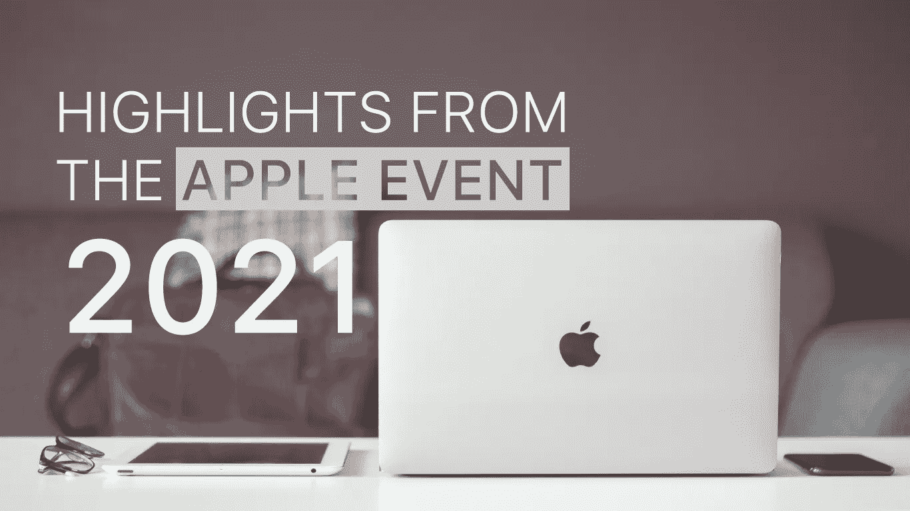

在所有技术中。爱好者们，10 月被称为科技十月，因为来自全球各地的所有科技巨头都将他们的年度发布会安排在这个时候。

苹果对这个科技嘉年华并不陌生，他们每年都会举办一次发布活动，在此期间，他们会展示苹果在过去一年中取得的所有技术突破以及他们即将推出的所有新设备。今年，2021 年 10 月 18 日再次举办了“2021 年苹果活动”。当然，自去年以来，由于我们正在经历的疫情，所有这样的活动实际上都已经举办了。苹果 2021 活动在 Youtube 上直播，由苹果公司的首席执行官蒂姆·库克启动。

以下是本次活动中你不想错过的 3 大亮点(把最好的留到最后😉).

## AirPods 3

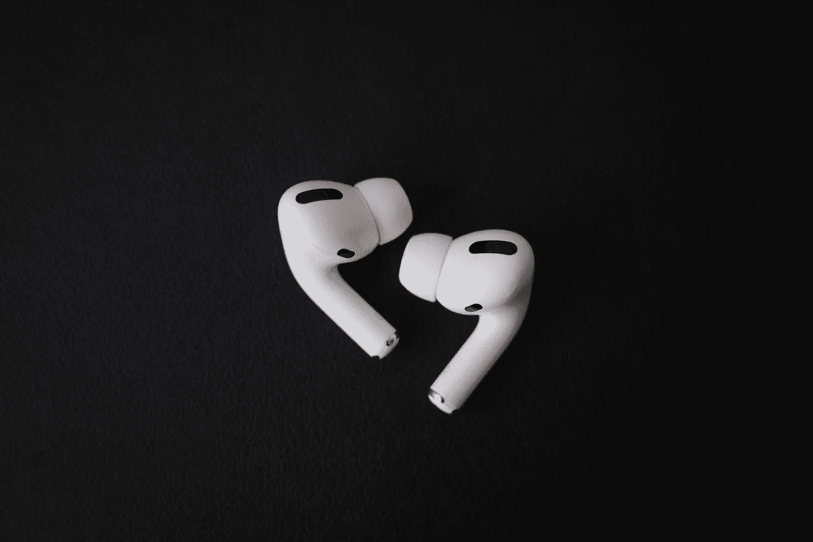

Photo by [Jonas Vandermeiren](https://unsplash.com/@jonasvandermeiren?utm_source=unsplash&utm_medium=referral&utm_content=creditCopyText) on [Unsplash](https://unsplash.com/s/photos/airpods?utm_source=unsplash&utm_medium=referral&utm_content=creditCopyText)

苹果 AirPods 的第三代产品这次出现了，它的外部设计略有变化，内部有一个穿孔。

AirPods 第三代的一些主要亮点是:

*   低失真驱动器，音质更好。
*   防汗防水。
*   长达 6 小时的聆听时间。
*   MagSafe /无线充电功能。

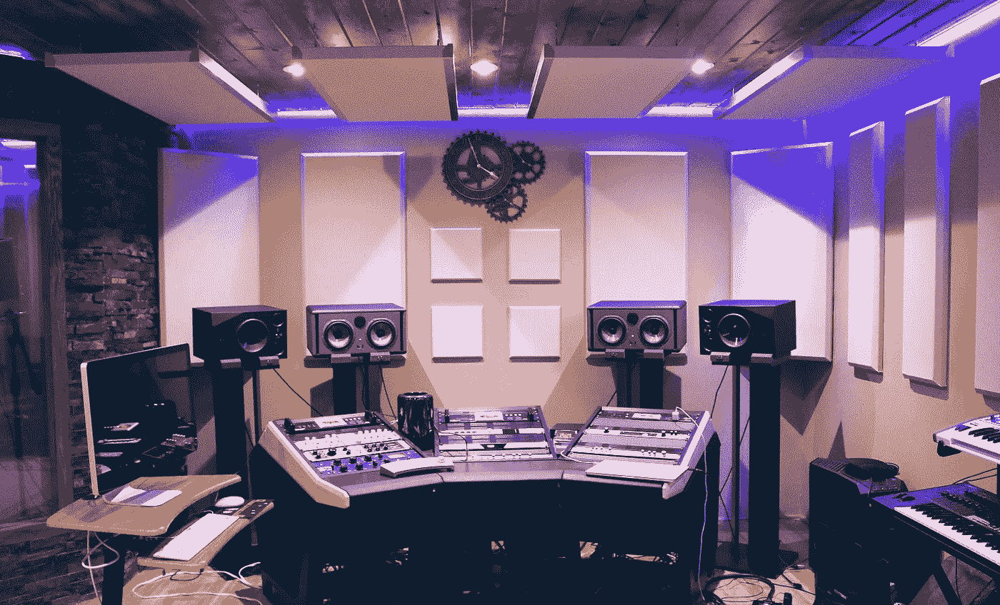

但也许最好的功能是支持**‘空间音频’，**这是以前只有 AirPods Pro 和 AirPods Max 才有的功能。空间音频是传统立体声音频的一个进步，传统立体声音频只能提供双向(左右)音频，空间音频是一种完整的三维沉浸式体验，现在出现在 AirPods 3 上。

*ai rpods 3 将零售* ***179 美元*** 。

## 新处理器

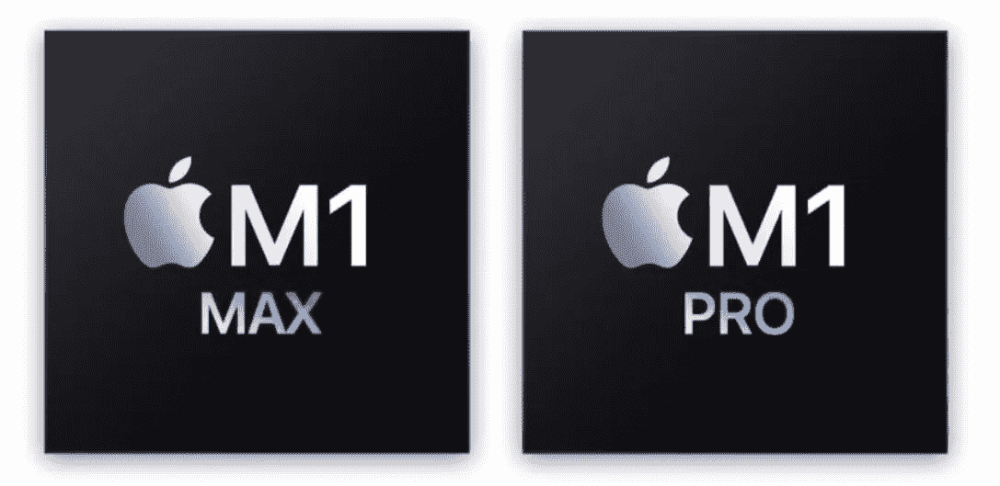

Source: Apple

去年，苹果公司推出了他们自己设计的 M1 芯片，这成为他们在笔记本电脑市场上的游戏规则改变者，与竞争对手相比，其性能更高，功耗明显更低。

今年苹果带来了重磅武器，展示了 M1 Pro 芯片和 M1 Max 芯片。 这些芯片遵循与 iPhone 相同的命名惯例，其中“ *Pro* ”版本优于标准版本，而“ *Max* ”版本是所有版本中最好的。

关于这两个芯片可以说很多，但我们将只把它作为本博客的技术规范。

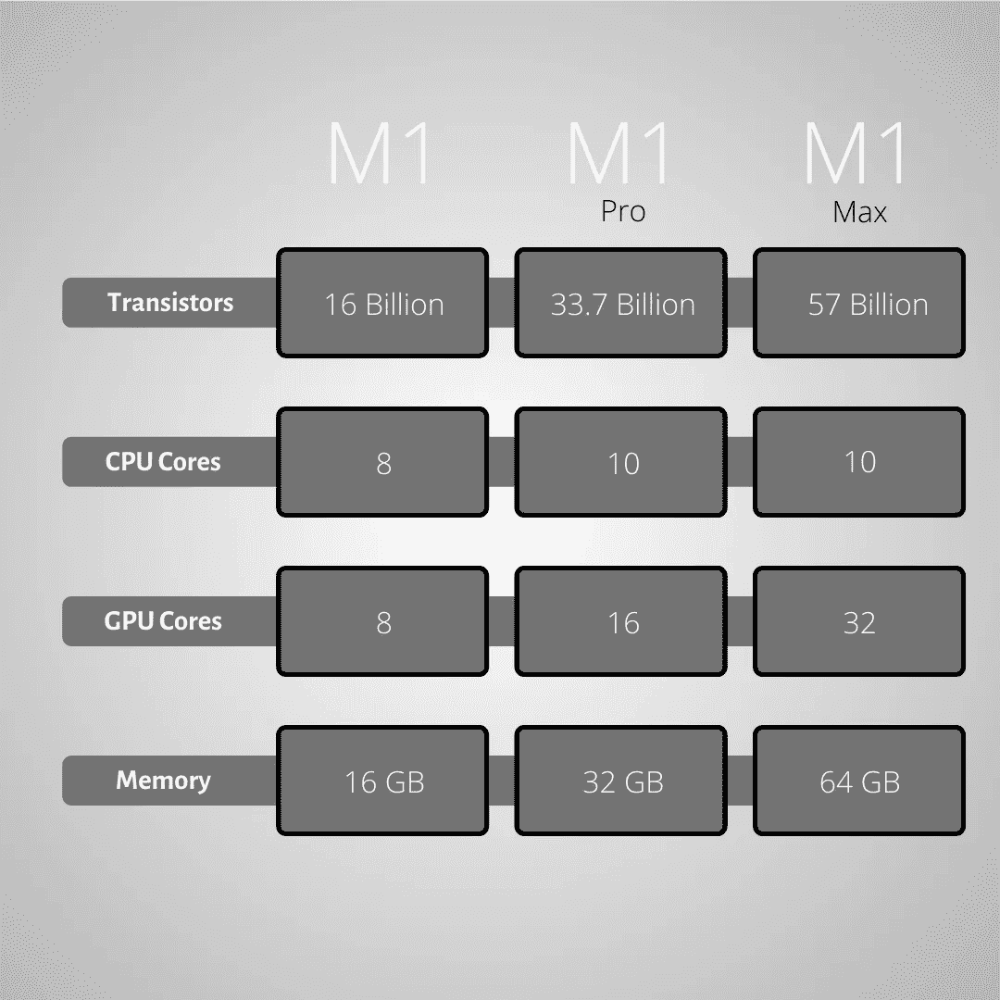

M1 (2020) VS M1 Pro VS M1 Max

上面的图表说明了一切，苹果已经加强了他们已经高性能的芯片。如果上面的数字不能让你满意，下面还有很多让你大吃一惊的图表等着你🤯。

我们知道这些芯片上的 CPU 功能强大，但你会问我们说的是多强大？

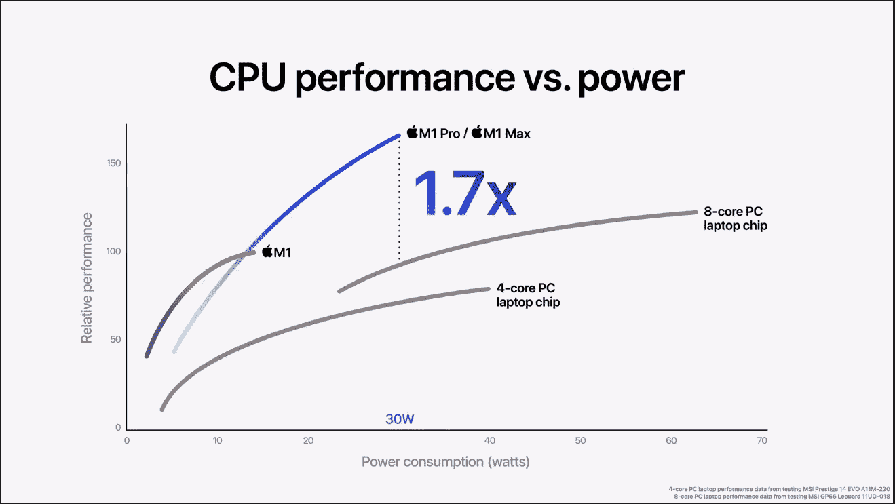

CPU performance comparisons (Source: Apple)

苹果声称，新的 M1 Pro 和 M1 Max 芯片比高端 8 核 PC 笔记本电脑芯片的性能高大约 30-35 %( T1 ),而最大功耗仅为 30 瓦。

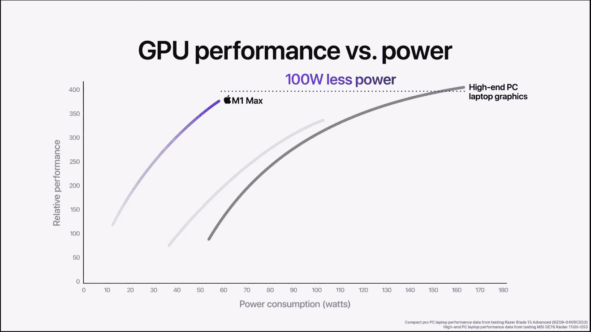

GPU performance comparisons ( Source: Apple)

M1 Max 上的 32 核 GPU 据称具有与高端 pc 笔记本电脑独立显卡相当的性能，而功耗却低约 100 瓦。

> 还需要注意的是，无论笔记本电脑是插上电源还是使用电池，这种性能都会保持不变，而其他高端笔记本电脑上的独立显卡在使用电池时性能会下降约 20%。

> M1 专业版将苹果芯片的惊人性能提升到了一个全新的水平
> 
> -约翰尼·斯鲁吉，SVP，硬件技术

## 新款 MacBook Pro

苹果发布了两款新的 MacBook Pros 一款 16 寸，一款 14 寸。这些新笔记本电脑将搭载我们在上面谈到的苹果新的高级 M1 芯片，不仅仅是处理器升级了。

看起来 Macbook Pro 已经进行了相当大的设计革新。

首先，**触摸条不见了**，物理功能键回归了，我猜他们终于意识到了触摸条是多么的无用。

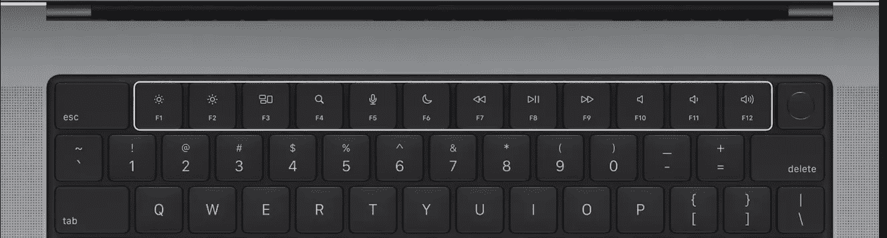

MacBook Pro keyboard (Source: Apple)

关于回归的话题，除了 **3 个 thunderbolt USB type-c** 端口和一个**耳机插孔，我们现在看到了 **HDMI 端口**以及 **MagSafe 充电端口**。**还有一个 **SD 卡插槽**用于快速传输媒体。

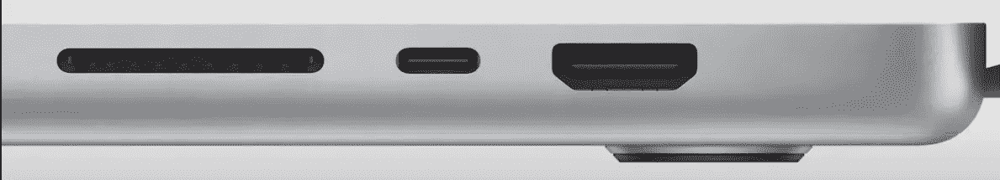

Ports on the new MacBook (Source: Apple)

现在也许是最令人震惊的一幕。Mac 的显示屏现在… **drumrolls* …* 顶部有一个**凹口，用于放置前置摄像头。**

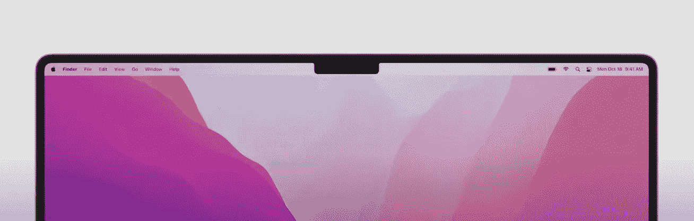

Notched display on the Mac

16 英寸机型的屏幕显示分辨率为 **3256 x 2334** ，14 英寸机型的屏幕显示分辨率为 **3024 x 1964** 。这两款机型的刷新率都高达 120 赫兹。

MAC 电脑还配备了一个新的**迷你 led 显示屏**，它也具有 **1600 尼特的峰值亮度和 1，000，000:1 的对比度**。

有太多要说的了。

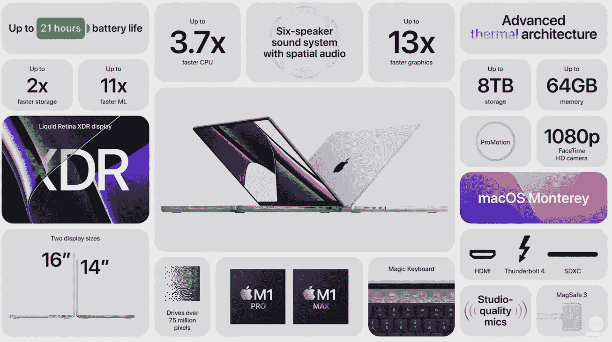

Source: Apple

> 这两款笔记本电脑的价格为:14 英寸的 ***1999 美元****16 英寸的* ***2499 美元*** *。*

## 那是一个包裹

这就是今年苹果发布会上你需要知道的一切。如果你也是一个技术发烧友，请考虑跟随。

 [## WritersByte

### 这是一个由两部分组成的系列。第一部分(这一部分)将是所有关于理论上的理解…

writersbyte.com](https://writersbyte.com)