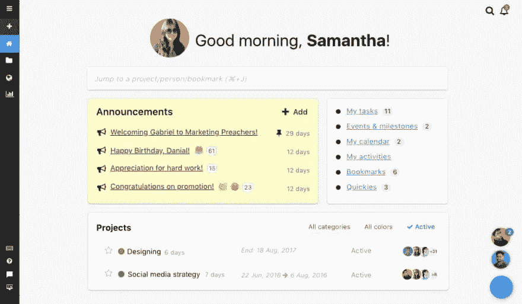
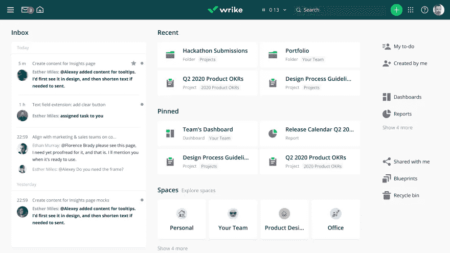
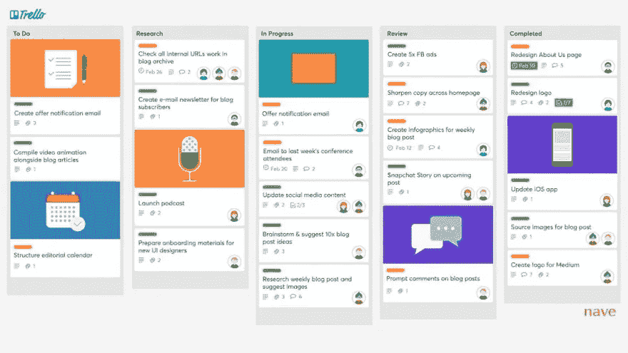
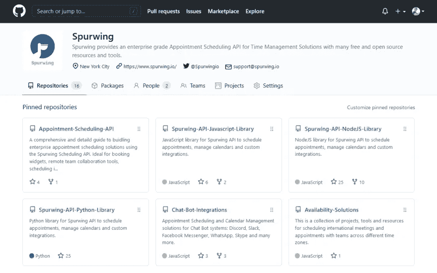

# 面向经理和高管的高效在家工作政策

> 原文：<https://medium.com/geekculture/highly-effective-work-from-home-policies-for-managers-and-executives-64856ff485b8?source=collection_archive---------51----------------------->

## 现在理解疫情对我们生活的诸多影响还为时过早。然而，有一件事是肯定的，那就是在家工作不会有任何进展。

根据 builtin.com[的调查](https://builtin.com/company-culture/work-from-home-policy)，在未来十年，超过三分之一的员工(全职)可能会在家工作。

然而，问题是远程工作对许多经理和高管来说是如此的陌生，以至于他们不确定如何建立**有效的在家工作政策**。如果放任自流，一些员工可能会在远程工作中苦苦挣扎，这可能会让您的公司陷入严重的困境。

> 一些在家工作的最佳实践包括定义目的、设定明确的期望、定义范围、概述流程、设定时间表以及确保技术支持。

本文将更深入地介绍这些实践，以及一些来自家庭工具的有用工作。所以，让我们开始吧！

# 在家工作最佳实践

制定一个清晰、简洁、有效的在家工作政策不一定是最容易的任务，尤其是对于那些在远程工作方面经验不足的经理和高管来说。

以下最佳实践将有助于保持您的在家工作政策，确保您的员工在远程工作时能够茁壮成长，从而使您的公司走上成功之路。

*   **定义目的** —贵公司的核心价值观是什么？它们应该反映在您的远程工作策略中。这也给了你一个机会来重申什么对公司最重要。确保您传达了该政策给员工带来的价值。
*   设定明确的期望——许多雇主担心在家工作会降低生产率，而许多员工相信他们实际上会更有效率。在任何情况下，你都要确保期望非常明确，这样就不会出现不必要的戏剧性事件。
*   **定义范围** —您的在家工作政策需要指定您公司的哪些职位允许在家工作。这样做将有助于限制不合格员工的远程工作请求，从而防止不必要的挫折。
*   **概述流程** —员工将如何提交部分或全部过渡到在家工作的请求？他们需要简单地由经理来管理吗？他们需要遵循正式的程序吗？清晰简明地分解需要发生的事情，避免将来每个人都头疼。
*   **制定时间表**——在家工作会被限制在特定的日子吗？会有“周三在家工作”吗？或者星期五可以不去办公室吗？考虑什么对你的公司最有利，并确保在你的政策中包含细节。这也应该包括预期的时间或是否将在个人的基础上。
*   **确保技术支持** —并非所有员工都具备相同的技术知识和家庭办公空间，能够在家高效工作。为了确保不影响工作效率，为希望远程工作的员工列出基本的技术要求和支持选项。

# 在家工作的工具

以下是一些在家办公工具的简要概述，这些工具有助于提高公司的工作效率和友情。

## ProofHub

这个管理软件将有助于简化您的各种远程项目和小组。几乎你能想到的项目管理的每个方面都包括在这里，让你的生活变得更加容易。

## 里克

Wrike 提供了与 ProofHub 类似的功能，其目标是通过简化的管理提高在家工作的效率。有一些很好的功能，比如一个工具，可以让你轻松地标记图像并留下评论，以便于协作。

## 特雷罗

Trello 因其易于在各种远程工作应用中使用而广受欢迎。您可以为任何给定的项目创建一个“板”,并为需要完成的任务添加和分配“卡”。

## 开源代码库

GitHub 是一个知名的代码托管平台。如果你的公司依赖于代码，GitHub 让协作和开发变得超级容易，不管你的员工在哪里。

## 不和谐/懈怠/微软团队/缩放

你可能会希望利用这些服务之一，使员工沟通保持顺畅，因为这是运营一家成功公司的最重要的方面之一。

# 战胜孤独

在家工作可能是许多员工的梦想，但其他人可能会觉得孤独。这就是为什么拥有如上所述的管理和沟通工具至关重要，以确保员工仍然保持联系。

你也可以通过安排“社交时间”来增进员工之间的友谊，在这种时间里，员工可以出去闲逛，聊聊与工作无关的事情。

# 包扎

在许多情况下，远程工作太受欢迎、太方便了，不能走开。不要害怕这种转变，你可以融入其中，帮助提升员工士气、你作为雇主的吸引力和整体生产力。

然而，制定一个开放而有效的在家工作的政策对实现这一目标至关重要，所以请确保你在政策中投入了足够的时间和精力，并牢记上述信息。

由 Spurwing 为您带来的我们的[调度 API](https://www.spurwing.io/) 使添加调度变得快速、可靠和可伸缩。

Appointment Scheduling API