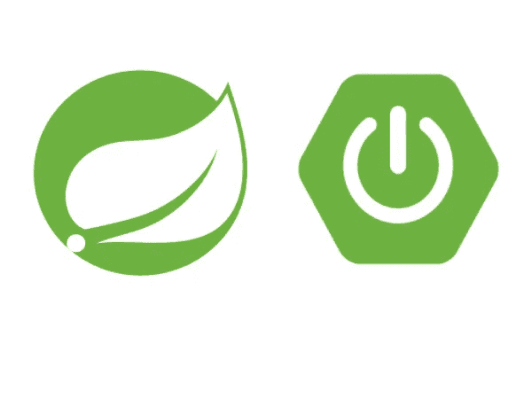
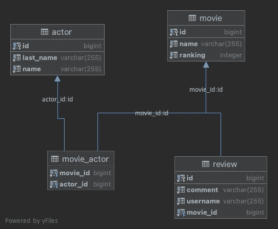
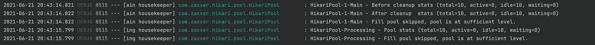
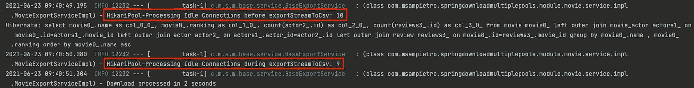

# 将数据库数据流式传输到。高效的 csv 文件——使用 Spring Boot 和 HikariCP 的实用实现

> 原文：<https://medium.com/geekculture/hikaricp-multiple-connection-pools-over-single-physical-database-a1cda85fb33b?source=collection_archive---------9----------------------->



在这篇文章中，我将解释如何使用一个主连接池和一个辅助连接池直接从一个数据库中下载大文件。

在此之前，我想解释一些基本的概念，并把我们的实现放在上下文中。

# **简介**

## ***连接池框架-* HikariCP**

在生产环境中，我们期望来自客户端的数千个并发请求，为每个请求打开和关闭数据库连接会导致数据库性能低下。

我们可以通过汇集来自客户端的连接来解决这个问题。连接池管理器重用现有的有限连接，而不是为每个请求创建一个新连接。它避免了创建到数据库的新连接的开销。

通过简单地实现数据库连接容器，我们可以有效地节省执行大量昂贵的数据库访问的成本，从而提高数据库驱动的应用程序的整体性能。

> [**HikariCP**](https://github.com/brettwooldridge/HikariCP)**是一个非常轻量级(大约 130Kb)和闪电般快速的 JDBC 连接池框架，由 Brett Wooldridge 在 2012 年左右开发。 **HikariCP** 已经包含在**spring-boot-starter-data-JPA**和**spring-boot-starter-JDBC**包中。**

## *****语境化*****

**假设您正在构建一个应用程序后端，并且需要实现:**

*   **核心 CRUD 操作。**
*   **下载—通过数据库流。**
*   **执行涉及解析和插入大型**的导入操作。csv** 数据集。**
*   **大型数据库表行上的调度任务。**

**考虑到客户机每秒钟都在通过您的应用程序并发执行事务，实现这些类型的吞吐量敏感特性而不考虑连接池的使用可能会有问题。**

**你听说过 ***连接不可用，请求 x ms 后超时…*** ？**

**正如本文开头所述，连接池通过像 **HikariCP** 这样的框架进行优化，以创建、维护和交付有限数量的数据库连接，这些数据库连接应该在几毫秒内被使用并返回到池中。如果您将这些有限的连接用于长时间运行的操作，您将耗尽面临超时异常的池中的连接。**

**当然，通过应用程序进行的数据库健康检查利用了这些连接，所以当您的**云基础架构**中的**负载平衡器**无法获得连接来检查您的应用程序和数据库是否健康时，您认为会发生什么？**

**求救，我们正在下降。**

## *****还是多加些人脉吧！*****

**请不要这样做(或者至少有意识地考虑可用的硬件)**

**仅仅为了创建新连接而创建新连接意味着高内存分配，并且需要用户名、密码和 TSL 规范，以便在每次创建时进行身份验证，从而导致应用程序和数据库的开销。**

****另一方面，连接的数量与数据库 CPU 的核心数量密切相关。****

> **您需要一个小池，充满了等待连接的线程。**
> 
> **一篇关于池大小调整的优秀推荐文章摘录:[https://github . com/brettwooldridge/HikariCP/wiki/About-Pool-Sizing](https://github.com/brettwooldridge/HikariCP/wiki/About-Pool-Sizing)**

## *****那么我们能做什么呢？*****

**你可能认为，OLAP 和 OLTP 的分离是你所寻求的，而且你是对的。**

**但是，让我们想象一下，你正在一家新成立的公司工作，在这里，通过不同数据源中正确的 ETL 过程进行分析和事务划分是不可行的(至少在这一点上)。初创企业的现实(小的开发团队、低预算、有限的时间表、有限的资源)有时不允许我们冒这样的风险，即通过进行这样的架构重新定义，耗费时间、精力和金钱，从而危及向客户交付可见价值的实现。**

## **一个解决方案**

**我们为什么不将操作分配到多个池中？**

**让我们定义一个**主连接池**，负责解析所有 CRUD 核心事务，以及一个辅助快速故障处理连接池**，我们可以调用它来执行下载、导入或调度任务等操作，模拟 OLTP/OLAP 分布。****

**如果您的辅助池的所有连接都耗尽了下载、导入或执行计划任务，您的主池将永远不会受到影响，您的应用程序可以保持健康和可操作，以实现其主要目的。**

**您还可以为每个连接池配置不同的属性，如**超时**或**事务隔离级别**。**

***是的……这个实现有一个* ***硬件资源限制*** *。如上所述，我们不能只是无限地添加连接。增加* ***处理池*** *或* ***主池*** *的需求可能意味着* ***硬件升级，需要更多的连接*** *，以及* ***更快地解析数据库进程*** *，以便尽快将连接返回池***

# ****代码请……****

> **GitHub 资源库:[**https://GitHub . com/msampietro/spring-download-multiple-pools**](https://github.com/msampietro/spring-download-multiple-pools)**

**我们的例子是一个已知的**演员电影** API(查看 ERD 图)。该示例的目的是在浏览器中触发一个完整的**演员列表**，初始化为 250k 行，以及一个完整的**电影列表**，初始化为 550k 行。**

****

***为了尽可能清晰，我们将引用类名和特定的代码片段，而不是复制和粘贴原始代码行。关于设置、项目结构和具体类的详细解释请查看 repo****readme . MD*****

## **配置类别**

**让我们开始定义连接池配置类:**

*****MainDatasourceConfig.java****【初级】****ProcessingDatasourceConfig.java****【次级】***

*   ***MainDatasourceConfig.java***

```
public class **MainDatasourceConfig** {...} **-> THE MAIN DATASOURCE AND CONNECTION POOL**
```

**在这个类中，我们定义了主**数据源**和一个全新的 **EntityManager** 和基于它的 **TransactionManager** 。**

**我将解释一些重要的方法。**

```
protected static HikariConfig **buildHikariConfig**(Map<String, Object> dataSourceProperties) {...}
```

****buildHikariConfig(…)** 正在手动引用 **application.properties** 文件属性来构建实例化数据源所需的 **HikariConfig** 对象。*(如果你愿意，你可以直接从属性文件中做同样的事情，但是我更喜欢用编程的方式。我们以后要重用这个方法)。***

**在这个方法中(目前)要考虑的最重要的属性是:池名**"光-1-Main】，*最大连接数*** *也称为* ***最大池大小*，**和 ***最小空闲连接数*** 在**应用程序属性**文件中相应地定义为 **20** 和 **10****

```
@Primary
@Bean(name = "dataSource")
public DataSource **dataSource**() {
    var hikariConfig = *buildHikariConfig*(getDataSourceProperties());
    return new HikariDataSource(hikariConfig);
}
```

****datasource()** 实际上是使用定义的属性实例化 datasource。**

```
@Primary
@Bean(name = "entityManagerFactory")
public LocalContainerEntityManagerFactoryBean **entityManagerFactory**(EntityManagerFactoryBuilder builder,
                                                                   @Qualifier("dataSource") DataSource dataSource) {
    return builder
            .dataSource(dataSource)
            .packages("com.msampietro.springdownloadmultiplepools.module")
            .properties(getJpaProperties())
            .build();
}
```

****EntityManager factory(…)**创建关于**主数据源**的 **EntityManager** ，并使用**扫描我们项目包的实体和存储库。包(…)** 构建器方法。**

*   ***ProcessingDatasourceConfig.java***

```
public class **ProcessingDatasourceConfig** {...} **-> THE SECONDARY DATASOURCE AND FIXED CONNECTION POOL**@Bean(name = "processingDataSource")
public DataSource **processingDataSource**(@Qualifier("dataSourceProperties") Map<String, Object> dataSourcePropertiesHolder) {
    Map<String, Object> dataSourceProperties = (Map<String, Object>) dataSourcePropertiesHolder.get("dataSourceProperties");
    var config = MainDatasourceConfig.*buildHikariConfig*(dataSourceProperties);
    **config.setMaximumPoolSize(config.getMinimumIdle());**
    **config.setPoolName("HikariPool-Processing");**
    config.getDataSourceProperties().remove("socketTimeout");
    return new HikariDataSource(config);
}
```

****Processing data source(…)**通过“data source properties”@ Bean 接收与**Main****data source**相同的配置，但重新定义了池名以匹配“**HikariPool-Processing”**和连接数。在这种情况下，如果**主池的** *最小空闲连接数*等于 10，那么辅助池的*最大连接数*将等于 10。由于我们没有为该池指定不同的*最小空闲*，它将默认为一个**固定的** **大小** ( *最大=最小空闲*)**

***根据您的需求，您可以为这些配置属性想到大量不同的选项和方法。这正是本例中提出的方法。***

```
@Bean(name = "processingEntityManagerFactory")
public LocalContainerEntityManagerFactoryBean **processingEntityManagerFactory**(EntityManagerFactoryBuilder builder,
                                                                             @Qualifier("processingDataSource") DataSource processingDataSource,
                                                                             @Qualifier("jpaProperties") Map<String, String> jpaProperties) {
    return builder
            .dataSource(processingDataSource)
            **.persistenceUnit("processing")**
            .packages("com.msampietro.springdownloadmultiplepools.module")
            .properties(jpaProperties)
            .build();
}
```

****processing EntityManager factory(…)**创建关于**辅助数据源**的 **EntityManager** ，并使用**扫描我们项目包的相同实体和存储库。包(…)** 构建器方法。**

**本例中的 **EntityManager** 使用**命名。persistenceUnit(“处理”)。**在我们的服务中注入辅助 EntityManager 时，我们将使用这个**持久性单元** **名称**。**

> ****澄清**:由于我们不想重复实体或存储库，每个保存、更新、查找、派生查询或通过 Jpa 存储库执行的任何方法都将使用 **@Primary** EntityManager，并连接主池。这是因为我们定义了相同的东西。包装(..)(意味着相同的实体和存储库)，并且一个比另一个优先。为了使辅助 EntityManager 有效，我们将在服务中的手动类型查询中显式指定该 EntityManager。你可以指定一个不同的**。package** 扫描如果您愿意，指向项目结构中不同位置的存储库，重复实体和存储库，但是使用默认的 Jpa 存储库方法，而不必构建手动输入的查询。**

**最后，我们需要在辅助数据源配置类中添加以下配置注释:**

```
@Configuration
@PropertySource({"classpath:application.properties"})
@EnableTransactionManagement
@EnableJpaRepositories(entityManagerFactoryRef = **"processingEntityManagerFactory"**,
        transactionManagerRef = **"processingTransactionManager"**,
        basePackages = **"com.msampietro.springdownloadmultiplepools.module"**)
public class **ProcessingDatasourceConfig** {...}
```

***在我们的主 datasource 配置类中我们不需要这些注释，因为 Spring 为 EntityManager 和 TransactionManager 使用默认的命名 beans】***

**如果一切配置正确，我们应该在控制台中看到两个池的跟踪日志。**

****

## **下载课程**

*   ***CSVWriterWrapper.java***

**这个类只是为这个例子选择的 CSV lib 的一个抽象( [**univocity 解析器**](https://github.com/uniVocity/univocity-parsers) **- >** 强烈推荐！)你可以通过包装器使用任何你想要的 csv 库。**

*   ***BaseExportService.java***

**BaseExportService 是一个抽象类，它基于选择列表构建类型化查询，并使用 CSVWriterWrapper 将查询结果直接传输到 OutputStream。每个实现类( **ActorExportServiceImpl** 和 **MovieExportServiceImpl** )负责定义文件头、查询选择和结果关联。**

**让我们解释一下神奇之处的基本方法:**

```
@Transactional(value = "processingTransactionManager", propagation = Propagation.*NOT_SUPPORTED*)
@Override
public void **exportStreamToCsv**(OutputStream outputStream) {
    *log*.info("({}) - HikariPool-Processing Idle Connections before exportStreamToCsv: {}", this.getClass(),
            this.getProcessingDataSourcePoolMetadata().getIdle());
    var start = Instant.*now*();
    **boolean autoCommit = getCurrentSessionAutoCommitPropertyAndSetFalse()**;
    **boolean readOnly = getCurrentSessionReadOnlyPropertyAndSetTrue()**;
    TypedQuery<Tuple> typedQuery = **buildTypedQuery()**;
    try (var csvWriter = new CSVWriterWrapper(outputStream);
         Stream<Tuple> streamData = typedQuery.getResultStream()) {
        *log*.info("({}) - HikariPool-Processing Idle Connections during exportStreamToCsv: {}", this.getClass(),
                this.getProcessingDataSourcePoolMetadata().getIdle());
        csvWriter.writeNext(headerNames);
        streamData.forEach(d -> **csvWriter.writeNext(this.toStringArray(d)))**;
        csvWriter.flush();
    }
    **restoreAutoCommitAndReadOnly(autoCommit, readOnly)**;
    var end = Instant.*now*();
    *log*.info("({}) - Download processed in {} seconds", this.getClass(), Duration.*between*(start, end).toSeconds());
}
```

1.  **首先，我们明确地使用@Transactional 注释获得一个会话，引用辅助 TransactionManager(还记得 ProcessingDatasourceConfig.java 类)而不传播。**
2.  **接下来要做的是获取当前会话的 ***自动提交*** 和 ***只读*** 属性，并将它们设置为所需的值。为了成功地传输数据，我们需要指定一个 **FETCH_SIZE** 提示，该提示需要*自动提交*为**假**并且*只读*为**真**。**
3.  **下一步是构建类型化查询，并使用我们的 CSVWriterWrapper 将结果(基于每个实现)直接传输到 OutputStream。**
4.  **最后，作为安全预防措施，我们将自动提交**和只读**恢复到它们的初始值。******

**现在让我们放大一下 **buildTypedQuery()** 方法:**

```
private TypedQuery<Tuple> **buildTypedQuery()** {
    var builder = this.getProcessingEntityManager().getCriteriaBuilder();
    CriteriaQuery<Tuple> query = builder.createTupleQuery();
    Root<T> root = query.from(modelType);
    query.multiselect(**this.buildSelections**(root, query, builder));
    if (**this.getSort()** != null && this.getSort().isSorted())
        query.orderBy(*toOrders*(sort, root, builder));
    TypedQuery<Tuple> typedQuery = **this.getProcessingEntityManager().createQuery(query);**
    Map<String, Object> queryHints = **buildQueryHints()**;
    queryHints.forEach(typedQuery::setHint);
    return typedQuery;
}
```

**除了设置实现类选择列表(**this . build selections(…)**)和 order ( **this.getSort(…)** )之外，该方法还使用类中注入的辅助**持久性单元**有效地创建了类型化查询(还记得我们在辅助实体管理器中建立持久性单元名称的时候吗)**

```
@PersistenceContext(**unitName = "processing"**)
private EntityManager **processingEntityManager**;
```

**然后它调用 **buildQueryHints()****

```
*/**
 * HINT_FETCH_SIZE ignored if autoCommit = true.
 * If pool autoCommit is true then it should be disabled for method execution
 **/* private Map<String, Object> **buildQueryHints()** {
    Map<String, Object> queryHints = new HashMap<>();
    queryHints.put(*HINT_FETCH_SIZE*, "5000");
    queryHints.put(*HINT_READONLY*, "true");
    queryHints.put(*HINT_CACHEABLE*, "true");
    return queryHints;
}
```

**这设置了 **FETCH_SIZE** 、 **READONLY** 和 **CACHEABLE** 所需的提示，以实现来自 db 的高效数据流。**

**最后，触发下载的控制器端点:**

*   **【ActorController.java **

```
@GetMapping(value = "/data")
public ResponseEntity<StreamingResponseBody> **getData**(HttpServletResponse response) {
    response.setCharacterEncoding(StandardCharsets.*UTF_8*.name());
    response.setHeader(HttpHeaders.*CONTENT_TYPE*, "application/octet-stream");
    response.setHeader(HttpHeaders.*CONTENT_DISPOSITION*, "attachment; filename=actors_export.csv");
  **  StreamingResponseBody stream = actorExportService::exportStreamToCsv;**
    return ResponseEntity.*ok*(stream);
}
```

****get data(http servlet response)**方法使用 Spring**steaming response body**将其 OutputStream 传递给我们的 BaseExportService**exportToCsv(output stream output stream)**方法。它还设置了一些必需的响应头。**

**在使用 [StreamingResponseBody](https://docs.spring.io/spring-framework/docs/current/javadoc-api/org/springframework/web/servlet/mvc/method/annotation/StreamingResponseBody.html) 时，我推荐你配置 Spring 中使用的 [TaskExecutor](https://docs.spring.io/spring-framework/docs/current/javadoc-api/org/springframework/core/task/TaskExecutor.html) 进行异步请求处理。看一看 **application.properties** 任务执行器配置部分。**

**现在我们可以开始下载了！**

**从浏览器调用[**http://localhost:8080/movies/data**](http://localhost:8080/movies/data)或[**http://localhost:8080/actors/data**](http://localhost:8080/movies/data)**。****

********

****我们可以在控制台日志中确认，在执行查询之前，我们在辅助池中有 **10** 个空闲连接，在下载过程中有 **9** 个空闲连接。****

****就是这样！****

****希望你喜欢:)****

*****特别感谢* [*萨尔瓦多*](https://medium.com/u/29e8ecba5ba1?source=post_page-----a1cda85fb33b--------------------------------) *对文章的修改。*****

# ****贮藏室ˌ仓库****

****[](https://github.com/msampietro/spring-download-multiple-pools) [## msampietro/spring-下载-多池

### 将数据库数据流式传输到。高效的 csv 文件——使用 Spring Boot 和 HikariCP Post 的实用实现…

github.com](https://github.com/msampietro/spring-download-multiple-pools) 

# 参考资料和有趣的文章

[](https://stackoverflow.blog/2020/10/14/improve-database-performance-with-connection-pooling/) [## 使用连接池提高数据库性能-堆栈溢出博客

### 我们倾向于依靠缓存解决方案来提高数据库性能。在内存中缓存频繁访问的查询或…

stackoverflow.blog](https://stackoverflow.blog/2020/10/14/improve-database-performance-with-connection-pooling/) [](https://github.com/brettwooldridge/HikariCP/wiki/About-Pool-Sizing) [## brettwood ridge/hikar ICP

### 配置连接池是开发人员经常犯的错误。有几个，可能…

github.com](https://github.com/brettwooldridge/HikariCP/wiki/About-Pool-Sizing) [](https://dzone.com/articles/database-connection-pooling-in-java-with-hikaricp) [## 用 HikariCP - DZone Java 实现 Java 中的数据库连接池

### 连接池是一种技术，用于提高具有动态数据库驱动内容的应用程序的性能…

dzone.com](https://dzone.com/articles/database-connection-pooling-in-java-with-hikaricp) 

# 联系信息

[](https://www.linkedin.com/in/sampietromartin) [## Martin Sampietro -阿根廷|职业简介| LinkedIn

### 查看 Martin Sampietro 在 LinkedIn(全球最大的职业社区)上的个人资料。马丁有 2 份工作列在…

www.linkedin.com](https://www.linkedin.com/in/sampietromartin) 

电子邮件:**sampietromartin1@gmail.com******