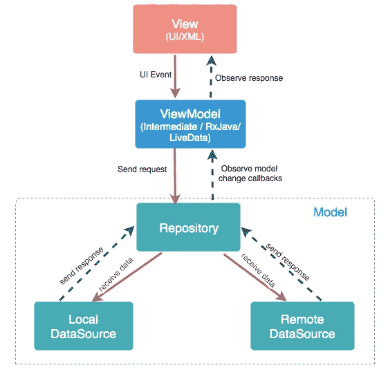
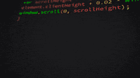

# Hilt:具有精简架构和完全可扩展性的应用程序

> 原文：<https://medium.com/geekculture/hilt-apps-with-lite-architecture-and-full-scalability-f813b0a581fb?source=collection_archive---------15----------------------->

Photo by [Ricardo Gomez Angel](https://unsplash.com/@ripato?utm_source=medium&utm_medium=referral) on [Unsplash](https://unsplash.com?utm_source=medium&utm_medium=referral)

就像这个漂亮干净的建筑一样，我们作为 android 开发者可以使用许多库来构建干净、快速和漂亮的应用程序架构，如 Hilt、Dagger …

## 介绍

在我们深入到架构的世界以及如何设计一个漂亮的应用架构之前，让我们先来谈谈依赖注入

依赖注入(DI)是一种在一般开发中广泛使用的技术，特别是在 android 开发中，DI 背后的主要思想是注入一个类 X 需要的所有依赖项，而不是在类本身内部初始化它们，通过这样做，作为开发人员的你可以获得很多好处

*   代码的可重用性
*   重构代码的容易程度
*   易于测试

这就是像 Dagger 这样的库进入游戏的原因。

我们使用 Dagger 来生成所有需要的类之间的依赖关系，这样开发人员就可以更专注于实现应用程序的功能，而不是专注于如何链接这些类。

## 什么是剑柄？

Hilt 是新的 jetpack 库，用于在项目中实现依赖注入，它是由 android 团队自己推荐的

视频链接:[https://www.youtube.com/watch?v=B56oV3IHMxg&t = 839s&ab _ channel = Android developers](https://www.youtube.com/watch?v=B56oV3IHMxg&t=839s&ab_channel=AndroidDevelopers)

在接下来的部分中，我们将讨论库在您的项目中的集成，保持耐心！

*“不练习就不配赢”* —安德烈·阿加西

## 我们在建造什么？

为了讨论一个好的应用架构和 hilt 的完整性，我们将建立一个小测验屏幕，显示一个问题列表和它们的类别

为此，我们需要依赖列表:刀柄，翻新，Gson 和协程

## 项目结构

整个这个项目，我们将使用 MVVM 架构来构建我们的代码

如果您不熟悉 MVVM 的实现，不要担心，您只是需要一些时间来理解它背后的想法

我强烈推荐你访问[这个关于应用架构](https://developer.android.com/jetpack/guide)的链接，更多实践你可以访问[这个关于视图模型的代码实验室](https://developer.android.com/codelabs/kotlin-android-training-view-model)

在我们的案例中:

*   视图:包含问题和类别列表的屏幕
*   ViewModel:我们屏幕的控制器
*   存储库:与 Rest API 交互的类和改进接口

## 集成刀柄和翻新

*   将类路径添加到根级别 build.gradle
*   在应用级 build.gradle 中添加插件和依赖项

## 创建依赖关系核心

为了创建可注入的类和接口，我们需要创建依赖注入的核心

在我看来，在《剑柄》中，核心分为两类

*   App 类:用@HiltAndroidApp 批注定义
*   App 模块对象:用@Module 和@InstallIn 注释定义

因此，首先我们创建一个名为 App 的类，如下所示

然后，我们创建另一个包含 app 模块组件的文件，我们将在其中定义每个可注入类以及如何提供它

@InstallIn 注释是定义模块安装位置的最简单的方法，如果没有这个注释，模块将不会被编译，并且会导致编译错误，正如在官方文档中提到的

## 定义 API 接口

下一步是定义应用程序中用于从服务器提取数据的 api 接口

在这个例子中，我们将使用这个[问题数据库 api](https://opentdb.com/api_config.php) ，对于一个简单的例子，我们的接口将只包含一个函数，它获取随机 10 个问题的列表

不要惊慌，QuestionResponse 是我创建的一个类，您可以在项目源代码中找到它，我们在这里只关注应用程序架构和依赖注入

创建接口后，我们需要定义类如何使用它的功能，为此我们将在模块对象中添加一些代码

*   首先我们将定义 OkHttp 对象是如何生成的
*   其次，我们将定义如何进行改造
*   最后，我们提供了 Api 接口组件

对于每个组件，我们将创建一个提供者函数，该函数将返回我们需要的类型(OkHttp，retrieve…)，为了使这些函数变得特殊，我们只需添加@Provides 注释

因此，正如您所看到的，第一个函数提供了一个 OkHttpClient 对象，第二个函数提供了一个改型对象，第三个函数定义了如何引用 IQuizApi

但是正如你看到的，每个函数上面都有@Singleton 注释

@Singleton 意味着所提供的对象在应用程序生命周期中只会实例化一次，例如这里的改造只会生成一次，每次我们需要改造参考时，我们都可以得到它。

另一个需要注意的是这些函数中的参数(第二和第三个),这些参数将在代码编译后由 Hilt 自动提供，这就是所有神奇的地方，所以你不需要担心组件之间的依赖关系

## 创建 api 存储库

要在我们的项目中完成 API 的集成，最后一步是定义将调用接口函数“getRandomQuestions”的存储库

储存库是一个 MVVM 术语，指的是直接调用数据的每个类，无论它是在本地数据库(sqlite，room..)或远程服务器(api)

在上面的代码中，我们刚刚创建了一个参数类型为 IQuizApi 的类 QuestionRepository，它带有一个 suspend 函数“getQuestion ”,使得在 Api 接口中调用 getRandomQuestion 一点也不奇怪

但是这里的神奇之处在于@Inject 注释，我们添加了这个注释，这样 Hilt 将提供所需的参数(在这个例子中是 IQuizApi ),这样我们在使用这个存储库时就不需要传递它了，这是 Hilt 的第二个技巧！

## 查看模型并将其链接到活动

这个简单例子的最后一步是创建我们的视图模型和视图(活动)

视图模型将通过调用存储库类并从中获取数据来收费，视图将从视图模型中获取结果来显示它

如果您看到诸如“livdeData”、“Dispatchers”和“emit”之类的高级协同术语，请不要惊慌。我强烈建议您查看此链接中的[以全面了解协同世界。在本文中，我们将重点介绍刀柄和应用程序体系结构](https://developer.android.com/codelabs/kotlin-coroutines)

所以在这个视图模型中，我们只创建了一个简单的类，在构造函数中有一个参数和一个函数

但是像往常一样，所有的魔力都在我们添加的注释中

这里@ViewModelInject 是我们的超级巨星，就像@Inject 一样，这个注释告诉 Hilt 为我们的类提供所有需要的需求，以便正确执行，所以对于 ViewModels，我们使用@ViewModelInject

在最后一块砖中，我们创建了视图(活动)，以问题列表的形式显示结果。

代码中您需要关注的主要部分是:

*   @ AndroidEntryPoint 这个注释是刀柄框架的一部分，它开始在你的其他 Android 类中启用成员注入，这个注释可以与 Activity、Fragment、Service、View 或 BroadcastReceiver 一起使用
*   通过视图模型<quizvm>是在不使用视图模型提供者或其他工厂的情况下初始化虚拟机的新方法</quizvm>

正如您在这个例子中看到的，我们编写了难以置信的少量代码行来创建一个简单的应用程序，该应用程序调用一个 webservice，将数据解析为对象列表，然后在 recyclerview 中显示

此外，请记住，这个示例是可扩展的，与使用像匕首这样的其他框架相比，我们可以用很少的时间添加任意多的特性

**结论**

因此，在结束我们的讨论时，我们需要强调的是，希尔特给了我们用最少的代码行构建可扩展应用程序的速度

在这个例子中，我们参观了剑柄的主要部件

*   模块
*   如何提供您想要的类型
*   注入存储库(任何类)
*   注射视图模型
*   创建一个安卓入口点和一个如何初始化视图模型的简单方法

当然，关于剑柄的更多信息，你可以在本页 [中查看](https://dagger.dev/hilt/)[https://dagger.dev/hilt/](https://dagger.dev/hilt/)你会发现你掌握这个框架所需要的一切

您可以在下面的链接中找到这个例子的所有源代码

 [## koukibard/hilt sample

### 通过在 GitHub 上创建帐户，为 kou kibadr/hilt sample 开发做出贡献。

github.com](https://github.com/koukibadr/HiltExample) 

我希望你从这篇文章中学到了一些新东西。

快乐编码！

