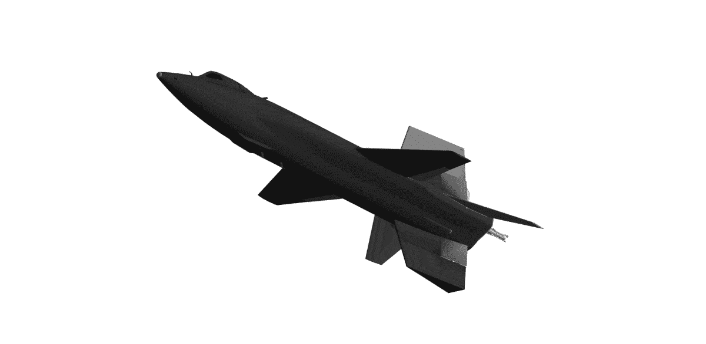

# 高超音速飞行的先驱

> 原文：<https://medium.com/geekculture/history-of-hypersonics-the-north-american-x-15-568bbd0a81cc?source=collection_archive---------42----------------------->

## 这是北美的 X-15，一个传奇，一个先驱，一个工程奇迹，它的诞生推动了帮助人类登上月球的科学研究

The North American X-15 (3D model). Image by the author.

1967 年 10 月 7 日，罗杰斯干湖一个阳光明媚的早晨。只有风和灰尘的声音敢于胆怯地打破沉默。突然，一声巨响从…传来