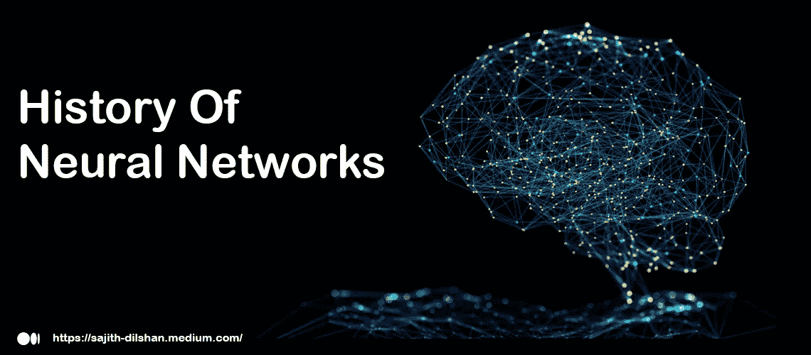

# 神经网络的历史

> 原文：<https://medium.com/geekculture/history-of-neural-networks-b762b053bc48?source=collection_archive---------21----------------------->

Neural Network

神经网络的历史知识。这对那个课题的研究是一个很大的支持。它过去的故事比大多数人想象的要长。古希腊人有“思维机器”的想法，一个金色机器人的想法。我们将关注导致神经网络思维进化的关键事件。

1943 年，沃伦·s·麦卡洛克和沃尔特·皮茨发表了《[神经活动固有思想的逻辑演算》](https://web.csulb.edu/~cwallis/382/readings/482/mccolloch.logical.calculus.ideas.1943.pdf) (PDF)，这项研究试图了解人脑如何通过连接的脑细胞或神经元产生复杂的模式。这项工作的一个主要想法是将具有二进制阈值的神经元与布尔逻辑进行比较。

1958 年，Frank Rosenblatt 开发了感知器，记录在他的研究中，“[感知器:大脑中信息存储和组织的概率模型](http://citeseerx.ist.psu.edu/viewdoc/download?doi=10.1.1.335.3398&rep=rep1&type=pdf)”(PDF)。他将麦卡洛克和皮特的工作向前推进了一步，在等式中引入了权重。利用 IBM 704，Rosenblatt 能够让一台计算机学习如何区分标记在左边的卡片和标记在右边的卡片。

1974 年，虽然许多研究人员对反向传播的想法做出了贡献，但保罗·沃博斯是美国第一个在他的[博士论文](https://www.researchgate.net/publication/35657389_Beyond_regression_new_tools_for_prediction_and_analysis_in_the_behavioral_sciences)中提到其在神经网络中的应用的人。

1989 年，Yann LeCun 发表了一篇[论文](http://yann.lecun.com/exdb/publis/pdf/lecun-89e.pdf) (PDF)，阐述了如何在反向传播中使用约束条件并将其集成到神经网络架构中，以用于训练算法。这项研究成功地利用神经网络来识别美国邮政服务提供的手写邮政编码数字。

*社交媒体:* [*LinkedIn*](https://www.linkedin.com/in/sajith-dilshan/) *，*[*Twitter*](https://twitter.com/sajithd7)*，*[*insta gram*](https://www.instagram.com/sajithd_dilshan/)*，* [*YouTube*](https://www.youtube.com/channel/UCn-a3_icXt1sN1vaFsIzqBg)