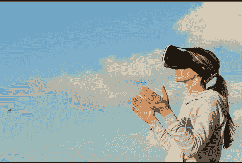

# 历史告诉我们，我们对科技的预测是有缺陷的

> 原文：<https://medium.com/geekculture/history-teaches-that-our-predictions-about-tech-are-flawed-714574853405?source=collection_archive---------19----------------------->

Image Credit: [Pexels](https://pixabay.com/photos/woman-virtual-reality-game-clouds-1845517/) on Pixabay

从统计学上来说，我们在预测什么会改变世界时总是失败。《快公司》曾经列出了这些主要失败预测的清单。他们有很多。换句话说，这种认识受到了更大的冲击:真正改变世界的东西并没有出现在专家的预测中。