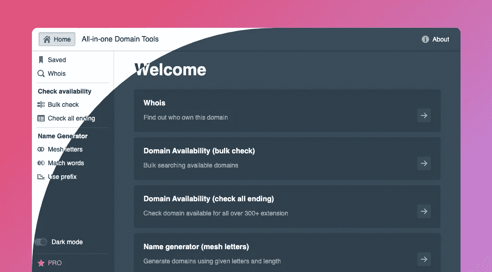
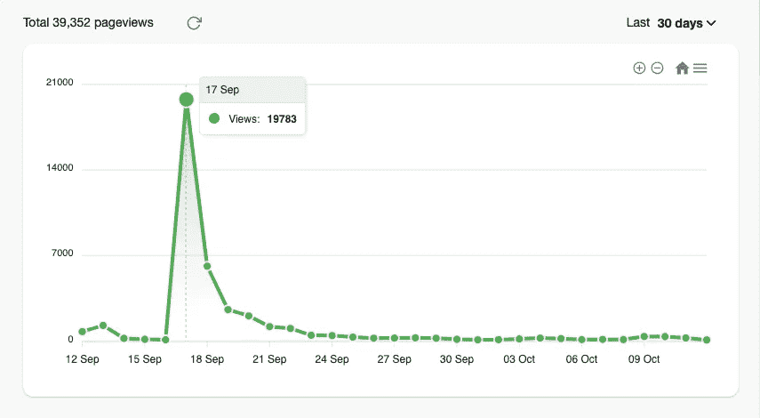
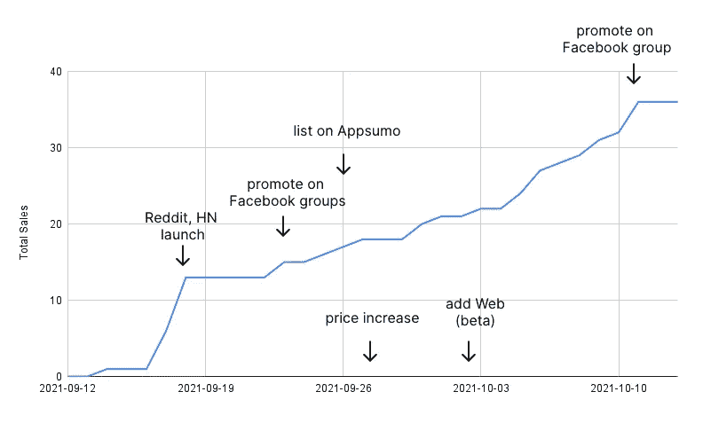

# 在 30 天内实现 1000 美元的销售额——以下是成功的案例

> 原文：<https://medium.com/geekculture/hitting-1k-of-sales-in-30-days-heres-what-worked-5e02a27b85e5?source=collection_archive---------15----------------------->

## *我如何开始 ishim 的旅程——一个领域工具，成为黑客新闻的特色，以及它如何获得第一笔销售*

30 天前，我推出了[ishim——一个查找可用单个单词域名的域名工具](https://twitter.com/hieuSSR/status/1437083927710093317)。ishim 最初是 macOS 的桌面应用程序，现在可以在 Linux、Windows、Web(测试版)上使用，迄今为止总销售额已达 1145 美元。

在这篇文章中，我将分享一些旅程，我是如何完成第一笔和后续销售的。无论你是在开发一个产品，还是在做一个副业项目，这些都是你可以尝试在没有关系网的情况下启动销售的事情。

# 怎么开始的

寻找好的域名是我的爱好之一。我使用在线工具(即 namesh，impossibly)进行域名建议和批量检查域名可用性。不过，他们中的许多人已经关闭了一段时间，没有任何通知。

所以我决定为它编写一个小型的本地命令行程序，并探索一些生成名称的方法。这是一件有趣的事情。

然后一个月前，我决定把它做成一个合适的桌面应用程序，目的是让其他人也能使用它。

*ishim 用户界面*

# 登上了黑客新闻的头版，实现了首次销售

当第一个版本准备好了，我建立了一个登陆页面，并添加了一个贝宝按钮。然后发布在 [Reddit](https://www.reddit.com/r/SideProject/comments/pmqtfo/allinone_domain_tools_find_the_perfect_domain_for/) 和 [HackerNews (HN)](https://news.ycombinator.com/item?id=28563831) 上。

它得到了关注和有趣的反馈。有些人不喜欢安装桌面应用程序，因为它需要一些工作、磁盘空间或恶意软件的可能性。其他一些人有过在线工具被关闭的经历，更喜欢有一个桌面应用程序供长期使用。还有一些关于如何改进应用程序的很好的建议。

这篇文章在 HN 的头版停留了半天，在“展示 HN”停留了两天。它在 5 天内带来了+31k 的页面请求，并完成了一些首次销售。

*来自 Reddit 和 HN 的 ish.im 流量峰值*

# 在脸书组上推广

我是几个脸书终身交易组织的成员。有个家伙不断出现，在这些小组上推销他的产品，赚了超过 25 万美元。大部分利润来自其他地方。尽管这让我对在这些团体中推广感到好奇。

HN 发布几天后，流量开始下降。我决定在一些脸书团体中推广 ishim。一个小时后，我的手机上弹出了第一条付款通知。然后更多的是在美国的早晨。

对于订阅模式的产品，终身交易可能不会让你长期受益。虽然这是一个启动新产品销售的好方法，并且可以让你与真正从中受益的用户进行早期对话。这是了解用户和你的产品的好方法。

况且 ishim 桌面授权还是一次性购买。与包月相比，它更容易消费。

# 在 Appsumo 上列表

几个月前，Appsumo 联系我，问我是否愿意在他们的平台上上市 [Inverr](https://inverr.com) ，我犹豫了。但是对于 ishim 来说，我想更多地关注发行，并决定尝试一下。

在 Appsumo 上市的好处是他们现有的受众，他们渴望获得好的交易。不过，该平台从现有用户的每笔交易中收取 30%的费用(对于新产品来说，这可能是合理的推荐费)，或者从新用户那里收取 2.5 美元。

此外，您需要将代码兑换功能集成到产品中。默认情况下，你不能接触到买家。

到目前为止，这是一次很好的经历。Appsumo 占 ishim 销售额的 27%(不包括退款)。

Total sales in the last 30 days

那是 ishim 的前 30 天。幸运的是，很早就获得了一些关注、销售、很好的反馈和与用户的对话。

对于新产品，你可以尝试在 HackerNews、Reddit、ProductHunt 等网站上推广。在一些平台上，运气和时机对达成目标很重要。拥有一个别致的登陆页面和产品照片也会有所帮助。

如果你提供非订阅产品(一次性购买)，想要验证，或者寻找早期用户，尝试在与交易相关的脸书团体上推广。这对 ishim 来说非常有效，尤其是在有晋升的时候。

请随意在不同的平台上尝试，因为上面的平台可能不是您理想的客户所在的地方

以上方法不需要你有人脉。如果你已经尝试了所有的方法，但仍然没有销售，可能是出了什么问题。要么是你的定价，要么是信息，要么是产品本身。

希望你觉得有用，如果你有任何建议，请告诉我。