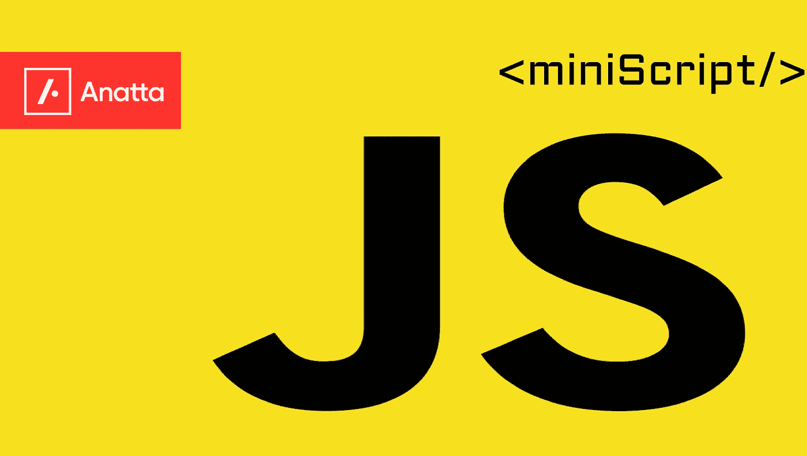
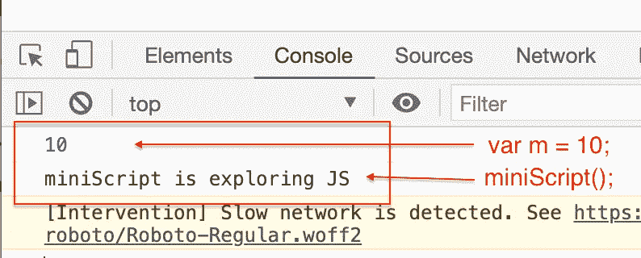
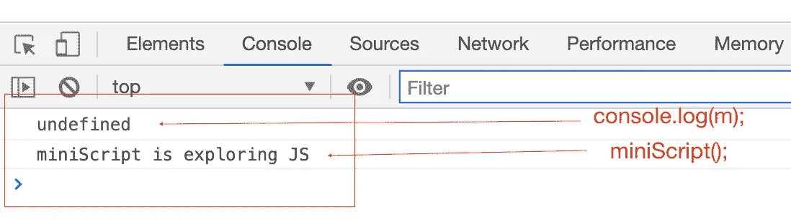
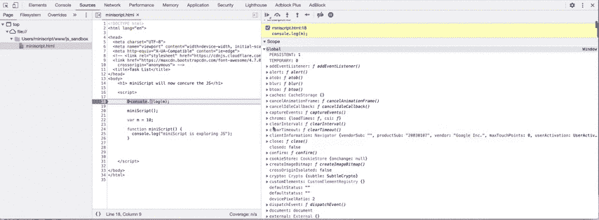
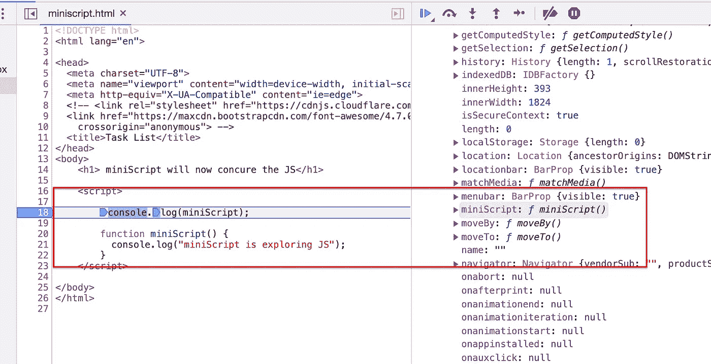
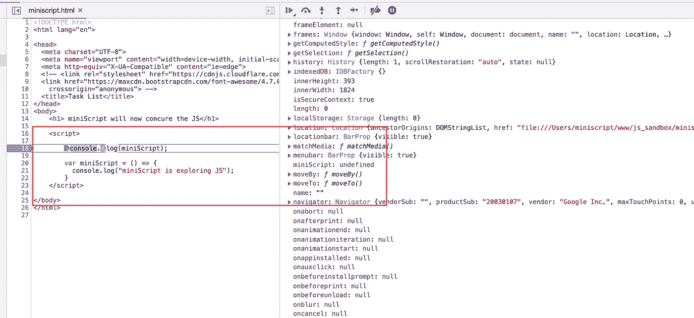

# 在 JavaScript 中提升。

> 原文：<https://medium.com/geekculture/hoisting-in-javascript-f0809921bbba?source=collection_archive---------3----------------------->



JavaScript 是另一个让我们热爱语言的美丽部分。

说到吊装，我们大部分时间都很困惑。这是面试官最喜欢问的问题之一。所以今天我们将试着用简单的通俗语言来理解起重。

我们先从一些 JS 代码来理解吊装。

```
// JS Hoistingvar m = 10;
function miniScript() {
  console.log(“miniScript is exploring JS”);
}// Let's invoke the functions and variables 
miniScript();
console.log(m);
```

这是一个简单的 JS 代码，其中我们声明了简单的变量和函数。预期的输出



这就是我们所知道的，但最大的问题是什么是吊装？

为了理解这一点，让我们修改上面写的代码。

```
//Call the function and variables even before we declaring them.console.log(m);
miniScript();function miniScript() {
  console.log(“miniScript is exploring JS”);
}
var m = 10;
```

你对这个的输出有什么看法？

大多数编程语言都会在这里抛出这个错误，因为我们试图运行那时还不存在的函数。

但这正是 JavaScript 的美妙之处，当我们深入探索时，它让我们更加热爱它。

这是上面这段代码的输出。



输出是 var m = ***undefined*** ，我们得到 miniScript()函数的正确值。这都是因为吊装。用通俗的语言来说，提升的定义应该是——
***JavaScript 中的提升是在声明或初始化变量和函数之前就访问它们，而没有任何错误*。**

所以最大的问题是 JavaScript 引擎是如何做到这一点的？
让我们将调试器放在第一行代码上，并停止浏览器来执行代码并深入其中。
我附上将调试器放入第一行代码的屏幕记录



GIF Image

所以你可以在全局范围内看到，如果我们向下滚动一点，我们可以找到我们的变量和函数。
变量未定义，这意味着 JavaScript 引擎给这个变量分配了一个内存，并给它一个占位符 ***未定义。***

现在，如果我们 console.log 我们的完整函数，您将会看到一些有趣的事情发生。

```
// Let's see how our function will look in Global scope before executing. *console*.log(miniScript);*function* miniScript() {
   *console*.log("miniScript is exploring JS");
}
```



JavaScript 甚至会在开始执行代码之前就给函数和变量分配内存。这叫吊装。

现在让我们看看如果我们使用箭头函数，那么在全局堆栈中会发生什么。这将不会像传统函数那样运行。

```
// Arrow function behave like variables. *console*.log(miniScript);*var* miniScript = () *=>* {
   *console*.log("miniScript is exploring JS");
}
```



你可以看到 arrow 函数的行为就像变量一样，因为它的值是 ***未定义的。*** 这意味着函数在执行上下文中分配内存，而 ***未定义*** 是其占位符。

提升是 JavaScript 的一个概念，其中 JS 在环境的顶部托管所有函数表达式和变量，正因为如此，我们可以在声明变量或函数之前使用它。

这一切都是因为吊装而发生的。下次如果有人问你提升——提升就是在初始化变量和函数之前就把内存分配给它们。

让我们更深入一点，看看在 ***让*** 和 ***const 的情况下会发生什么？***

```
// Use case for let or Const - I am using const 
console.log(m);const m = 'miniScript';
```

你认为输出会是什么？它们的行为会和 var 或函数一样吗？让我看看……


答案有点复杂。您可以看到我们得到了错误“ ***”未捕获的引用错误:在初始化*** 之前无法访问“m”。这意味着我们不能在初始化之前访问变量，但是正如你所看到的**作用域**我们有另一个名为 ***脚本*** 的局部作用域，其中我们的变量' **m** '及其值为**未定义**。那么这意味着什么呢？
这意味着 **let 和**const 不属于全局作用域。他们在**全局作用域**之上创建自己的 ***局部作用域*** 。

这被称为**时间死区**。如果你试图从死区访问这些变量，你会得到**引用错误**。但是在提升 ***const 和 let 方面有内存和占位符未定义。这意味着它们也被吊起。***

所以这都是关于 JavaScript 提升。我试图保持简单，并试图解释引擎盖下发生了什么。JavaScript 引擎如何分配内存和提升变量？

如果你喜欢这篇文章，请给我一个大拇指👍。这将激励我用简单的通俗语言写另一篇文章。

由 [< miniScript/ >](https://medium.com/u/c675f5ddadb8?source=post_page-----f0809921bbba--------------------------------) 在我的桌子上写着爱❤️，同时用 [Anatta](https://medium.com/u/ef174edd651b?source=post_page-----f0809921bbba--------------------------------) 制作电子商务商店。


anatta.io