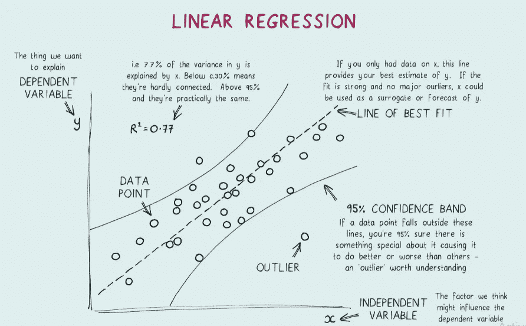

# 理解线性回归所有假设的圣杯

> 原文：<https://medium.com/geekculture/holy-grail-for-understanding-all-the-assumptions-of-linear-regression-210f224192b5?source=collection_archive---------14----------------------->

## 线性回归基础

## 以及 SAS 代码来检查它们

Royalty-free illustration by Dan White 100 on [Shutterstock](https://www.shutterstock.com/g/Dan+White+1000)

毫无疑问，线性回归是每个数据科学家在开始成为成功的数据科学家的旅程时学习的第一个算法。有几十篇文章和帖子…